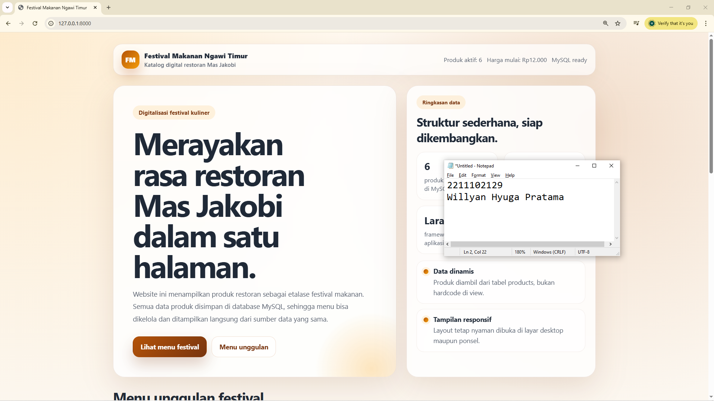
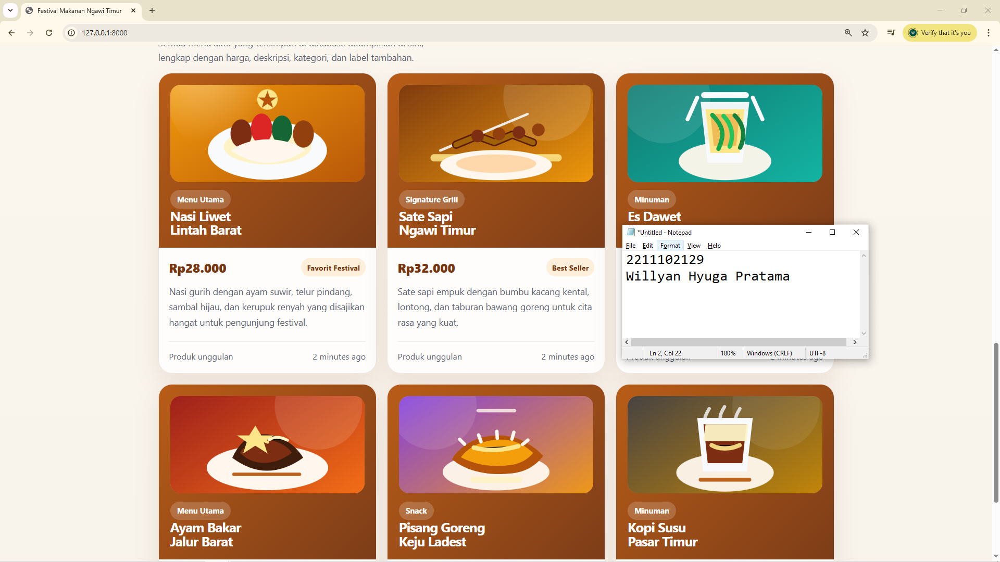

<div align="center">
  <br />
  <h1>LAPORAN PRAKTIKUM <br> APLIKASI BERBASIS PLATFORM </h1>
  <br />
  <h3>MODUL 11 12 13 <br> Laravel dan Database </h3>
  <br />
  
  <br />
  <br />
  <br />
  <h3>Disusun Oleh :</h3>
  <p>
    <strong>Willyan Hyuga Pratama</strong>
    <br>
    <strong>2211102129</strong>
    <br>
    <strong>S1 IF-11-REG05</strong>
  </p>
  <br />
  <h3>Dosen Pengampu :</h3>
  <p>
    <strong>Dedi Agung Prabowo, S.Kom., M.Kom</strong>
  </p>
  <br />
  <br />
  <h4>Asisten Praktikum :</h4>
  <strong>Apri Pandu Wicaksono </strong>
  <br>
  <strong>Hamka Zaenul Ardi</strong>
  <br />
  <h3>LABORATORIUM HIGH PERFORMANCE <br>FAKULTAS INFORMATIKA <br>UNIVERSITAS TELKOM PURWOKERTO <br>2026 </h3>
</div>

<hr>

# Dasar Teori

## Laravel Framework

Laravel adalah web application framework berbasis PHP yang dirancang untuk mempermudah pengembangan aplikasi web modern. Framework ini mengikuti pola arsitektur MVC (Model-View-Controller) yang memisahkan logika bisnis, presentasi, dan data. Laravel menyediakan fitur-fitur powerful seperti:

- **Eloquent ORM**: Memudahkan interaksi dengan database menggunakan object-oriented syntax
- **Blade Templating Engine**: Template engine yang ekspresif untuk membuat view HTML
- **Routing System**: Sistem routing yang fleksibel dan intuitif untuk mengatur endpoint aplikasi
- **Seeding & Migration**: Tools untuk mengelola struktur database dan mengisi data awal secara terprogram
- **Built-in Authentication**: Sistem autentikasi dan otorisasi yang siap pakai
- **Middleware**: Layer untuk memproses request sebelum mencapai controller
- **Composer Dependency Manager**: Mengelola package dan dependencies dengan mudah

## Database & MySQL

Database adalah sistem penyimpanan data terstruktur yang memungkinkan aplikasi menyimpan, mengambil, dan memanipulasi data. MySQL adalah relational database management system (RDBMS) yang populer dan open-source. Konsep utama database:

- **Table**: Struktur data berbentuk baris dan kolom yang menyimpan record
- **Column/Field**: Atribut atau properti dari setiap entitas data (misal: name, price, image_url)
- **Row/Record**: Satu baris data yang merepresentasikan satu entitas lengkap
- **Primary Key**: Identifikasi unik untuk setiap record
- **Relationships**: Hubungan antar tabel (One-to-Many, Many-to-Many, dll)
- **Migrations**: File version control untuk perubahan struktur database
- **Seeding**: Proses pengisian data awal atau testing ke dalam database

## Integrasi Laravel & Database

Dalam aplikasi ini, Laravel terhubung ke MySQL melalui konfigurasi di file `.env`. Eloquent ORM memudahkan CRUD operations (Create, Read, Update, Delete) tanpa menulis raw SQL queries. Model `Product` merepresentasikan tabel `products`, sedangkan `ProductSeeder` mengisi data awal. Migration file mendefisikan struktur tabel dengan kolom-kolom seperti name, price, image_url, dan featured untuk menampilkan katalog makanan secara dinamis dari database.

### Source Code

```php
<body>
        <div class="shell">
            <div class="wrap">
                <header class="topbar">
                    <div class="brand">
                        <div class="brand-mark">FM</div>
                        <div>
                            <div>Festival Makanan Ngawi Timur</div>
                            <small style="color: var(--muted); font-weight: 600;">Katalog digital restoran Mas Jakobi</small>
                        </div>
                    </div>
                    <div class="meta">
                        <span>Produk aktif: {{ $totalProducts }}</span>
                        <span>Harga mulai: Rp{{ number_format($startingPrice ?? 0, 0, ',', '.') }}</span>
                        <span>MySQL ready</span>
                    </div>
                </header>

                <section class="hero">
                    <article class="hero-card">
                        <span class="eyebrow">Digitalisasi festival kuliner</span>
                        <h1>Merayakan rasa restoran Mas Jakobi dalam satu halaman.</h1>
                        <p class="lead">
                            Website ini menampilkan produk restoran sebagai etalase festival makanan. Semua data produk disimpan di database MySQL, sehingga menu bisa dikelola dan ditampilkan langsung dari sumber data yang sama.
                        </p>
                        <div class="cta-row">
                            <a class="btn btn-primary" href="#menu">Lihat menu festival</a>
                            <a class="btn btn-secondary" href="#unggulan">Menu unggulan</a>
                        </div>
                    </article>
```

**Kode Lengkap:** [index.blade.php](/resources/views/festival/index.blade.php)


```php
class ProductSeeder extends Seeder
{
    /**
     * Run the database seeds.
     */
    public function run(): void
    {
        $products = [
            [
                'name' => 'Nasi Liwet Lintah Barat',
                'category' => 'Menu Utama',
                'badge' => 'Favorit Festival',
                'description' => 'Nasi gurih dengan ayam suwir, telur pindang, sambal hijau, dan kerupuk renyah yang disajikan hangat untuk pengunjung festival.',
                'price' => 28000,
                'image_url' => '/images/products/nasi-liwet.svg',
                'featured' => true,
            ],
            [
                'name' => 'Sate Sapi Ngawi Timur',
                'category' => 'Signature Grill',
                'badge' => 'Best Seller',
                'description' => 'Sate sapi empuk dengan bumbu kacang kental, lontong, dan taburan bawang goreng untuk cita rasa yang kuat.',
                'price' => 32000,
                'image_url' => '/images/products/sate-sapi.svg',
                'featured' => true,
            ],
```

**Kode Lengkap:** [ProductSeeder.php](/database/seeders/ProductSeeder.php)


### Screenshot Output

Tampilan beranda/landing page aplikasi Festival Kuliner Ngawi Timur.




### Penjelasan Program
Website ini adalah katalog festival makanan untuk Restoran Mas Jakobi di Ngawi Timur yang menampilkan menu produk makanan dengan gambar SVG, harga, deskripsi, dan kategori dalam layout yang responsif. Dibangun dengan Laravel 12 dan MySQL, website menyajikan produk unggulan di bagian atas dan daftar lengkap menu di bawah dengan desain modern menggunakan glassmorphism dan gradient.
