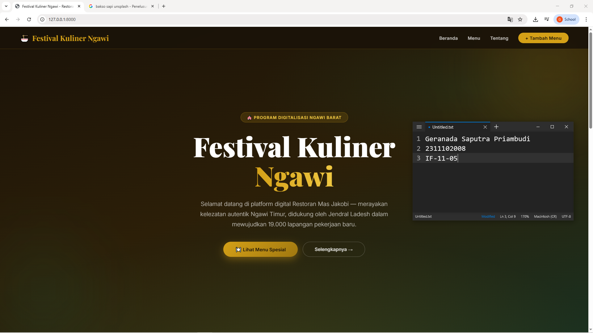
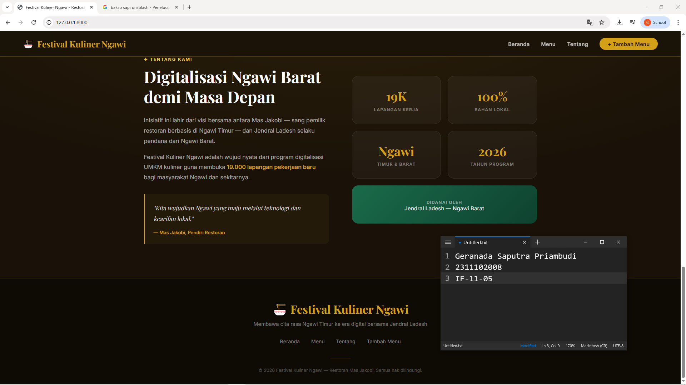
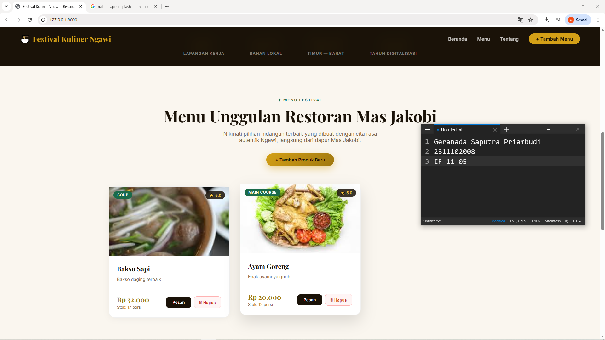
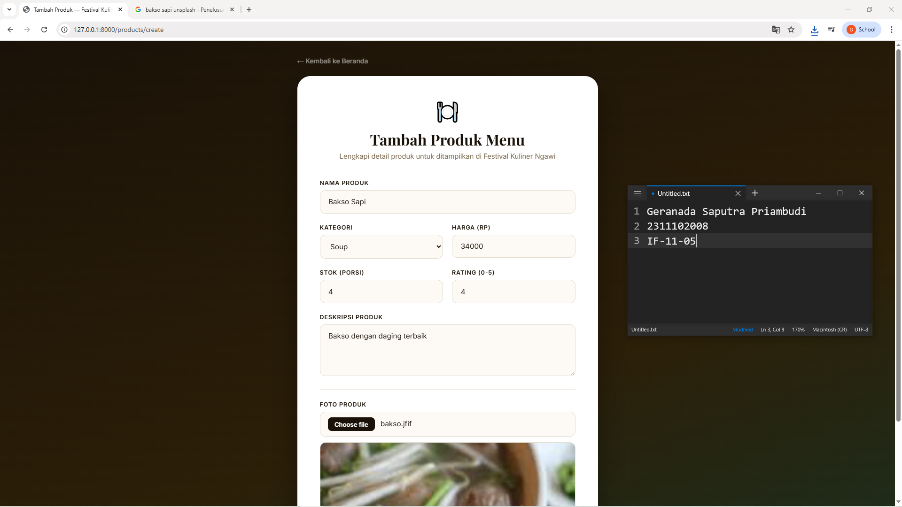

<div align="center">
  <br />
  <h1>LAPORAN PRAKTIKUM <br> APLIKASI BERBASIS PLATFORM </h1>
  <br />
  <h3>MODUL 11 12 13 <br> Laravel dan Database </h3>
  <br />
  
  <br />
  <br />
  <br />
  <h3>Disusun Oleh :</h3>
  <p>
    <strong>Geranada Saputra Priambudi</strong>
    <br>
    <strong>2311102008</strong>
    <br>
    <strong>S1 IF-11-REG05</strong>
  </p>
  <br />
  <h3>Dosen Pengampu :</h3>
  <p>
    <strong>Dedi Agung Prabowo, S.Kom., M.Kom</strong>
  </p>
  <br />
  <br />
  <h4>Asisten Praktikum :</h4>
  <strong>Apri Pandu Wicaksono </strong>
  <br>
  <strong>Hamka Zaenul Ardi</strong>
  <br />
  <h3>LABORATORIUM HIGH PERFORMANCE <br>FAKULTAS INFORMATIKA <br>UNIVERSITAS TELKOM PURWOKERTO <br>2026 </h3>
</div>

<hr>

# Dasar Teori

1. Dasar Teori Laravel
Laravel adalah framework PHP berbasis arsitektur MVC (Model-View-Controller) yang dirancang untuk mempermudah pengembangan aplikasi web secara cepat, terstruktur, dan aman. Laravel menyediakan berbagai fitur bawaan seperti routing, ORM (Eloquent), autentikasi, middleware, validasi, dan migrasi database.

Secara konsep, Laravel memiliki komponen utama sebagai berikut:

Model: merepresentasikan data dan logika akses ke database.
View: menampilkan antarmuka kepada pengguna.
Controller: mengatur alur proses antara model dan view.
Laravel juga menerapkan prinsip clean code dan modern PHP development dengan dukungan Composer, artisan CLI, serta integrasi yang baik terhadap package pihak ketiga. Dengan demikian, Laravel cocok digunakan dalam pengembangan aplikasi skala kecil hingga besar.

Fitur penting Laravel yang sering digunakan:

Routing: menentukan URL dan aksi yang dijalankan.
Middleware: menyaring request sebelum diproses.
Eloquent ORM: mempermudah operasi CRUD tanpa menulis SQL mentah secara penuh.
Migration dan Seeder: mempermudah pengelolaan struktur dan data awal database.
Blade Template Engine: memudahkan pembuatan tampilan dinamis.
Keamanan: proteksi CSRF, hashing password, dan mekanisme autentikasi/otorisasi.
2. Dasar Teori Database
Database adalah kumpulan data terstruktur yang disimpan secara sistematis agar mudah diakses, dikelola, dan diperbarui. Sistem yang digunakan untuk mengelola database disebut DBMS (Database Management System), contohnya MySQL, PostgreSQL, dan SQL Server.

Konsep dasar dalam database:

Tabel: tempat penyimpanan data dalam bentuk baris dan kolom.
Record (baris): satu kesatuan data.
Field (kolom): atribut dari data.
Primary Key: kunci unik untuk membedakan setiap record.
Foreign Key: kunci penghubung antar tabel.
Dalam perancangan database, relasi antar tabel sangat penting, yaitu:

One to One (1:1)
One to Many (1:N)
Many to Many (N:M)
Agar struktur data efisien dan minim redundansi, digunakan normalisasi database (misalnya 1NF, 2NF, 3NF). Selain itu, transaksi database mengikuti prinsip ACID:

Atomicity: transaksi dijalankan sepenuhnya atau dibatalkan.
Consistency: data tetap valid sesuai aturan.
Isolation: transaksi tidak saling mengganggu.
Durability: data tersimpan permanen setelah commit.


### Source Code

```php
<!DOCTYPE html>
<html lang="{{ str_replace('_', '-', app()->getLocale()) }}">
<head>
    <meta charset="utf-8">
    <meta name="viewport" content="width=device-width, initial-scale=1">
    <title>Tambah Produk — Festival Kuliner Ngawi</title>

    <!-- Fonts -->
    <link rel="preconnect" href="https://fonts.googleapis.com">
    <link rel="preconnect" href="https://fonts.gstatic.com" crossorigin>
    <link href="https://fonts.googleapis.com/css2?family=Playfair+Display:wght@400;600;700&family=Inter:wght@300;400;500;600&display=swap" rel="stylesheet">

    <style>
        :root {
            --gold:        #d4a017;
            --gold-light:  #f0c842;
            --gold-dark:   #a07810;
            --emerald:     #1a6b4a;
            --dark:        #1a1208;
            --cream:       #faf6ef;
            --text-muted:  #7a6a4f;
            --error:       #c0392b;
        }

        * { margin: 0; padding: 0; box-sizing: border-box; }

        body {
            font-family: 'Inter', sans-serif;
            background: linear-gradient(160deg, #1a1208 0%, #2c1f08 60%, #1a3020 100%);
            min-height: 100vh;
            display: flex;
            align-items: center;
            justify-content: center;
            padding: 2rem;
        }

        .page-wrap {
            width: 100%;
            max-width: 640px;
            animation: fadeUp 0.7s ease-out both;
        }
        @keyframes fadeUp {
            from { opacity: 0; transform: translateY(28px); }
            to   { opacity: 1; transform: translateY(0); }
        }

        .back-link {
            display: inline-flex;
            align-items: center;
            gap: 0.4rem;
            color: rgba(255,255,255,0.5);
            text-decoration: none;
            font-size: 0.88rem;
            font-weight: 500;
            margin-bottom: 1.5rem;
            transition: color 0.25s;
        }
        .back-link:hover { color: var(--gold-light); }

        .card {
            background: #fff;
            border-radius: 28px;
            padding: 3rem;
            box-shadow: 0 24px 64px rgba(0,0,0,0.35);
        }
```

**Kode Lengkap:** [create.blade.php](/resources/views/products/create.blade.php)


```php
<?php

use App\Http\Controllers\ProductController;
use Illuminate\Support\Facades\Route;

Route::get('/', [ProductController::class, 'index'])->name('home');
Route::get('/products/create', [ProductController::class, 'create'])->name('products.create');
Route::post('/products', [ProductController::class, 'store'])->name('products.store');
Route::delete('/products/{product}', [ProductController::class, 'destroy'])->name('products.destroy');

```

**Kode Lengkap:** [web.php](/routes/web.php)


### Screenshot Output

Tampilan beranda/landing page aplikasi Festival Kuliner Ngawi Timur.






### Penjelasan Program
Website ini adalah aplikasi Laravel bertema Festival Kuliner Ngawi untuk menampilkan daftar produk kuliner dan mengelolanya (tambah serta hapus data). Data produk disimpan di database sehingga konten pada halaman utama selalu terintegrasi dengan sistem CRUD sederhana.
