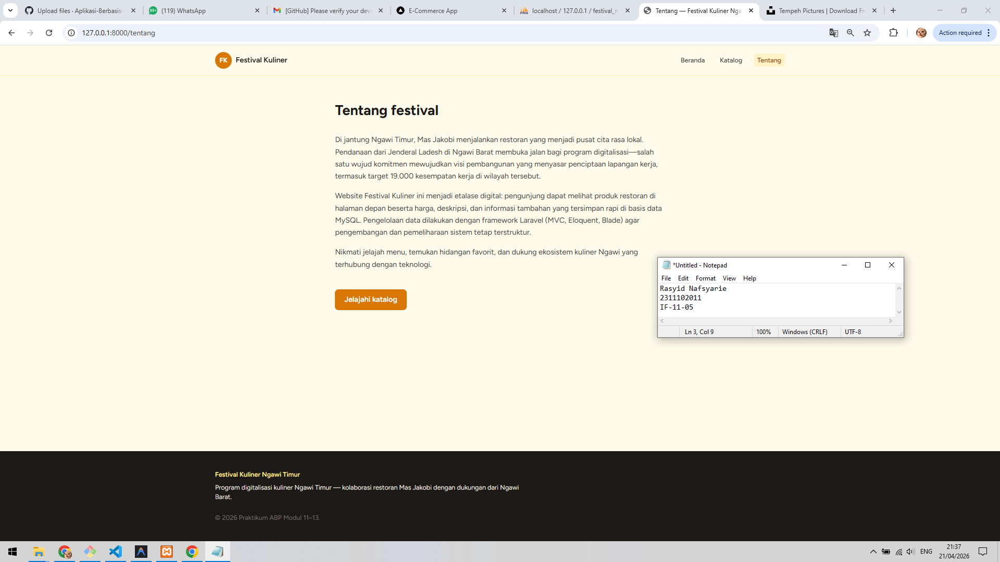
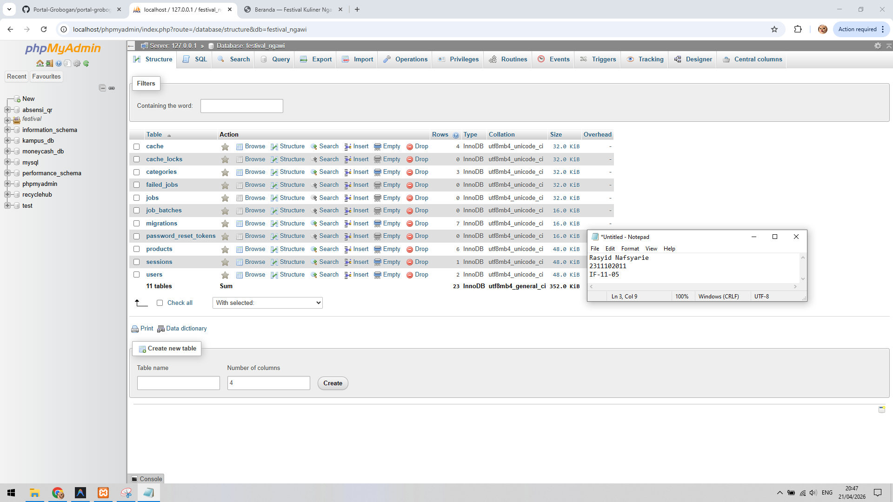

   
  <h1>LAPORAN PRAKTIKUM   APLIKASI BERBASIS PLATFORM </h1>
   
  <h3>MODUL 11 12 13   Laravel dan Database </h3>
   
  
   
   
   
  <h3>Disusun Oleh :</h3>
  

    <strong>Rasyid Nafsyarie</strong>
     
    <strong>2311102011</strong>
     
    <strong>S1 IF-11-REG05</strong>
  

   
  <h3>Dosen Pengampu :</h3>
  

    <strong>Dedi Agung Prabowo, S.Kom., M.Kom</strong>
  

   
   
  <h4>Asisten Praktikum :</h4>
  <strong>Apri Pandu Wicaksono </strong>
   
  <strong>Hamka Zaenul Ardi</strong>
   
  <h3>LABORATORIUM HIGH PERFORMANCE  FAKULTAS INFORMATIKA  UNIVERSITAS TELKOM PURWOKERTO  2026 </h3>

# Dasar Teori

Laravel adalah salah satu framework PHP paling populer yang menggunakan pola arsitektur MVC (Model-View-Controller). Tujuannya adalah untuk mempermudah proses pengembangan web dengan menyediakan sintaks yang ekspresif dan elegan.

1. Arsitektur MVC (Model-View-Controller)
Laravel memisahkan logika aplikasi menjadi tiga komponen utama untuk menjaga kode tetap terorganisir:

Model: Menangani logika data dan berinteraksi langsung dengan database.

View: Bagian yang menangani tampilan atau User Interface (UI) kepada pengguna (biasanya menggunakan file .blade.php).

Controller: Jembatan antara Model dan View. Controller menerima permintaan pengguna, mengambil data melalui Model, dan mengirimkannya ke View.

2. Eloquent ORM (Object-Relational Mapper)
Ini adalah fitur unggulan Laravel untuk urusan database. Eloquent memungkinkan pengembang berinteraksi dengan database menggunakan sintaks PHP yang intuitif daripada menulis SQL mentah (raw SQL).

Prinsip Kerja: Setiap tabel di database memiliki "Model" yang terkait.

Contoh: Untuk mengambil semua data dari tabel users, Anda cukup menulis $users = User::all(); alih-alih SELECT * FROM users;.

3. Database Migrations
Migrations berfungsi seperti Version Control (seperti Git) tetapi untuk database.

Fungsi: Anda mendefinisikan struktur tabel (kolom, tipe data, indeks) di dalam file PHP.

Manfaat: Memungkinkan tim pengembang untuk berbagi skema database yang sama tanpa harus mengekspor file .sql secara manual. Anda cukup menjalankan perintah php artisan migrate.

4. Query Builder dan Hubungan Antar Data (Relationships)
Laravel menyediakan cara mudah untuk mengelola relasi antar tabel database yang kompleks:

One-to-One: Contohnya, satu User memiliki satu Profil.

One-to-Many: Satu Postingan memiliki banyak Komentar.

Many-to-Many: Banyak Mahasiswa mengambil banyak Mata Kuliah.

5. Keamanan Database
Laravel secara otomatis melindungi aplikasi dari serangan umum terhadap database:

SQL Injection: Menggunakan PDO parameter binding untuk memastikan input pengguna tidak bisa memanipulasi kueri SQL.

CSRF (Cross-Site Request Forgery): Melindungi integritas data saat melakukan operasi Create, Update, Delete melalui form.

### Screenshot Output

1. **beranda.png** - Tampilan Beranda

2. **tentang.png** - Tampilan Tentang

3. **db.png** - Database MySQL

### Penjelasan Program

Website ini adalah platform katalog kuliner berbasis Laravel yang berfungsi untuk menampilkan daftar produk kepada publik serta menyediakan fitur dashboard bagi admin untuk mengelola kategori dan data produk secara dinamis.
