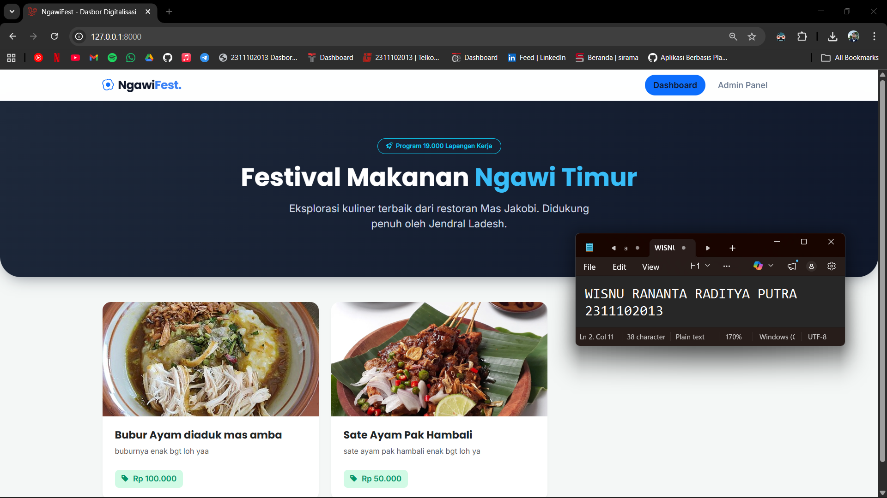
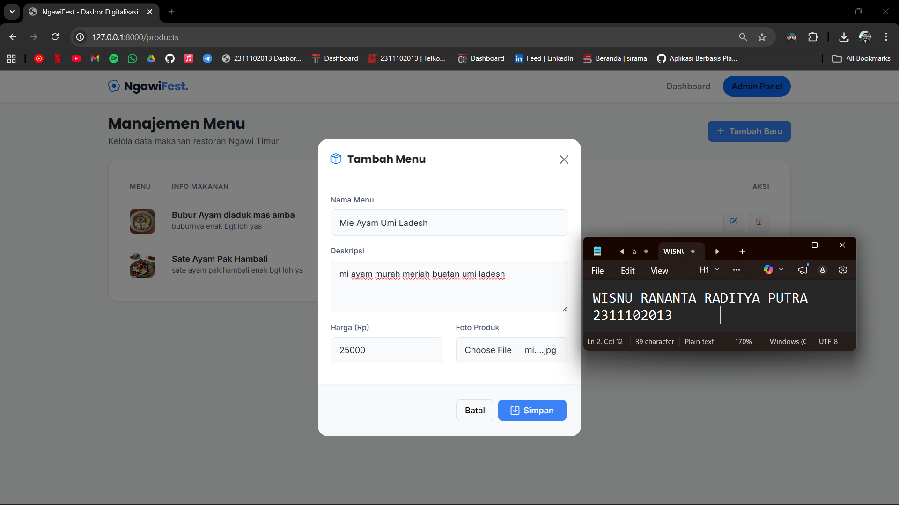
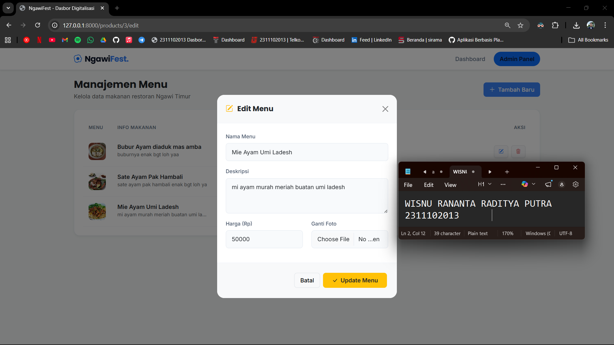
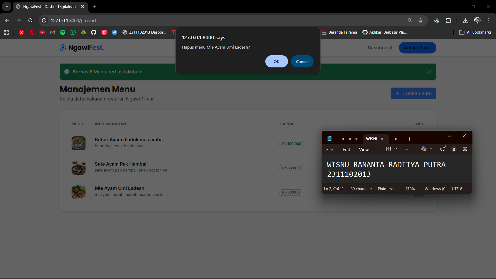
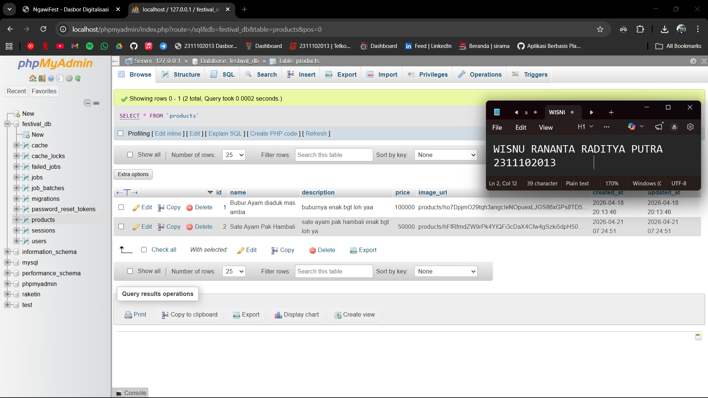

<div align="center">
  <br />
  <h1>LAPORAN PRAKTIKUM <br> APLIKASI BERBASIS PLATFORM </h1>
  <br />
  <h3>MODUL 10, 11, 12 <br> Laravel dan Database </h3>
  <br />
  
  <br />
  <br />
  <br />
  <h3>Disusun Oleh :</h3>
  <p>
    <strong>Wisnu Rananta Raditya Putra</strong>
    <br>
    <strong>2311102013</strong>
    <br>
    <strong>S1 IF-11-REG05</strong>
  </p>
  <br />
  <h3>Dosen Pengampu :</h3>
  <p>
    <strong>Dedi Agung Prabowo, S.Kom., M.Kom</strong>
  </p>
  <br />
  <br />
  <h4>Asisten Praktikum :</h4>
  <strong>Apri Pandu Wicaksono </strong>
  <br>
  <strong>Hamka Zaenul Ardi</strong>
  <br />
  <h3>LABORATORIUM HIGH PERFORMANCE <br>FAKULTAS INFORMATIKA <br>UNIVERSITAS TELKOM PURWOKERTO <br>2026 </h3>
</div>

<hr>


# Dasar Teori

<p align="justify">
Laravel adalah framework berbasis PHP yang digunakan untuk membangun aplikasi web secara terstruktur dan efisien. Laravel menerapkan konsep MVC (Model-View-Controller) yang memisahkan logika aplikasi, tampilan, dan pengelolaan alur program sehingga memudahkan pengembangan dan pemeliharaan. Framework ini juga menyediakan berbagai fitur seperti routing, middleware, autentikasi, serta Eloquent ORM yang memungkinkan interaksi dengan database menggunakan pendekatan berbasis objek tanpa harus menulis query SQL secara langsung.
</p>

<p align="justify">
MySQL merupakan sistem manajemen basis data relasional (RDBMS) yang digunakan untuk menyimpan dan mengelola data dalam bentuk tabel dengan menggunakan bahasa SQL. MySQL bersifat open-source, cepat, dan banyak digunakan dalam pengembangan aplikasi web. Dalam implementasinya, Laravel dan MySQL saling terintegrasi, di mana Laravel mengatur logika aplikasi dan proses data, sedangkan MySQL berfungsi sebagai media penyimpanan data, sehingga pengelolaan data menjadi lebih mudah, efisien, dan terstruktur.
</p>

# Tugas 10,11,12 - Laravel dan Database
## 1. Source Code layouts/app.blade.php
```html
<!-- 2311102013
Wisnu Rananta Raditya Putra
S1IF-11-05 -->
<!DOCTYPE html>
<html lang="id">
<head>
    <meta charset="UTF-8">
    <meta name="viewport" content="width=device-width, initial-scale=1.0">
    <title>NgawiFest - Dasbor Digitalisasi</title>
    
    <link href="https://cdn.jsdelivr.net/npm/bootstrap@5.3.0/dist/css/bootstrap.min.css" rel="stylesheet">
    <link rel="stylesheet" href="https://cdn.jsdelivr.net/npm/bootstrap-icons@1.11.1/font/bootstrap-icons.css">
    
    <link href="https://fonts.googleapis.com/css2?family=Inter:wght@400;500;600&family=Poppins:wght@500;600;700&display=swap" rel="stylesheet">

    <style>
        body { background-color: #f4f7f6; font-family: 'Inter', sans-serif; color: #334155; }
        h1, h2, h3, h4, h5, h6, .navbar-brand { font-family: 'Poppins', sans-serif; }
        .navbar { background: rgba(255, 255, 255, 0.95) !important; backdrop-filter: blur(10px); border-bottom: 1px solid #e2e8f0; }
        .navbar-brand { color: #0f172a !important; font-size: 1.4rem; letter-spacing: -0.5px; }
        .navbar-brand span { color: #3b82f6; }
        .nav-link { color: #64748b !important; font-weight: 500; transition: color 0.3s; }
        .nav-link:hover, .nav-link.active { color: #0f172a !important; font-weight: 600; }
        .hero-section { background: linear-gradient(135deg, #1e293b 0%, #0f172a 100%); color: white; padding: 4.5rem 0; border-radius: 0 0 2.5rem 2.5rem; margin-bottom: 3rem; box-shadow: 0 10px 30px -10px rgba(15, 23, 42, 0.5); }
        .card-menu { border: none; border-radius: 16px; box-shadow: 0 4px 6px -1px rgba(0,0,0,0.05); transition: all 0.3s ease; background: #fff; overflow: hidden; }
        .card-menu:hover { transform: translateY(-8px); box-shadow: 0 20px 25px -5px rgba(0,0,0,0.1); }
        .card-menu img { height: 220px; object-fit: cover; }
        .price-tag { color: #059669; background: #d1fae5; padding: 6px 12px; border-radius: 8px; font-weight: 600; font-size: 0.95rem; display: inline-block; }
        .dash-container { background: #fff; border-radius: 16px; padding: 1.5rem; box-shadow: 0 4px 6px -1px rgba(0,0,0,0.05); border: 1px solid #e2e8f0; }
        .table > thead th { color: #64748b; font-size: 0.8rem; text-transform: uppercase; letter-spacing: 0.5px; font-weight: 600; border-bottom: none; padding: 1rem; }
        .table > tbody td { vertical-align: middle; border-bottom: 1px solid #f1f5f9; padding: 1rem; color: #334155; }
        .img-thumb { width: 48px; height: 48px; object-fit: cover; border-radius: 10px; }
        .btn { border-radius: 8px; font-weight: 500; padding: 0.5rem 1rem; transition: all 0.2s; }
        .btn-primary { background-color: #3b82f6; border: none; }
        .btn-primary:hover { background-color: #2563eb; transform: translateY(-2px); }
        .action-btn { padding: 6px 12px; border-radius: 6px; font-size: 0.85rem; }
        .modal-content { border-radius: 20px; border: none; overflow: hidden; }
        .modal-header { border-bottom: 1px solid #f1f5f9; padding: 1.5rem; }
        .modal-body { padding: 1.5rem; }
        .modal-footer { border-top: 1px solid #f1f5f9; padding: 1.5rem; }
        .form-control { border-radius: 8px; border: 1px solid #e2e8f0; padding: 0.75rem 1rem; background-color: #f8fafc; }
        .form-control:focus { background-color: #fff; border-color: #3b82f6; box-shadow: 0 0 0 3px rgba(59, 130, 246, 0.1); }
        .form-label { font-size: 0.9rem; color: #475569; font-weight: 500; }
    </style>
</head>
<body>

    @include('partials.navbar')

    @yield('content')

    <script src="https://cdn.jsdelivr.net/npm/bootstrap@5.3.0/dist/js/bootstrap.bundle.min.js"></script>

    @stack('scripts')

</body>
</html>
```

## 2. Source Code partials/navbar.blade.php
```html
<!-- 2311102013
Wisnu Rananta Raditya Putra
S1IF-11-05 -->
<nav class="navbar navbar-expand-lg sticky-top shadow-sm">
    <div class="container">
        <a class="navbar-brand fw-bold" href="{{ url('/') }}">
            <i class="bi bi-egg-fried text-primary me-2"></i>Ngawi<span>Fest.</span>
        </a>
        <button class="navbar-toggler border-0" type="button" data-bs-toggle="collapse" data-bs-target="#navbarNav">
            <span class="navbar-toggler-icon"></span>
        </button>
        <div class="collapse navbar-collapse" id="navbarNav">
            <ul class="navbar-nav ms-auto align-items-center">
                <li class="nav-item">
                    <a class="nav-link px-3 btn btn-light rounded-pill {{ $halaman == 'depan' ? 'bg-primary text-white active' : '' }}" href="{{ url('/') }}">
                        Dashboard
                    </a>
                </li>
                <li class="nav-item ms-lg-2">
                    <a class="nav-link px-3 btn btn-light rounded-pill {{ $halaman == 'manajemen' ? 'bg-primary text-white active' : '' }}" href="{{ route('products.index') }}">
                        Admin Panel
                    </a>
                </li>
            </ul>
        </div>
    </div>
</nav>
```

## 3. Source Code festival.blade.php
```html
<!-- 2311102013
Wisnu Rananta Raditya Putra
S1IF-11-05 -->
@extends('layouts.app')

@section('content')
    {{-- DASHBOARD --}}
    @if($halaman == 'depan')
    <div class="hero-section text-center">
        <div class="container">
            <span class="badge bg-primary/20 text-info border border-info px-3 py-2 rounded-pill mb-3">
                <i class="bi bi-rocket-takeoff me-1"></i> Program 19.000 Lapangan Kerja
            </span>
            <h1 class="display-5 fw-bold mb-3">Festival Makanan <span style="color: #38bdf8;">Ngawi Timur</span></h1>
            <p class="lead text-slate-300 mx-auto" style="max-width: 600px; color: #cbd5e1;">
                Eksplorasi kuliner terbaik dari restoran Mas Jakobi. Didukung penuh oleh Jendral Ladesh.
            </p>
        </div>
    </div>
    @endif

    <div class="container pb-5 mt-4">
        @if(session('success'))
            <div class="alert alert-success alert-dismissible fade show shadow-sm border-0 bg-success text-white rounded-3" role="alert">
                <i class="bi bi-check-circle-fill me-2"></i> <strong>Berhasil!</strong> {{ session('success') }}
                <button type="button" class="btn-close btn-close-white" data-bs-dismiss="alert" aria-label="Close"></button>
            </div>
        @endif

        @if($halaman == 'depan')
            <div class="row g-4">
                @forelse($products as $p)
                <div class="col-lg-4 col-md-6">
                    <div class="card card-menu">
                        image_url ? asset('storage/' . $p->image_url) : 'https://images.unsplash.com/photo-1546069901-ba9599a7e63c?q=80&w=600&auto=format&fit=crop' }}" alt="{{ $p->name }}">
                        <div class="card-body p-4">
                            <h5 class="card-title fw-bold text-dark mb-2">{{ $p->name }}</h5>
                            <p class="card-text text-muted mb-4" style="font-size: 0.9rem; line-height: 1.6;">{{ $p->description }}</p>
                            <div class="d-flex align-items-center justify-content-between mt-auto">
                                <span class="price-tag"><i class="bi bi-tag-fill me-1"></i> Rp {{ number_format($p->price, 0, ',', '.') }}</span>
                            </div>
                        </div>
                    </div>
                </div>
                @empty
                <div class="col-12 text-center py-5 dash-container">
                    <i class="bi bi-inbox text-muted" style="font-size: 4rem;"></i>
                    <h4 class="fw-bold mt-3 text-dark">Belum Ada Menu</h4>
                </div>
                @endforelse
            </div>

        {{-- ADMIN PANEL --}}
        @elseif($halaman == 'manajemen')
            <div class="d-flex justify-content-between align-items-center mb-4">
                <div>
                    <h3 class="fw-bold mb-1 text-dark">Manajemen Menu</h3>
                    <p class="text-muted mb-0">Kelola data makanan restoran Ngawi Timur</p>
                </div>
                <button class="btn btn-primary" data-bs-toggle="modal" data-bs-target="#modalTambah">
                    <i class="bi bi-plus-lg me-1"></i> Tambah Baru
                </button>
            </div>

            <div class="dash-container table-responsive">
                <table class="table table-borderless align-middle mb-0">
                    <thead>
                        <tr>
                            <th width="80">Menu</th>
                            <th>Info Makanan</th>
                            <th>Harga</th>
                            <th class="text-end">Aksi</th>
                        </tr>
                    </thead>
                    <tbody>
                        @forelse($products as $p)
                        <tr>
                            <td>
                                image_url ? asset('storage/' . $p->image_url) : 'https://images.unsplash.com/photo-1546069901-ba9599a7e63c?q=80&w=150&auto=format&fit=crop' }}" class="img-thumb">
                            </td>
                            <td>
                                <div class="fw-bold text-dark">{{ $p->name }}</div>
                                <div class="text-muted d-inline-block text-truncate" style="max-width: 250px; font-size: 0.85rem;">{{ $p->description }}</div>
                            </td>
                            <td>
                                <span class="badge bg-light text-success border border-success-subtle px-2 py-1">
                                    Rp {{ number_format($p->price, 0, ',', '.') }}
                                </span>
                            </td>
                            <td class="text-end">
                                <a href="{{ route('products.edit', $p->id) }}" class="btn btn-light text-primary action-btn me-1 border shadow-sm"><i class="bi bi-pencil-square"></i></a>
                                <form action="{{ route('products.destroy', $p->id) }}" method="POST" class="d-inline">
                                    @csrf @method('DELETE')
                                    <button type="submit" class="btn btn-light text-danger action-btn border shadow-sm" onclick="return confirm('Hapus menu {{ $p->name }}?')"><i class="bi bi-trash3"></i></button>
                                </form>
                            </td>
                        </tr>
                        @empty
                        <tr><td colspan="4" class="text-center py-4">Data Kosong</td></tr>
                        @endforelse
                    </tbody>
                </table>
            </div>
        @endif
    </div>

    {{-- MODAL ADD --}}
    <div class="modal fade" id="modalTambah" tabindex="-1" aria-hidden="true">
        <div class="modal-dialog modal-dialog-centered">
            <div class="modal-content">
                <div class="modal-header">
                    <h5 class="modal-title fw-bold text-dark"><i class="bi bi-box-seam me-2 text-primary"></i> Tambah Menu</h5>
                    <button type="button" class="btn-close" data-bs-dismiss="modal" aria-label="Close"></button>
                </div>
                <form action="{{ route('products.store') }}" method="POST" enctype="multipart/form-data">
                    @csrf
                    <div class="modal-body">
                        <div class="mb-3"><label class="form-label">Nama Menu</label><input type="text" name="name" class="form-control" required></div>
                        <div class="mb-3"><label class="form-label">Deskripsi</label><textarea name="description" class="form-control" rows="3" required></textarea></div>
                        <div class="row">
                            <div class="col-md-6 mb-3"><label class="form-label">Harga (Rp)</label><input type="number" name="price" class="form-control" required></div>
                            <div class="col-md-6 mb-3"><label class="form-label">Foto Produk</label><input type="file" name="image" class="form-control" accept="image/*"></div>
                        </div>
                    </div>
                    <div class="modal-footer bg-light">
                        <button type="button" class="btn btn-light border" data-bs-dismiss="modal">Batal</button>
                        <button type="submit" class="btn btn-primary px-4"><i class="bi bi-save me-1"></i> Simpan</button>
                    </div>
                </form>
            </div>
        </div>
    </div>

    {{-- MODAL EDIT --}}
    @if(isset($editProduct))
    <div class="modal fade" id="modalEdit" tabindex="-1" aria-hidden="true">
        <div class="modal-dialog modal-dialog-centered">
            <div class="modal-content">
                <div class="modal-header bg-light">
                    <h5 class="modal-title fw-bold text-dark"><i class="bi bi-pencil-square me-2 text-warning"></i> Edit Menu</h5>
                    <a href="{{ route('products.index') }}" class="btn-close" aria-label="Close"></a>
                </div>
                <form action="{{ route('products.update', $editProduct->id) }}" method="POST" enctype="multipart/form-data">
                    @csrf @method('PUT')
                    <div class="modal-body">
                        <div class="mb-3"><label class="form-label">Nama Menu</label><input type="text" name="name" class="form-control" value="{{ $editProduct->name }}" required></div>
                        <div class="mb-3"><label class="form-label">Deskripsi</label><textarea name="description" class="form-control" rows="3" required>{{ $editProduct->description }}</textarea></div>
                        <div class="row">
                            <div class="col-md-6 mb-3"><label class="form-label">Harga (Rp)</label><input type="number" name="price" class="form-control" value="{{ $editProduct->price }}" required></div>
                            <div class="col-md-6 mb-3"><label class="form-label">Ganti Foto</label><input type="file" name="image" class="form-control" accept="image/*"></div>
                        </div>
                    </div>
                    <div class="modal-footer bg-light">
                        <a href="{{ route('products.index') }}" class="btn btn-light border">Batal</a>
                        <button type="submit" class="btn btn-warning px-4 text-dark fw-bold"><i class="bi bi-check-lg me-1"></i> Update Menu</button>
                    </div>
                </form>
            </div>
        </div>
    </div>
    @endif
@endsection

{{-- Script Khusus Modal Edit --}}
@push('scripts')
    @if(isset($editProduct))
    <script>
        document.addEventListener("DOMContentLoaded", function() {
            var editModal = new bootstrap.Modal(document.getElementById('modalEdit'), { backdrop: 'static', keyboard: false });
            editModal.show();
        });
    </script>
    @endif
@endpush
```

## 4. Source Code ProductController.php
```php
<!-- 2311102013
Wisnu Rananta Raditya Putra
S1IF-11-05 -->
<?php

namespace App\Http\Controllers;

use App\Models\Product;
use Illuminate\Http\Request;
use Illuminate\Support\Facades\Storage; 

class ProductController extends Controller
{
    public function frontPage()
    {
        $products = Product::all();
        return view('festival', ['products' => $products, 'halaman' => 'depan']);
    }

    public function index()
    {
        $products = Product::all();
        return view('festival', ['products' => $products, 'halaman' => 'manajemen']);
    }

    public function store(Request $request)
    {
        $request->validate([
            'name' => 'required', 
            'description' => 'required', 
            'price' => 'required',
            'image' => 'nullable|image|mimes:jpeg,png,jpg,gif|max:2048' // Validasi file gambar (maks 2MB)
        ]);

        $data = $request->all();

        if ($request->hasFile('image')) {
            // Simpan gambar ke folder 'storage/app/public/products'
            $data['image_url'] = $request->file('image')->store('products', 'public');
        }

        Product::create($data);
        return redirect()->route('products.index')->with('success', 'Menu berhasil ditambah!');
    }

    public function edit(Product $product)
    {
        $products = Product::all();
        return view('festival', [
            'products' => $products, 
            'halaman' => 'manajemen', 
            'editProduct' => $product
        ]);
    }

    public function update(Request $request, Product $product)
    {
        $request->validate([
            'name' => 'required', 
            'description' => 'required', 
            'price' => 'required',
            'image' => 'nullable|image|mimes:jpeg,png,jpg,gif|max:2048'
        ]);

        $data = $request->all();

        // Jika user mengupload gambar baru
        if ($request->hasFile('image')) {
            // Hapus gambar lama dari storage jika ada
            if ($product->image_url) {
                Storage::disk('public')->delete($product->image_url);
            }
            // Simpan gambar baru
            $data['image_url'] = $request->file('image')->store('products', 'public');
        }

        $product->update($data);
        return redirect()->route('products.index')->with('success', 'Menu berhasil diubah!');
    }

    public function destroy(Product $product)
    {
        if ($product->image_url) {
            Storage::disk('public')->delete($product->image_url);
        }
        
        $product->delete();
        return redirect()->route('products.index')->with('success', 'Menu dihapus!');
    }
}
```

## 5. Source Code Models Product.php
```php
<!-- 2311102013
Wisnu Rananta Raditya Putra
S1IF-11-05 -->
<?php

namespace App\Models;

use Illuminate\Database\Eloquent\Factories\HasFactory;
use Illuminate\Database\Eloquent\Model;

class Product extends Model
{
    use HasFactory;

    protected $fillable = [
        'name',
        'description',
        'price',
        'image_url',
    ];
}

```

## 6. Source Code Routes web.php
```php
<!-- 2311102013
Wisnu Rananta Raditya Putra
S1IF-11-05 -->
<?php

use Illuminate\Support\Facades\Route;
use App\Http\Controllers\ProductController;

Route::get('/', [ProductController::class, 'frontPage']);

Route::resource('products', ProductController::class);
```

# Screenshots Output






# Penjelasan
<p align="justify">
File <code>layouts/app.blade.php</code> merupakan template utama yang berisi struktur dasar HTML, pemanggilan CSS/JS (Bootstrap), serta ,<code>@include</code> untuk navbar dan <code>@yield('content')</code> sebagai tempat menampilkan isi halaman. File <code>partials/navbar.blade.php</code> kini sudah sesuai fungsinya, yaitu hanya berisi komponen navbar untuk navigasi antara halaman dashboard dan admin panel dengan penanda halaman aktif.
</p>

<p align="justify">
File <code>festival.blade.php</code> adalah tampilan utama aplikasi yang menampilkan dua kondisi, yaitu halaman dashboard (menampilkan daftar produk/menu) dan halaman manajemen (CRUD data produk). Di dalamnya juga terdapat fitur tambah dan edit data menggunakan modal. Pada bagian backend, <code>ProductController.php</code> menangani seluruh proses CRUD termasuk upload dan penghapusan gambar, <code>Product.php</code> sebagai model untuk menghubungkan ke database serta menentukan field yang bisa diisi, dan <code>web.php</code> mengatur routing aplikasi. Secara keseluruhan, aplikasi ini adalah sistem manajemen menu makanan berbasis Laravel dengan fitur lengkap dan struktur yang sudah lebih rapi.
</p>