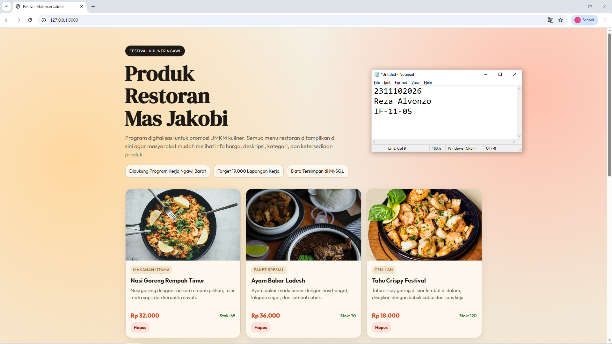
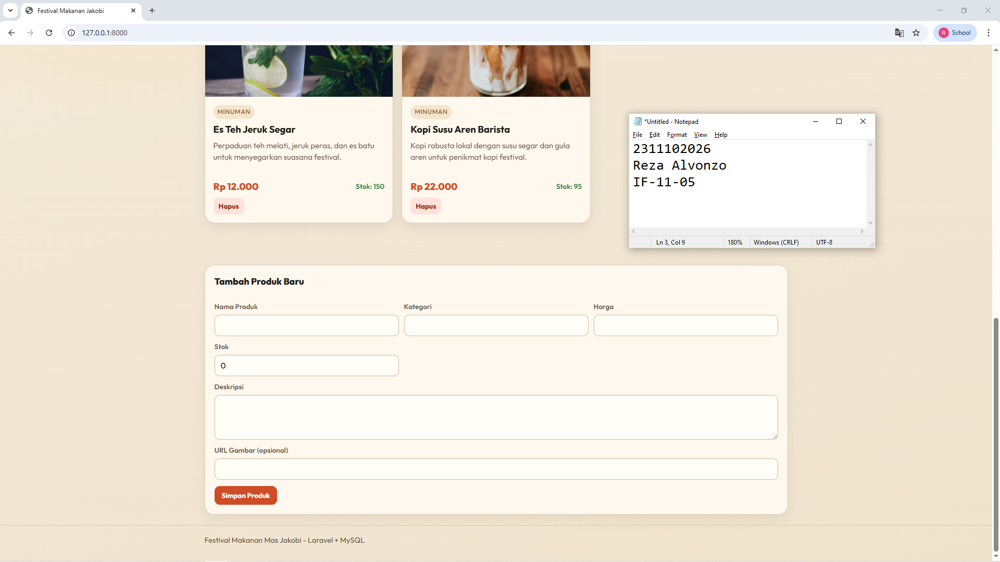
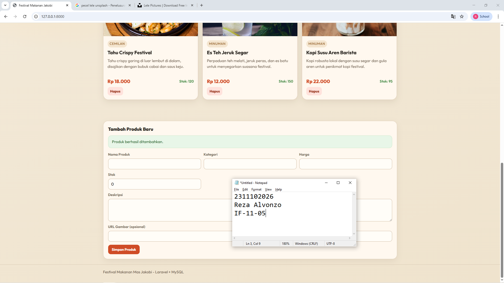

<div align="center">
  <br />
  <h1>LAPORAN PRAKTIKUM <br> APLIKASI BERBASIS PLATFORM </h1>
  <br />
  <h3>MODUL 11 12 13 <br> Laravel dan Database </h3>
  <br />
  
  <br />
  <br />
  <br />
  <h3>Disusun Oleh :</h3>
  <p>
    <strong>Reza Alvonzo</strong>
    <br>
    <strong>2311102026</strong>
    <br>
    <strong>S1 IF-11-REG05</strong>
  </p>
  <br />
  <h3>Dosen Pengampu :</h3>
  <p>
    <strong>Dedi Agung Prabowo, S.Kom., M.Kom</strong>
  </p>
  <br />
  <br />
  <h4>Asisten Praktikum :</h4>
  <strong>Apri Pandu Wicaksono </strong>
  <br>
  <strong>Hamka Zaenul Ardi</strong>
  <br />
  <h3>LABORATORIUM HIGH PERFORMANCE <br>FAKULTAS INFORMATIKA <br>UNIVERSITAS TELKOM PURWOKERTO <br>2026 </h3>
</div>

<hr>

# Dasar Teori

1. Dasar Teori Laravel

Laravel merupakan framework PHP yang dirancang untuk mempermudah proses pengembangan aplikasi web dengan pendekatan yang elegan dan terstruktur. Laravel mengadopsi pola arsitektur Model-View-Controller (MVC) yang berfungsi untuk memisahkan antara pengolahan data (model), tampilan antarmuka (view), dan logika aplikasi (controller).

Framework ini menyediakan berbagai komponen siap pakai seperti sistem routing, pengelolaan session, autentikasi pengguna, serta ORM bernama Eloquent yang memungkinkan interaksi dengan database menjadi lebih sederhana tanpa harus menulis query SQL secara langsung. Selain itu, Laravel juga memiliki fitur Blade Template Engine yang memudahkan dalam pembuatan tampilan dinamis.

Keunggulan lain dari Laravel adalah adanya fitur migration dan seeding yang membantu developer dalam mengelola struktur serta isi database secara sistematis. Dengan demikian, Laravel menjadi salah satu framework yang banyak digunakan dalam pengembangan aplikasi web modern karena mendukung efisiensi, keamanan, dan kemudahan pemeliharaan sistem.

2. Dasar Teori Database

Database adalah sistem penyimpanan data yang terorganisir sehingga data dapat dikelola dan diakses dengan mudah oleh pengguna maupun aplikasi. Dalam pengembangan perangkat lunak, database berperan penting sebagai tempat penyimpanan seluruh informasi yang dibutuhkan sistem.

Salah satu jenis database yang paling umum digunakan adalah Relational Database Management System (RDBMS), di mana data disimpan dalam bentuk tabel yang memiliki relasi antar tabel. Contoh DBMS yang banyak digunakan adalah MySQL, yang mendukung penggunaan bahasa SQL untuk melakukan pengolahan data.

Dalam database, terdapat beberapa elemen penting seperti tabel, atribut (kolom), tuple (baris), serta kunci utama (primary key) dan kunci tamu (foreign key) yang berfungsi untuk menjaga konsistensi dan hubungan antar data. Pengolahan data dalam database umumnya dilakukan melalui operasi CRUD (Create, Read, Update, Delete).

Dengan adanya database, aplikasi dapat menyimpan data secara permanen, menjaga integritas data, serta meningkatkan efisiensi dalam pengelolaan informasi. Integrasi database dengan Laravel memungkinkan proses manipulasi data dilakukan dengan lebih cepat dan terstruktur melalui penggunaan ORM.


### Source Code

```html
<!DOCTYPE html>
<html lang="id">
<head>
    <meta charset="UTF-8">
    <meta name="viewport" content="width=device-width, initial-scale=1.0">
    <title>Festival Makanan Jakobi</title>
    <link rel="preconnect" href="https://fonts.googleapis.com">
    <link rel="preconnect" href="https://fonts.gstatic.com" crossorigin>
    <link href="https://fonts.googleapis.com/css2?family=Outfit:wght@400;600;700;800&family=DM+Serif+Display&display=swap" rel="stylesheet">
    <style>
        :root {
            --bg: #f6f1e8;
            --ink: #1d1a15;
            --paper: #fff8ef;
            --primary: #cf4c26;
            --accent: #f4b400;
            --soft: #eadfce;
            --muted: #6b5d4d;
            --success: #2f7d32;
        }

        * {
            box-sizing: border-box;
            margin: 0;
            padding: 0;
        }

        body {
            font-family: "Outfit", sans-serif;
            color: var(--ink);
            background:
                radial-gradient(circle at 12% 20%, #ffd89f 0, transparent 35%),
                radial-gradient(circle at 88% 10%, #ffc1ae 0, transparent 28%),
                linear-gradient(160deg, #f6f1e8 0%, #f2e8d6 48%, #efe3cd 100%);
            min-height: 100vh;
            line-height: 1.5;
        }

        .container {
            width: min(1120px, 92%);
            margin: 0 auto;
        }

        .hero {
            padding: 56px 0 34px;
            position: relative;
            animation: reveal 700ms ease-out;
        }

        .hero-badge {
            display: inline-block;
            background: var(--ink);
            color: #fff;
            padding: 8px 14px;
            border-radius: 99px;
            letter-spacing: 0.06em;
            font-size: 0.74rem;
            text-transform: uppercase;
            margin-bottom: 18px;
        }
```

**Kode Lengkap:** [index.blade.php](/resources/views/products/index.blade.php)


### Screenshot Output





### Penjelasan Program
Website ini adalah platform digital "Festival Makanan Mas Jakobi" yang dibangun menggunakan framework Laravel dan database MySQL untuk mengelola serta menampilkan daftar produk UMKM kuliner secara informatif kepada pelanggan. Proyek ini merupakan bagian dari tugas praktikum Aplikasi Berbasis Platform yang bertujuan untuk mendukung program digitalisasi promosi produk lokal dan pengelolaan stok barang.