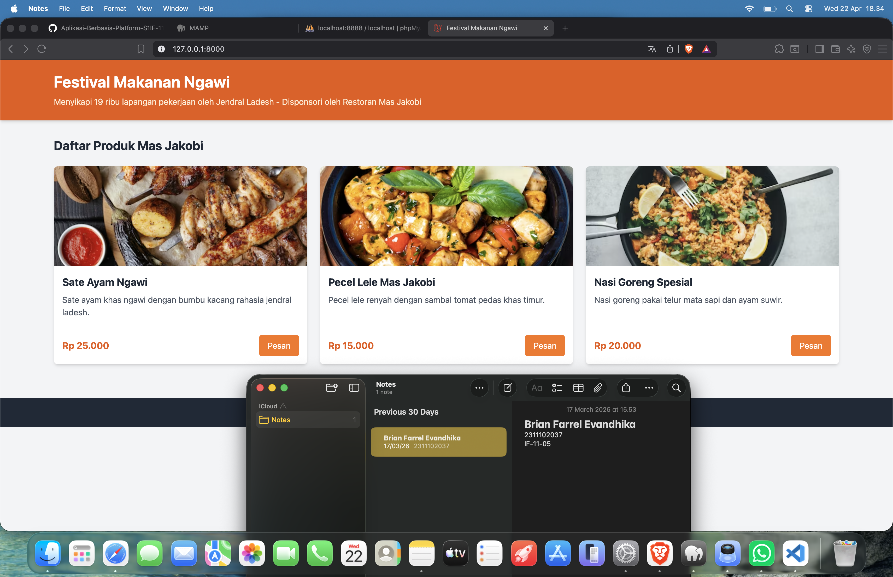

<div align="center">
  <br />
  <h1>LAPORAN PRAKTIKUM <br> APLIKASI BERBASIS PLATFORM </h1>
  <br />
  <h3>MODUL 10, 11, 12 <br> Laravel dan Database </h3>
  <br />
  
  <br />
  <br />
  <br />
  <h3>Disusun Oleh :</h3>
  <p>
    <strong>Brian Farrel Evandhika</strong>
    <br>
    <strong>2311102037</strong>
    <br>
    <strong>S1 IF-11-REG05</strong>
  </p>
  <br />
  <h3>Dosen Pengampu :</h3>
  <p>
    <strong>Dedi Agung Prabowo, S.Kom., M.Kom</strong>
  </p>
  <br />
  <br />
  <h4>Asisten Praktikum :</h4>
  <strong>Apri Pandu Wicaksono </strong>
  <br>
  <strong>Hamka Zaenul Ardi</strong>
  <br />
  <h3>LABORATORIUM HIGH PERFORMANCE <br>FAKULTAS INFORMATIKA <br>UNIVERSITAS TELKOM PURWOKERTO <br>2026 </h3>
</div>

<hr>


# Dasar Teori

<p align="justify">
Laravel adalah framework berbasis PHP yang digunakan untuk membangun aplikasi web secara terstruktur dan efisien. Laravel menerapkan konsep MVC (Model-View-Controller) yang memisahkan logika aplikasi, tampilan, dan pengelolaan alur program sehingga memudahkan pengembangan dan pemeliharaan. Framework ini juga menyediakan berbagai fitur seperti routing, middleware, autentikasi, serta Eloquent ORM yang memungkinkan interaksi dengan database menggunakan pendekatan berbasis objek tanpa harus menulis query SQL secara langsung.
</p>

<p align="justify">
MySQL merupakan sistem manajemen basis data relasional (RDBMS) yang digunakan untuk menyimpan dan mengelola data dalam bentuk tabel dengan menggunakan bahasa SQL. MySQL bersifat open-source, cepat, dan banyak digunakan dalam pengembangan aplikasi web. Dalam implementasinya, Laravel dan MySQL saling terintegrasi, di mana Laravel mengatur logika aplikasi dan proses data, sedangkan MySQL berfungsi sebagai media penyimpanan data, sehingga pengelolaan data menjadi lebih mudah, efisien, dan terstruktur.
</p>

# Tugas 10,11,12 - Laravel dan Database
## 1. Source Code resources/views/welcome.blade.php
```html
<!DOCTYPE html>
<html lang="id">
<head>
    <meta charset="UTF-8">
    <meta name="viewport" content="width=device-width, initial-scale=1.0">
    <title>Festival Makanan Ngawi</title>
    <script src="https://cdn.tailwindcss.com"></script>
</head>
<body class="bg-gray-100 font-sans">
    <header class="bg-orange-600 text-white p-6 shadow-md">
        <div class="container mx-auto px-4">
            <h1 class="text-3xl font-bold">Festival Makanan Ngawi</h1>
            <p class="mt-2 text-orange-100">Menyikapi 19 ribu lapangan pekerjaan oleh Jendral Ladesh - Disponsori oleh Restoran Mas Jakobi</p>
        </div>
    </header>

    <main class="container mx-auto px-4 py-8">
        <h2 class="text-2xl font-bold mb-6 text-gray-800">Daftar Produk Mas Jakobi</h2>
        <div class="grid grid-cols-1 md:grid-cols-2 lg:grid-cols-3 gap-6">
            @foreach($products as $product)
            <div class="bg-white rounded-lg shadow-md overflow-hidden">
                image_url }}" alt="{{ $product->name }}" class="w-full h-48 object-cover">
                <div class="p-4">
                    <h3 class="text-xl font-bold text-gray-800">{{ $product->name }}</h3>
                    <p class="text-gray-600 mt-2 h-16 overflow-hidden">{{ $product->description }}</p>
                    <div class="mt-4 flex justify-between items-center">
                        <span class="text-orange-600 font-bold text-lg">Rp {{ number_format($product->price, 0, ',', '.') }}</span>
                        <button class="bg-orange-500 hover:bg-orange-600 text-white px-4 py-2 rounded">Pesan</button>
                    </div>
                </div>
            </div>
            @endforeach
        </div>
    </main>

    <footer class="bg-gray-800 text-white text-center p-4 mt-8">
        <p>&copy; {{ date('Y') }} Festival Makanan Ngawi Barat. All rights reserved.</p>
    </footer>
</body>
</html>
```

## 2. Source Code app/Http/Controllers/ProductController.php
```php
<?php

namespace App\Http\Controllers;

use Illuminate\Http\Request;

class ProductController extends Controller
{
    public function index()
    {
        $products = \App\Models\Product::all();
        return view('welcome', compact('products'));
    }
}
```

## 3. Source Code app/Models/Product.php
```php
<?php

namespace App\Models;

use Illuminate\Database\Eloquent\Factories\HasFactory;
use Illuminate\Database\Eloquent\Model;

class Product extends Model
{
    use HasFactory;

    protected $fillable = [
        'name',
        'description',
        'price',
        'image_url',
    ];
}
```

## 4. Source Code routes/web.php
```php
<?php

use Illuminate\Support\Facades\Route;
use App\Http\Controllers\ProductController;

Route::get('/', [ProductController::class, 'index']);
```

# Screenshots Output


# Penjelasan
<p align="justify">
Pada praktikum ini, telah dibuat sebuah aplikasi web sederhana menggunakan framework Laravel. Aplikasi ini menampilkan sebuah halaman festival makanan bertajuk "Festival Makanan Ngawi", dimana produk-produk yang ditampilkan diambil dari database MySQL menggunakan Eloquent ORM. 
</p>
<p align="justify">
File <code>welcome.blade.php</code> digunakan sebagai halaman utama (View) yang menampilkan daftar makanan menggunakan framework Tailwind CSS agar tampilannya menarik dan responsif. Data yang ditampilkan pada halaman ini dikelola oleh <code>ProductController.php</code>, yang mana bertugas untuk mengambil seluruh data produk dari database menggunakan model <code>Product.php</code> dan mengirimkannya ke <i>view</i>. Model <code>Product.php</code> ini merepresentasikan tabel products dalam database dan mengatur kolom mana saja yang dapat diisi melalui properti <code>$fillable</code>. Selanjutnya, semua alur <i>request</i> untuk rute utama <code>/</code> diatur di dalam <code>web.php</code> agar memanggil fungsi <code>index()</code> pada controller tersebut. Gambar hasil eksekusi dari source code tersebut dapat dilihat pada bagian Screenshots Output di atas.
</p>
