

   
  <h1>LAPORAN PRAKTIKUM   APLIKASI BERBASIS PLATFORM </h1>
   
  <h3>MODUL 11 12 13   Laravel dan Database </h3>
   
  
   
   
   
  <h3>Disusun Oleh :</h3>
  

    <strong>Muhammad Aulia Muzzaki Nugraha</strong>
     
    <strong>2311102051</strong>
     
    <strong>S1 IF-11-REG05</strong>
  

   
  <h3>Dosen Pengampu :</h3>
  

    <strong>Dedi Agung Prabowo, S.Kom., M.Kom</strong>
  

   
   
  <h4>Asisten Praktikum :</h4>
  <strong>Apri Pandu Wicaksono </strong>
   
  <strong>Hamka Zaenul Ardi</strong>
   
  <h3>LABORATORIUM HIGH PERFORMANCE  FAKULTAS INFORMATIKA  UNIVERSITAS TELKOM PURWOKERTO  2026 </h3>

# Dasar Teori

## Laravel
Laravel adalah framework PHP berbasis arsitektur MVC (Model-View-Controller) yang mempermudah pengembangan aplikasi web secara terstruktur.
Pada program ini, Laravel digunakan untuk:

- Mengatur alur URL melalui routing.
- Memisahkan logika bisnis pada controller.
- Mengelola data melalui model Eloquent ORM.
- Menampilkan antarmuka dengan Blade template.
- Menyediakan autentikasi (login, register, lupa password) secara cepat.

Dengan konsep tersebut, kode menjadi lebih rapi, mudah dipelihara, dan cocok untuk pengembangan aplikasi katalog produk.

## Database
Database adalah sistem penyimpanan data terstruktur yang memungkinkan data disimpan, dicari, dan dikelola secara konsisten.
Program ini menggunakan database relasional (MySQL) dengan tabel utama seperti:

- `users` untuk data akun admin/pengguna.
- `categories` untuk data kategori produk.
- `products` untuk data produk makanan.
- `password_reset_tokens` untuk proses reset password.

Relasi utama pada aplikasi adalah satu kategori memiliki banyak produk (one-to-many), sehingga data lebih terorganisir dan tidak redundan.

## Kaitan Dasar Teori dengan Program
Penerapan Laravel dan database pada program Festival Kuliner Ngawi Timur memungkinkan fitur publik dan admin berjalan terintegrasi, seperti menampilkan katalog produk, filter kategori, CRUD data admin, serta autentikasi dan pengiriman email reset password.

### Screenshot Output

#### Halaman Publik
1. **halaman1.jpeg** - Tampilan beranda/landing page aplikasi Festival Kuliner Ngawi Timur.
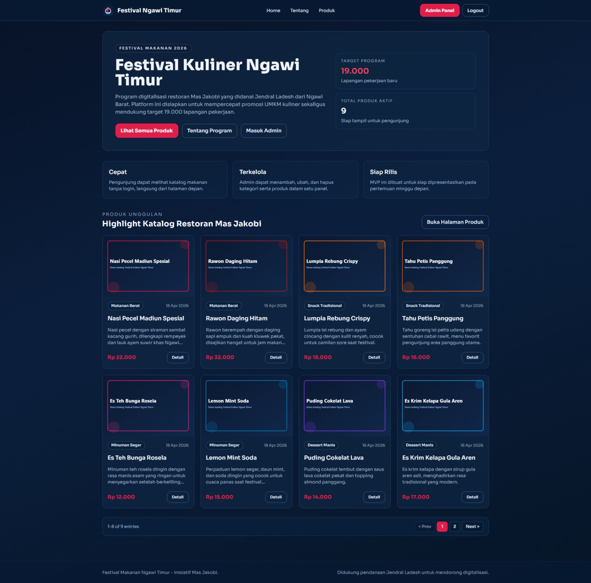

2. **halaman2.jpeg** - Tampilan halaman produk dengan daftar katalog yang dapat dijelajahi pengguna.
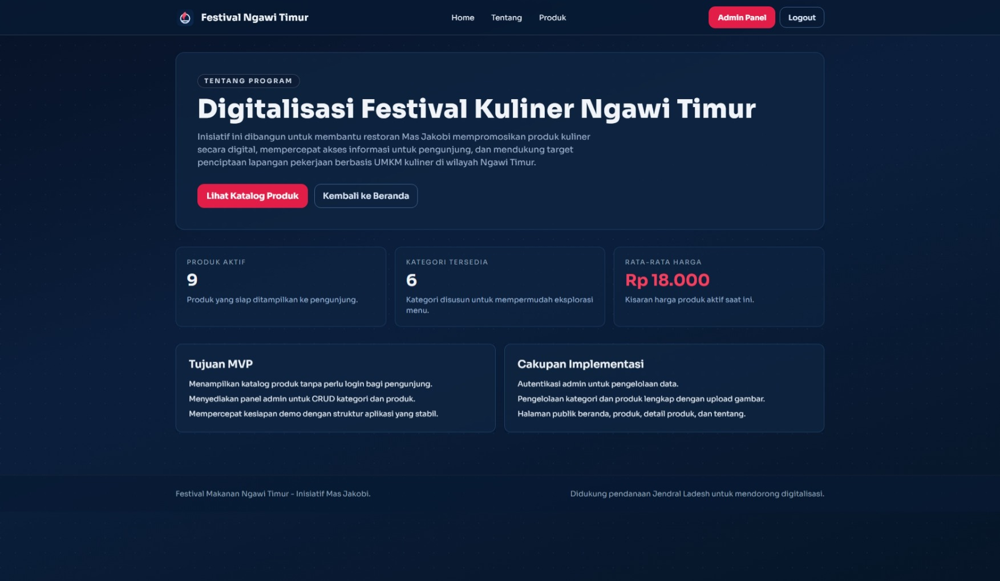

3. **halaman3.jpeg** - Tampilan halaman informasi lanjutan publik (tentang/detail konten festival).
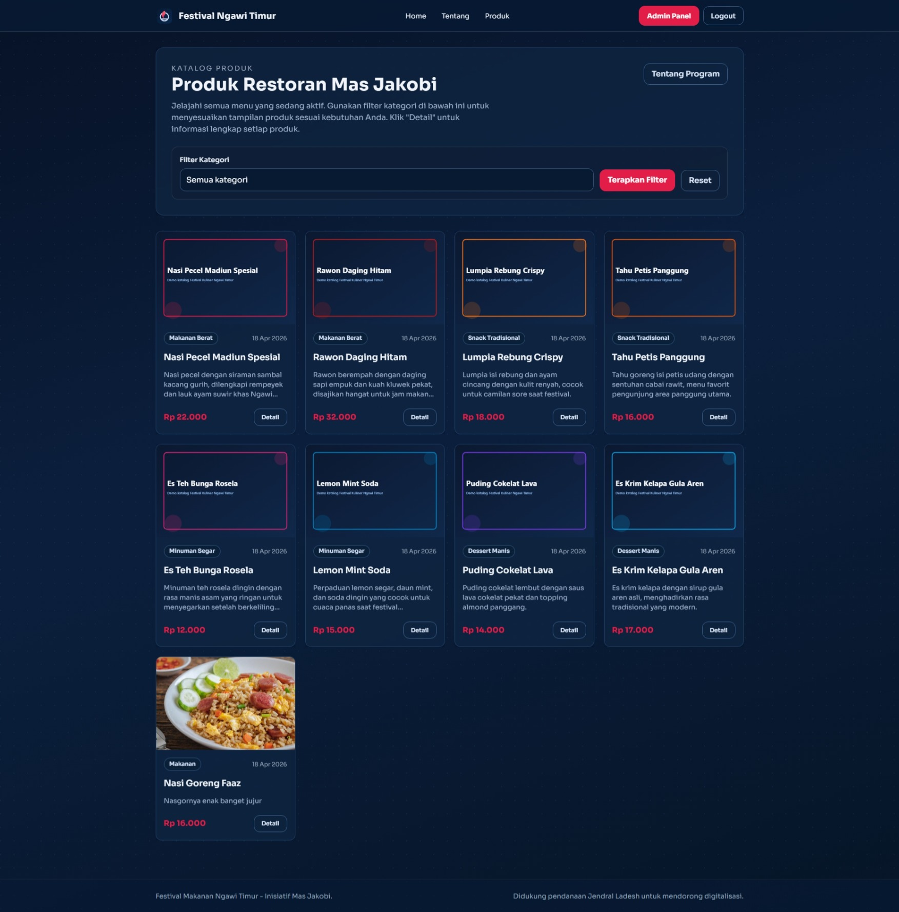

4. **detailproduk.jpeg** - Halaman detail produk yang menampilkan informasi lengkap satu produk.
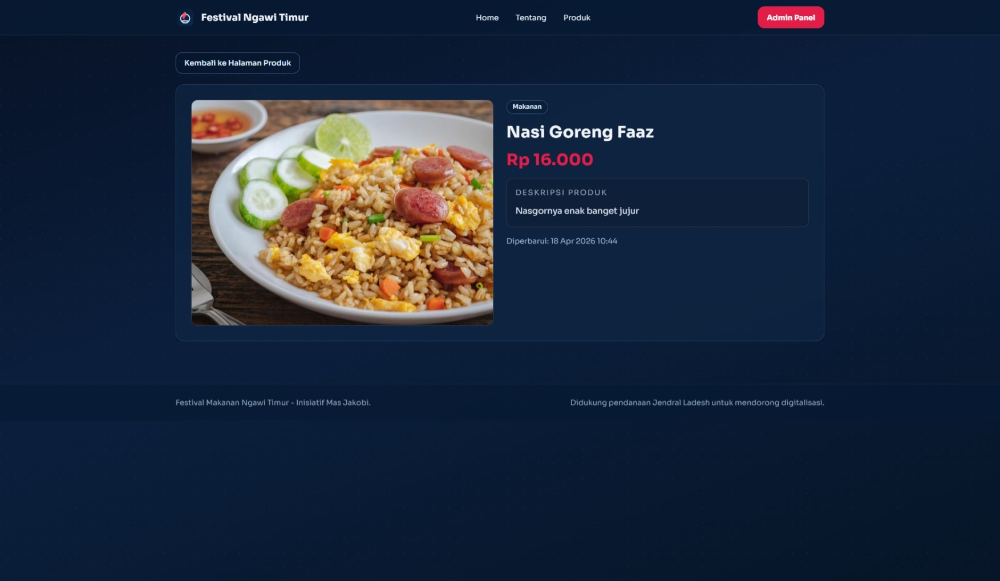

#### Halaman Autentikasi
5. **login.jpeg** - Halaman login admin untuk masuk ke panel pengelolaan sistem.
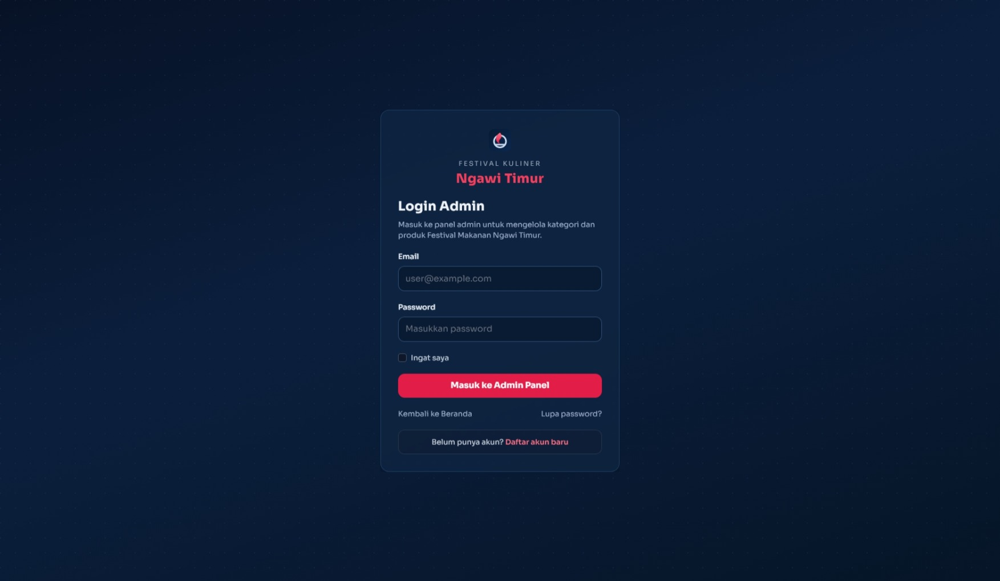

6. **daftar.jpeg** - Halaman pendaftaran akun baru (register).
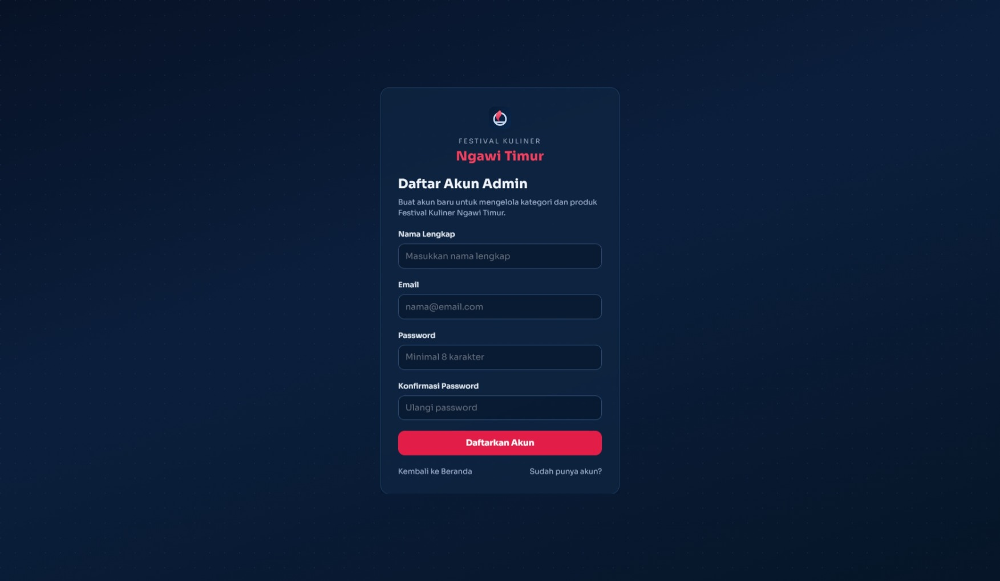

7. **lupapw.jpeg** - Halaman lupa password untuk meminta tautan reset password.
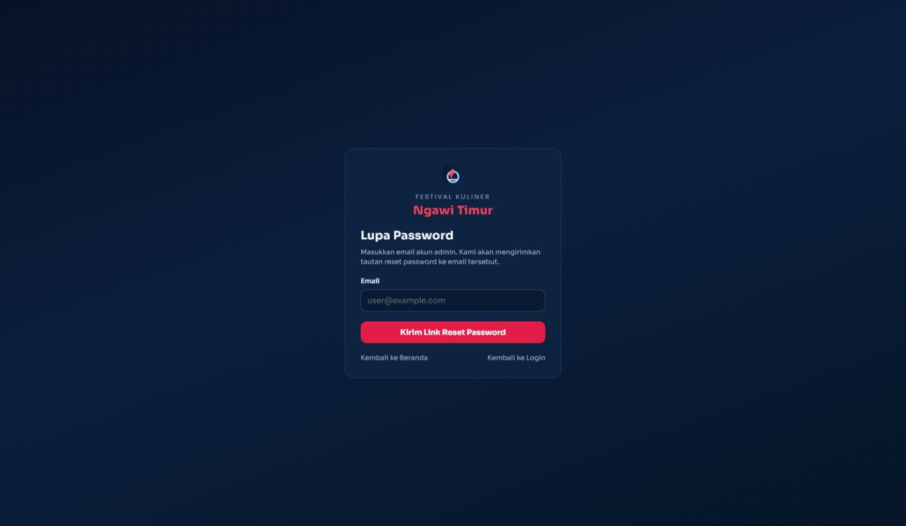

8. **reset-email.jpeg** - Tampilan email reset password yang diterima pengguna.
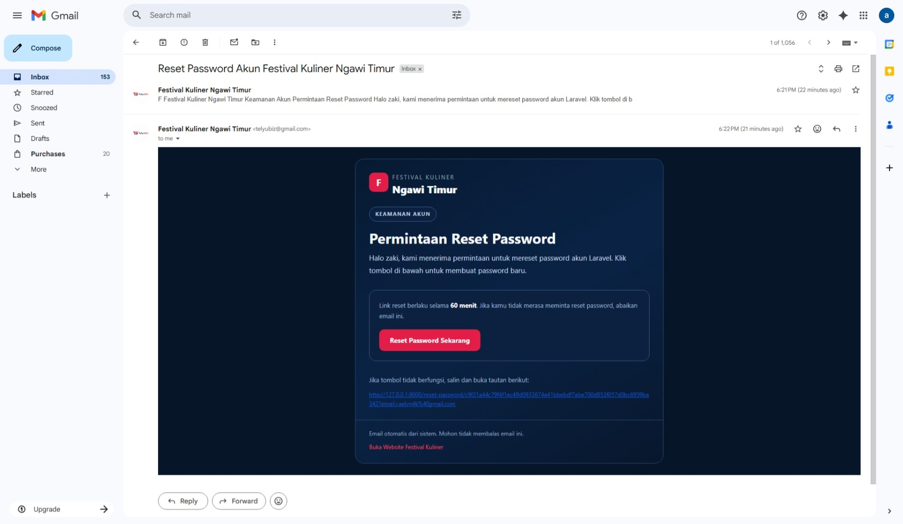

#### Halaman Admin
9. **dashboard.jpeg** - Dashboard admin yang menampilkan ringkasan data sistem.
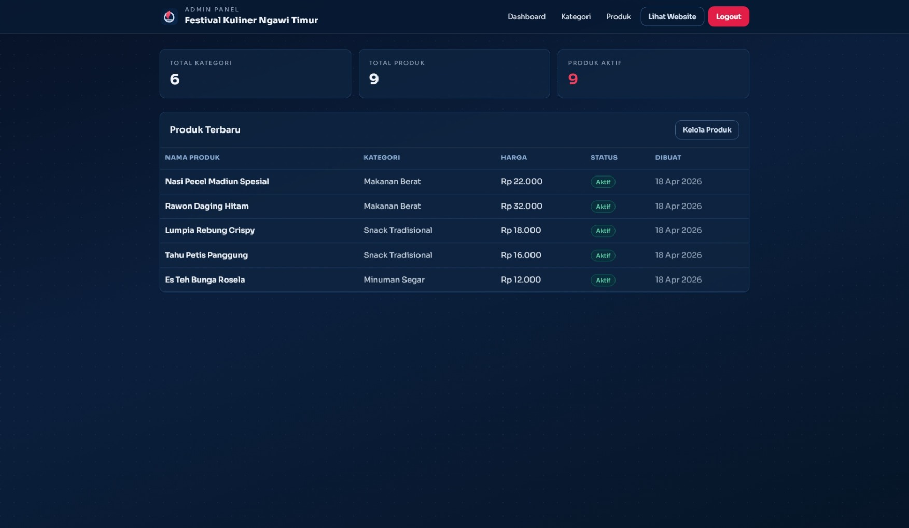

10. **kategori1.jpeg** - Halaman daftar kategori produk pada panel admin.
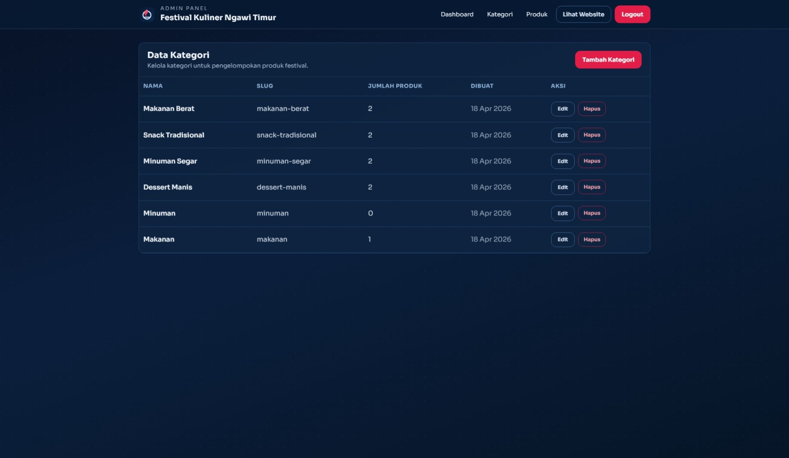

11. **tambahkategori.jpeg** - Form tambah kategori baru pada panel admin.
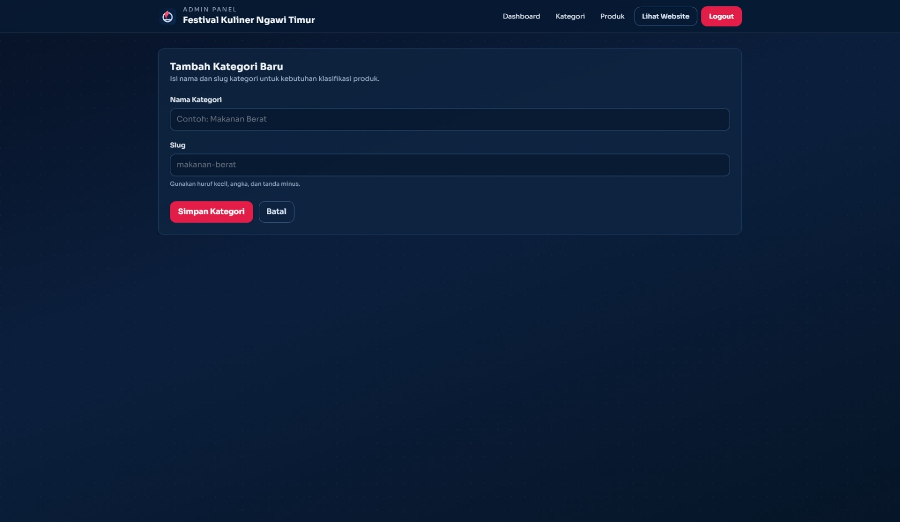

12. **editKategori.jpeg** - Form edit data kategori pada panel admin.
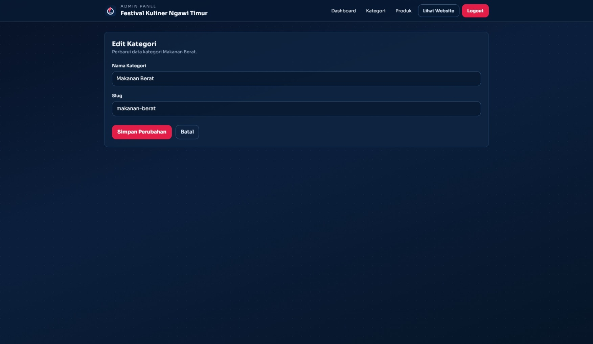

13. **produk1.jpeg** - Halaman daftar produk pada panel admin.
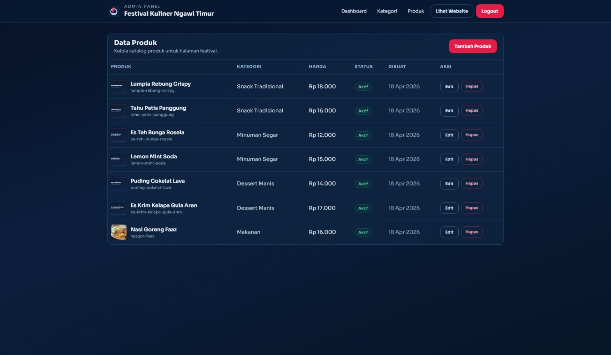

14. **tambahProduk.jpeg** - Form tambah produk baru pada panel admin.
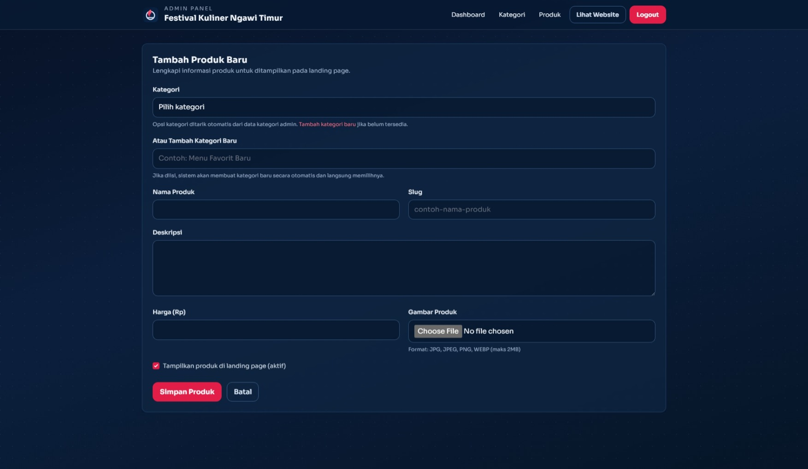

15. **editProduk.jpeg** - Form edit produk pada panel admin.
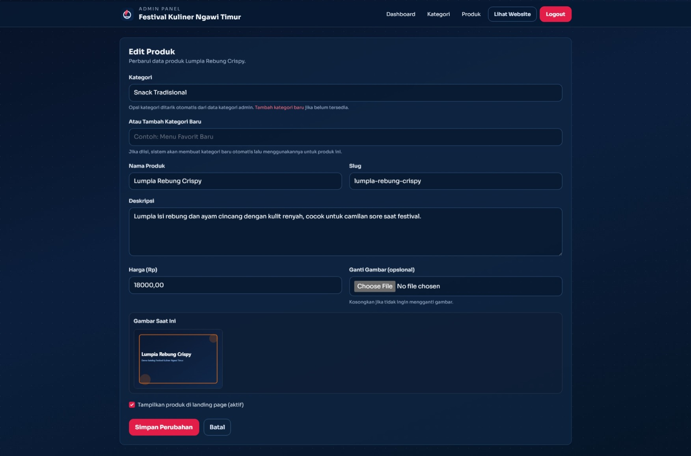

### Penjelasan Program
Aplikasi ini merupakan website katalog Festival Kuliner Ngawi Timur dengan dua sisi utama, yaitu halaman publik dan panel admin.
Halaman publik menampilkan informasi festival, daftar produk, detail produk, serta pagination untuk memudahkan navigasi data.
Panel admin digunakan untuk mengelola kategori dan produk (tambah, ubah, hapus), termasuk upload gambar produk.
Sistem autentikasi juga sudah mendukung pendaftaran akun baru dan reset password melalui email.
