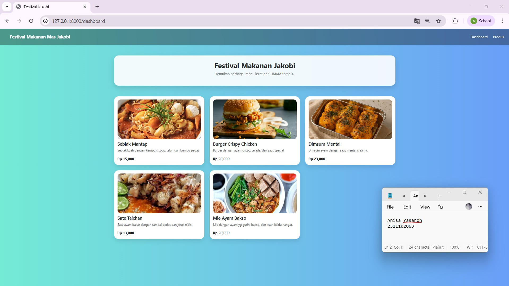
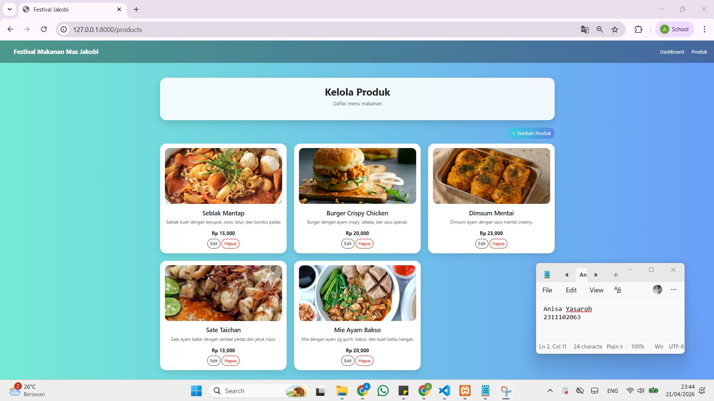
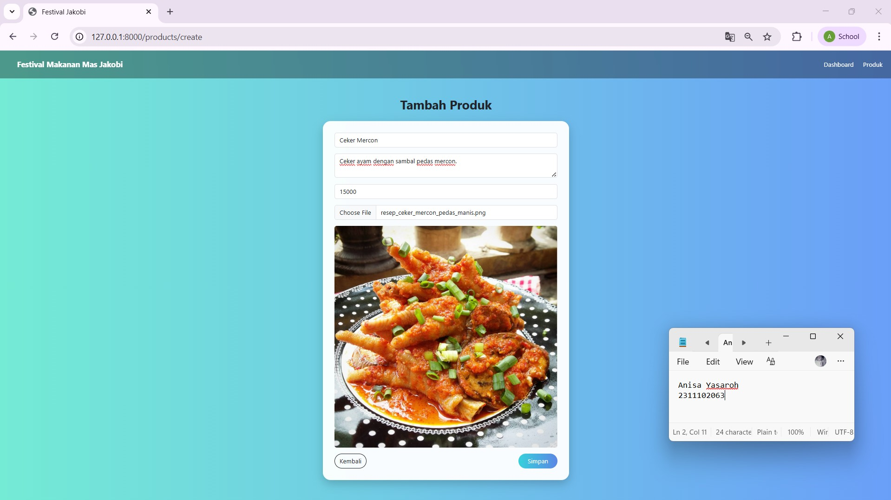
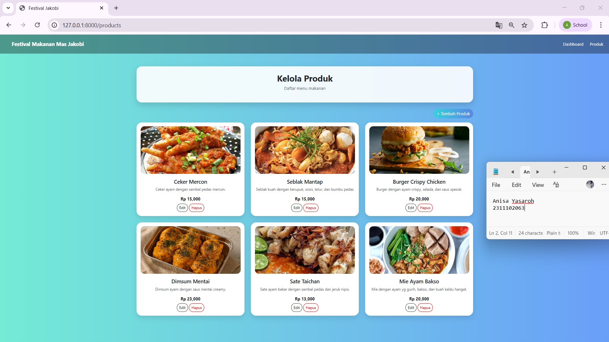
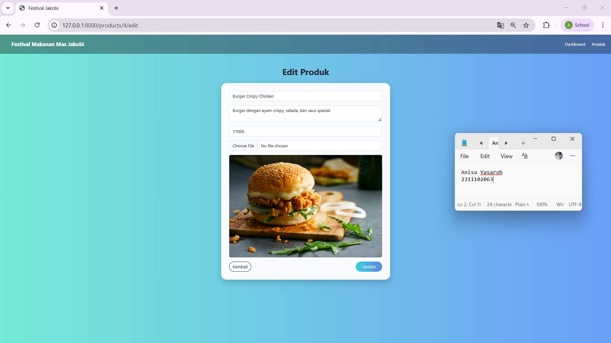
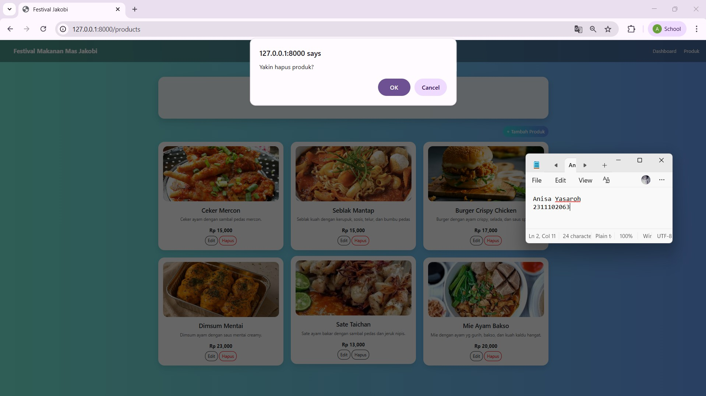
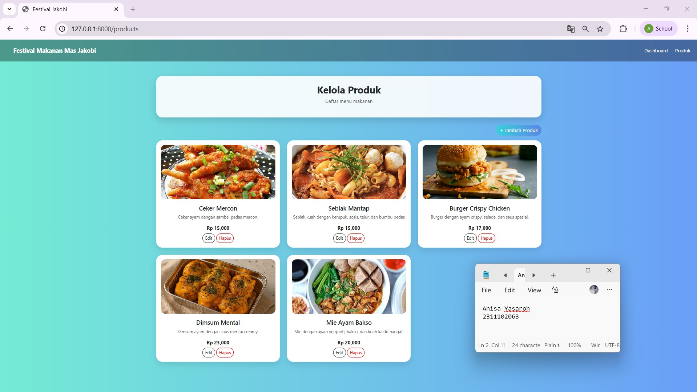
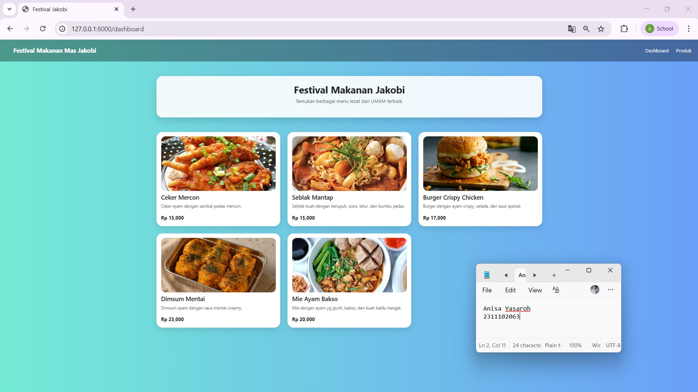
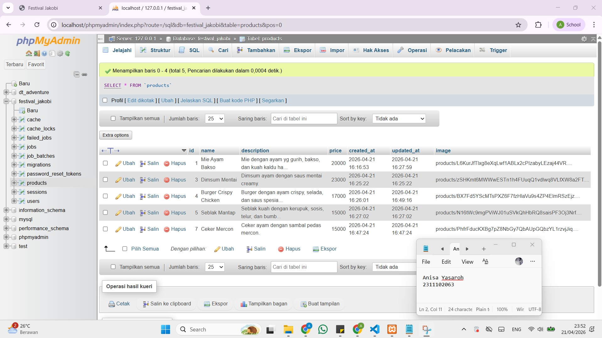

<div align="center">
  <br />
  <h1>LAPORAN PRAKTIKUM <br> APLIKASI BERBASIS PLATFORM </h1>
  <br />
  <h3>MODUL 10-11-12 <br> LARAVEL DAN DATABASE </h3>
  <br />
  
  <br />
  <br />
  <br />
  <h3>Disusun Oleh :</h3>
  <p>
    <strong>Anisa Yasaroh</strong>
    <br>
    <strong>2311102063</strong>
    <br>
    <strong>S1 IF-11-REG05</strong>
  </p>
  <br />
  <h3>Dosen Pengampu :</h3>
  <p>
    <strong>Dedi Agung Prabowo, S.Kom., M.Kom</strong>
  </p>
  <br />
  <br />
  <h4>Asisten Praktikum :</h4>
  <strong>Apri Pandu Wicaksono </strong>
  <br>
  <strong>Hamka Zaenul Ardi</strong>
  <br />
  <h3>LABORATORIUM HIGH PERFORMANCE <br>FAKULTAS INFORMATIKA <br>UNIVERSITAS TELKOM PURWOKERTO <br>2026 </h3>
</div>

<hr>

## Dasar Teori

Pengembangan aplikasi web modern memerlukan framework yang terstruktur untuk mendukung efisiensi dan konsistensi dalam proses pengembangan. Laravel merupakan framework berbasis PHP yang mengimplementasikan arsitektur Model-View-Controller (MVC), yaitu pendekatan yang memisahkan antara komponen pengolahan data (Model), logika aplikasi (Controller), dan tampilan (View). Struktur ini memungkinkan pengelolaan kode program dilakukan secara sistematis sesuai dengan tanggung jawab masing-masing komponen.

Laravel menyediakan berbagai fitur yang mendukung pengembangan aplikasi, seperti sistem routing untuk mengatur alur permintaan, middleware untuk pengendalian akses, serta Eloquent ORM yang digunakan untuk melakukan interaksi dengan database melalui pendekatan berbasis objek. Selain itu, Laravel juga mendukung penggunaan migrasi untuk mendefinisikan dan mengelola struktur basis data dalam bentuk kode.

Database merupakan sistem penyimpanan data yang digunakan untuk menyimpan informasi secara terstruktur dan bersifat persisten. Dalam implementasinya, data produk seperti nama, deskripsi, harga, dan gambar disimpan dalam tabel `products` dan dikelola melalui model `Product`. Interaksi terhadap data dilakukan menggunakan Eloquent ORM sehingga proses manipulasi data dapat dilakukan secara terintegrasi dengan aplikasi.

Pada sisi tampilan, Bootstrap digunakan sebagai framework CSS untuk menyusun antarmuka aplikasi. Bootstrap menyediakan komponen dan sistem layout berbasis grid yang mendukung tampilan responsif pada berbagai ukuran perangkat, sehingga struktur tampilan dapat disusun secara konsisten.

## Tugas Restoran Mas Jakobi 

## Code web.php

```
<?php

use Illuminate\Support\Facades\Route;
use App\Http\Controllers\ProductController;

Route::get('/', function () {
    return redirect('/dashboard');
});

// Dashboard
Route::get('/dashboard', [ProductController::class, 'dashboard']);

// CRUD Produk
Route::resource('products', ProductController::class);
```
## Code ProductController.php

```
<?php

namespace App\Http\Controllers;

use App\Models\Product;
use Illuminate\Http\Request;
use Illuminate\Support\Facades\Storage;

class ProductController extends Controller
{

    public function dashboard()
    {
        $products = Product::latest()->take(6)->get();
        return view('dashboard', compact('products'));
    }

    public function index()
    {
        $products = Product::latest()->get();
        return view('products.index', compact('products'));
    }

    public function create()
    {
        return view('products.create');
    }
    
    public function store(Request $request)
    {
        $request->validate([
            'name' => 'required',
            'description' => 'required',
            'price' => 'required|integer',
            'image' => 'nullable|image|mimes:jpg,jpeg,png|max:2048'
        ]);

        $data = $request->only(['name','description','price']);

        if ($request->hasFile('image')) {
            $data['image'] = $request->file('image')->store('products','public');
        }

        Product::create($data);

        return redirect('/products')->with('success','Berhasil tambah produk');
    }

    public function edit($id)
    {
        $product = Product::findOrFail($id);
        return view('products.edit', compact('product'));
    }

    public function update(Request $request, $id)
    {
        $request->validate([
            'name' => 'required',
            'description' => 'required',
            'price' => 'required|integer',
            'image' => 'nullable|image|mimes:jpg,jpeg,png|max:2048'
        ]);

        $product = Product::findOrFail($id);

        $data = $request->only(['name','description','price']);
        if ($request->hasFile('image')) {

            if ($product->image) {
                Storage::disk('public')->delete($product->image);
            }

            $data['image'] = $request->file('image')->store('products','public');
        }

        $product->update($data);

        return redirect('/products')->with('success','Berhasil update');
    }

    public function destroy($id)
    {
        $product = Product::findOrFail($id);

        if ($product->image) {
            Storage::disk('public')->delete($product->image);
        }

        $product->delete();

        return redirect('/products')->with('success','Berhasil hapus');
    }
}
```
## Code dashboard.blade.php

```
@extends('layouts.app')

@section('content')

<style>
    body {
        background: linear-gradient(to right, #74ebd5, #6a9ff8);
    }

    .hero-box {
        background: rgba(255,255,255,0.9);
        border-radius: 20px;
        padding: 25px;
        text-align: center;
        box-shadow: 0 10px 25px rgba(0,0,0,0.15);
    }

    .food-card {
        background: white;
        border-radius: 20px;
        padding: 15px;
        box-shadow: 0 10px 20px rgba(0,0,0,0.1);
        transition: 0.3s;
    }

    .food-card:hover {
        transform: translateY(-5px);
    }

    .food-img {
        width: 100%;
        height: 180px;
        object-fit: cover;
        border-radius: 15px;
    }
</style>

<div class="container">

    <!-- HERO -->
    <div class="hero-box mb-5">
        <h2 class="fw-bold">Festival Makanan Jakobi</h2>
        <p class="text-muted">
            Temukan berbagai menu lezat dari UMKM terbaik.
        </p>
    </div>

    <!-- PRODUK -->
    <div class="row">

    @forelse($products as $p)
        <div class="col-md-4 mb-4">

            <div class="food-card">

                @if($p->image)
                    image) }}" class="food-img">
                @else
                    
                @endif

                <h5 class="mt-2">{{ $p->name }}</h5>
                <p class="text-muted small">{{ $p->description }}</p>
                <b>Rp {{ number_format($p->price) }}</b>

            </div>

        </div>
    @empty
        <p class="text-center text-white">Belum ada produk</p>
    @endforelse

    </div>

</div>

@endsection
```
## Code Product.php

```
<?php

namespace App\Models;

use Illuminate\Database\Eloquent\Model;

class Product extends Model
{
    protected $fillable = ['name', 'description', 'price', 'image'];
}
```


### Screenshot Output










### Penjelasan Code

Program ini merupakan aplikasi manajemen produk makanan berbasis web dengan nama Festival Makanan Jakobi yang dibangun menggunakan framework Laravel dan terintegrasi dengan database. Aplikasi ini menerapkan arsitektur Model-View-Controller (MVC) untuk memisahkan antara logika aplikasi, pengolahan data, dan tampilan. File `app.blade.php` berfungsi sebagai layout utama yang berisi struktur dasar halaman serta integrasi Bootstrap untuk menghasilkan tampilan yang responsif. Routing aplikasi didefinisikan pada file `web.php`, di mana route `/` diarahkan ke halaman dashboard, sedangkan route resource `products` digunakan untuk menangani seluruh operasi CRUD secara otomatis melalui `ProductController`.

Pengolahan data dilakukan pada `ProductController.php` yang berperan dalam mengatur alur data antara model dan view. Method seperti `index()`, `create()`, `store()`, `edit()`, `update()`, dan `destroy()` digunakan untuk menjalankan operasi CRUD, sedangkan method `dashboard()` digunakan untuk menampilkan beberapa produk terbaru. Validasi input diterapkan pada proses penyimpanan dan pembaruan data, serta fitur upload gambar disediakan dengan penyimpanan file ke dalam storage Laravel. Model `Product.php` digunakan untuk merepresentasikan tabel `products` dalam database dan menentukan atribut yang dapat diisi melalui properti `$fillable`. Data kemudian ditampilkan pada halaman `dashboard.blade.php` menggunakan Blade template dengan perulangan dinamis sehingga aplikasi mampu menampilkan informasi produk secara terstruktur dan interaktif.