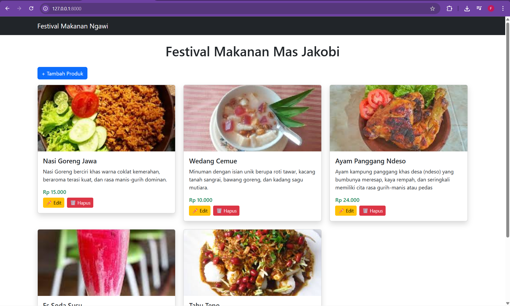
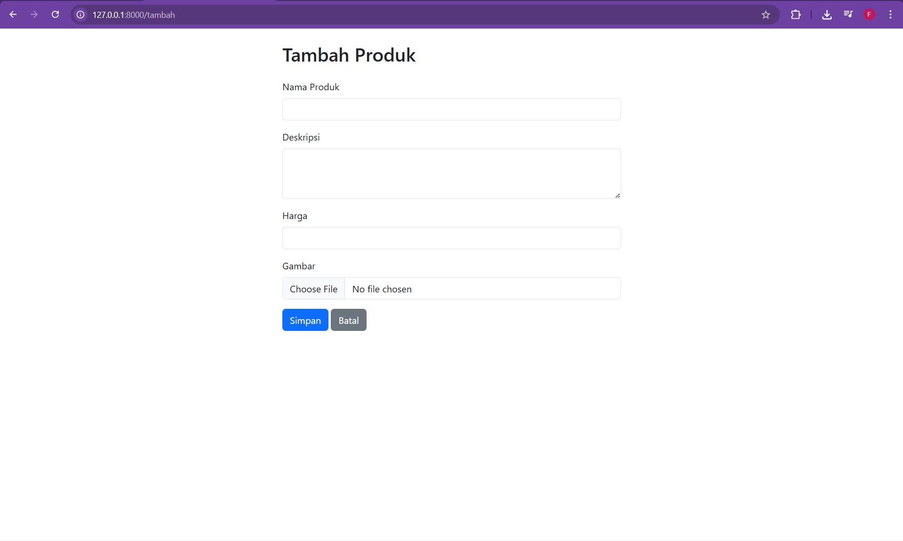
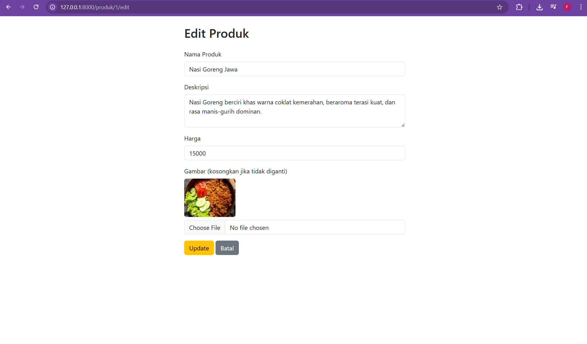
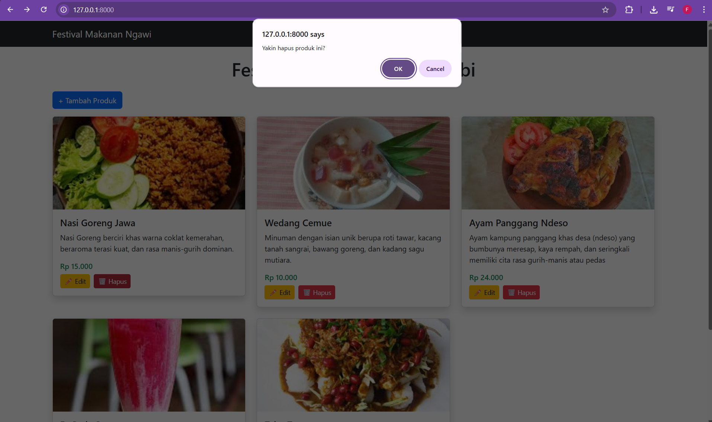

<div align="center">
  <br />
  <h1>LAPORAN PRAKTIKUM <br> APLIKASI BERBASIS PLATFORM </h1>
  <br />
  <h3>MODUL 10-11-12 <br> LARAVEL DAN DATABASE </h3>
  <br />
  
  <br />
  <br />
  <br />
  <h3>Disusun Oleh :</h3>
  <p>
    <strong>Fitri Kusumaningtyas</strong>
    <br>
    <strong>2311102068</strong>
    <br>
    <strong>S1 IF-11-REG05</strong>
  </p>
  <br />
  <h3>Dosen Pengampu :</h3>
  <p>
    <strong>Dedi Agung Prabowo, S.Kom., M.Kom</strong>
  </p>
  <br />
  <br />
  <h4>Asisten Praktikum :</h4>
  <strong>Apri Pandu Wicaksono </strong>
  <br>
  <strong>Hamka Zaenul Ardi</strong>
  <br />
  <h3>LABORATORIUM HIGH PERFORMANCE <br>FAKULTAS INFORMATIKA <br>UNIVERSITAS TELKOM PURWOKERTO <br>2026 </h3>
</div>

<hr>

## Dasar Teori

Laravel adalah framework PHP berbasis arsitektur MVC (Model-View-Controller) yang digunakan untuk mempercepat, terstruktur, dan efektif pengembangan aplikasi web. Laravel memiliki banyak fitur bawaan, termasuk routing, middleware, autentikasi, dan ORM (Object-Relational Mapping) Eloquent. Sehingga memudahkan aplikasi berinteraksi dengan database tanpa harus menulis query SQL secara langsung. Karena mampu meningkatkan produktivitas pengembang sekaligus menjaga kualitas kode, Laravel banyak digunakan untuk membangun aplikasi web modern karena memiliki sintaks yang elegan dan dokumentasi yang lengkap.

Database adalah kumpulan data yang disusun secara sistematis dan disimpan sehingga dapat diakses, dikelola, dan diperbarui dengan mudah. Ini penting untuk pengembangan aplikasi web karena dapat menyimpan informasi pengguna, transaksi, dan konten lainnya. Integrasi Laravel dan database memungkinkan pengolahan data yang lebih efisien, aman, dan terstruktur dalam aplikasi. Laravel juga mendukung berbagai jenis database seperti MySQL, PostgreSQL, dan SQLite, serta menawarkan fitur migration, seeding, dan query builder.

## TASK FESTIVAL NGAWI

## Code web.php

``` php
<?php

use Illuminate\Support\Facades\Route;
use App\Http\Controllers\ProdukController;

Route::get('/',                     [ProdukController::class, 'index']);
Route::get('/tambah',               [ProdukController::class, 'create']);
Route::post('/produk',              [ProdukController::class, 'store']);
Route::get('/produk/{id}/edit',     [ProdukController::class, 'edit']);
Route::put('/produk/{id}',          [ProdukController::class, 'update']);
Route::delete('/produk/{id}',       [ProdukController::class, 'destroy']);
Route::get('/produk/gambar/{id}',   [ProdukController::class, 'showGambar'])->name('produk.gambar');
```
## Code ProductController.php

``` php
<?php

namespace App\Http\Controllers;

use App\Models\Produk;
use Illuminate\Http\Request;

class ProdukController extends Controller
{
    // READ 
    public function index()
    {
        $produk = Produk::all();
        return view('produk.index', compact('produk'));
    }

    // CREATE 
    public function create()
    {
        return view('produk.tambah');
    }

    public function store(Request $request)
    {
        $request->validate([
            'nama_produk' => 'required',
            'deskripsi'   => 'required',
            'harga'       => 'required|numeric',
            'gambar'      => 'nullable|image',
        ]);

        $gambar = null;
        if ($request->hasFile('gambar')) {
            $gambar = file_get_contents($request->file('gambar')->getRealPath());
        }

        Produk::create([
            'nama_produk' => $request->nama_produk,
            'deskripsi'   => $request->deskripsi,
            'harga'       => $request->harga,
            'gambar'      => $gambar,
        ]);

        return redirect('/')->with('success', 'Produk berhasil ditambahkan!');
    }

    // EDIT 
    public function edit($id)
    {
        $produk = Produk::findOrFail($id);
        return view('produk.edit', compact('produk'));
    }

    // UPDATE 
    public function update(Request $request, $id)
    {
        $request->validate([
            'nama_produk' => 'required',
            'deskripsi'   => 'required',
            'harga'       => 'required|numeric',
            'gambar'      => 'nullable|image',
        ]);

        $produk = Produk::findOrFail($id);

        $gambar = $produk->gambar; // tetap pakai gambar lama
        if ($request->hasFile('gambar')) {
            $gambar = file_get_contents($request->file('gambar')->getRealPath());
        }

        $produk->update([
            'nama_produk' => $request->nama_produk,
            'deskripsi'   => $request->deskripsi,
            'harga'       => $request->harga,
            'gambar'      => $gambar,
        ]);

        return redirect('/')->with('success', 'Produk berhasil diupdate!');
    }

    // DELETE 
    public function destroy($id)
    {
        Produk::findOrFail($id)->delete();
        return redirect('/')->with('success', 'Produk berhasil dihapus!');
    }

    public function showGambar($id)
    {
        $produk = Produk::findOrFail($id);

        if (!$produk->gambar) {
            abort(404);
        }

        $finfo = new \finfo(FILEINFO_MIME_TYPE);
        $mimeType = $finfo->buffer($produk->gambar);

        return response($produk->gambar)
            ->header('Content-Type', $mimeType);
    }
}
```
## Code index.blade.php

``` html
<!DOCTYPE html>
<html>
<head>
    <title>Festival Makanan</title>
    <link href="https://cdn.jsdelivr.net/npm/bootstrap@5.3.0/dist/css/bootstrap.min.css" rel="stylesheet">
</head>
<body>

<nav class="navbar navbar-dark bg-dark mb-4">
    <div class="container">
        <span class="navbar-brand">Festival Makanan Ngawi</span>
    </div>
</nav>

<div class="container mt-4">
    <h1 class="text-center mb-4">Festival Makanan Mas Jakobi</h1>

    @if(session('success'))
        <div class="alert alert-success">{{ session('success') }}</div>
    @endif

    <a href="/tambah" class="btn btn-primary mb-3">+ Tambah Produk</a>

    <div class="row">
        @foreach($produk as $p)
        <div class="col-md-4">
            <div class="card mb-4 shadow">

                @if($p->gambar)
                    id) }}"
                         alt="{{ $p->nama_produk }}"
                         class="card-img-top"
                         style="height:200px; object-fit:cover;">
                @else
                    
                @endif

                <div class="card-body">
                    <h5 class="card-title">{{ $p->nama_produk }}</h5>
                    <p class="card-text">{{ $p->deskripsi }}</p>
                    <h6 class="text-success">Rp {{ number_format($p->harga, 0, ',', '.') }}</h6>

                    <div class="d-flex gap-2 mt-2">
                        <a href="/produk/{{ $p->id }}/edit" class="btn btn-warning btn-sm">✏️ Edit</a>

                        <form action="/produk/{{ $p->id }}" method="POST">
                            @csrf
                            @method('DELETE')
                            <button type="submit" class="btn btn-danger btn-sm"
                                onclick="return confirm('Yakin hapus produk ini?')">
                                🗑️ Hapus
                            </button>
                        </form>
                    </div>
                </div>

            </div>
        </div>
        @endforeach
    </div>
</div>

</body>
</html>
```
## Code tambah.blade.php
``` php
<!DOCTYPE html>
<html>
<head>
    <title>Tambah Produk</title>
    <link href="https://cdn.jsdelivr.net/npm/bootstrap@5.3.0/dist/css/bootstrap.min.css" rel="stylesheet">
</head>
<body>

<div class="container mt-4" style="max-width:600px">
    <h2 class="mb-4">Tambah Produk</h2>

    <form action="/produk" method="POST" enctype="multipart/form-data">
        @csrf

        <div class="mb-3">
            <label class="form-label">Nama Produk</label>
            <input type="text" name="nama_produk" class="form-control" required>
        </div>

        <div class="mb-3">
            <label class="form-label">Deskripsi</label>
            <textarea name="deskripsi" class="form-control" rows="3" required></textarea>
        </div>

        <div class="mb-3">
            <label class="form-label">Harga</label>
            <input type="number" name="harga" class="form-control" required>
        </div>

        <div class="mb-3">
            <label class="form-label">Gambar</label>
            <input type="file" name="gambar" class="form-control" accept="image/*">
        </div>

        <button type="submit" class="btn btn-primary">Simpan</button>
        <a href="/" class="btn btn-secondary">Batal</a>
    </form>
</div>

</body>
</html>
```
## Code edit.blade.php
``` php
<!DOCTYPE html>
<html>
<head>
    <title>Edit Produk</title>
    <link href="https://cdn.jsdelivr.net/npm/bootstrap@5.3.0/dist/css/bootstrap.min.css" rel="stylesheet">
</head>
<body>

<div class="container mt-4" style="max-width:600px">
    <h2 class="mb-4">Edit Produk</h2>

    <form action="/produk/{{ $produk->id }}" method="POST" enctype="multipart/form-data">
        @csrf
        @method('PUT')

        <div class="mb-3">
            <label class="form-label">Nama Produk</label>
            <input type="text" name="nama_produk" class="form-control" 
                   value="{{ $produk->nama_produk }}" required>
        </div>

        <div class="mb-3">
            <label class="form-label">Deskripsi</label>
            <textarea name="deskripsi" class="form-control" rows="3" required>{{ $produk->deskripsi }}</textarea>
        </div>

        <div class="mb-3">
            <label class="form-label">Harga</label>
            <input type="number" name="harga" class="form-control" 
                   value="{{ $produk->harga }}" required>
        </div>

        <div class="mb-3">
            <label class="form-label">Gambar (kosongkan jika tidak diganti)</label>
            @if($produk->gambar)
                <div class="mb-2">
                    id) }}" 
                         style="height:100px; object-fit:cover;" class="rounded">
                </div>
            @endif
            <input type="file" name="gambar" class="form-control" accept="image/*">
        </div>

        <button type="submit" class="btn btn-warning">Update</button>
        <a href="/" class="btn btn-secondary">Batal</a>
    </form>
</div>

</body>
</html>
```
## Code create.blade.php
``` php
<h1>Tambah Produk</h1>

<form method="POST" action="/produk">
@csrf
<input type="text" name="nama_produk" placeholder="Nama Produk"><br>
<textarea name="deskripsi" placeholder="Deskripsi"></textarea><br>
<input type="number" name="harga" placeholder="Harga"><br>
<input type="text" name="gambar" placeholder="Nama gambar"><br>
<button type="submit">Simpan</button>
</form>
```
## Code Product.php
``` php
<?php

namespace App\Models;

use Illuminate\Database\Eloquent\Model;

class Produk extends Model
{
    protected $table = 'produks';
    protected $fillable = ['nama_produk', 'deskripsi', 'harga', 'gambar'];
}
```


### Screenshot Output





### Penjelasan Code

Kode program Laravel di atas membangun sebuah aplikasi sederhana untuk manajemen data produk pada “Festival Makanan Ngawi” dengan menerapkan konsep CRUD (Create, Read, Update, Delete). Pada file web.php, didefinisikan beberapa route yang menghubungkan URL dengan method di dalam ProdukController, seperti menampilkan data (`index`), menambah (`create`, `store`), mengedit (`edit`, `update`), menghapus (`destroy`), serta menampilkan gambar (`showGambar`). Controller kemudian mengatur logika aplikasi, di mana data produk diambil dari database menggunakan model Produk (Eloquent ORM). Saat menambah atau mengedit data, dilakukan validasi input (nama, deskripsi, harga, dan gambar), lalu data disimpan ke database. Khusus gambar, file dikonversi menjadi bentuk binary menggunakan `file_get_contents()` agar dapat disimpan langsung di database, dan ditampilkan kembali melalui response dengan MIME type yang sesuai.

Pada bagian tampilan (Blade), index.blade.php berfungsi menampilkan seluruh data produk dalam bentuk card menggunakan Bootstrap, lengkap dengan gambar, nama, deskripsi, harga, serta tombol edit dan hapus seperti pada hasil output yang ditampilkan. Jika gambar tidak tersedia, maka akan ditampilkan placeholder. File tambah.blade.php dan edit.blade.php digunakan sebagai form input untuk menambah dan mengubah data produk, dengan dukungan upload gambar. Model Produk.php berperan sebagai penghubung ke tabel database (`produks`) dan menentukan field yang boleh diisi (`fillable`). Secara keseluruhan, integrasi antara route, controller, model, dan view ini menghasilkan aplikasi web dinamis yang mampu mengelola data produk makanan secara lengkap dan interaktif sesuai tampilan yang dihasilkan.
