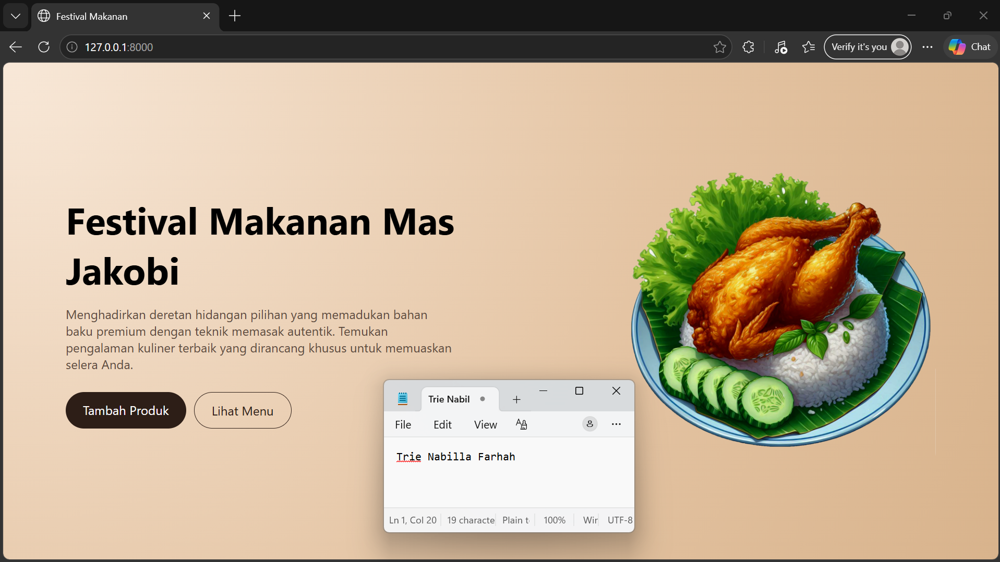
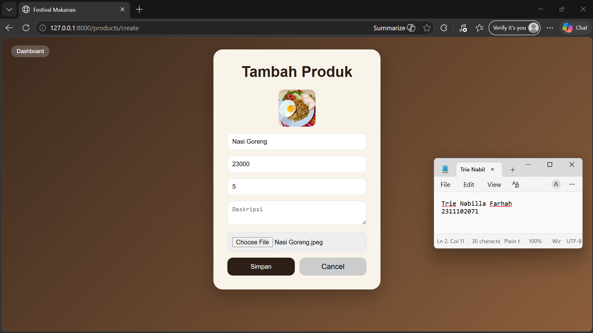
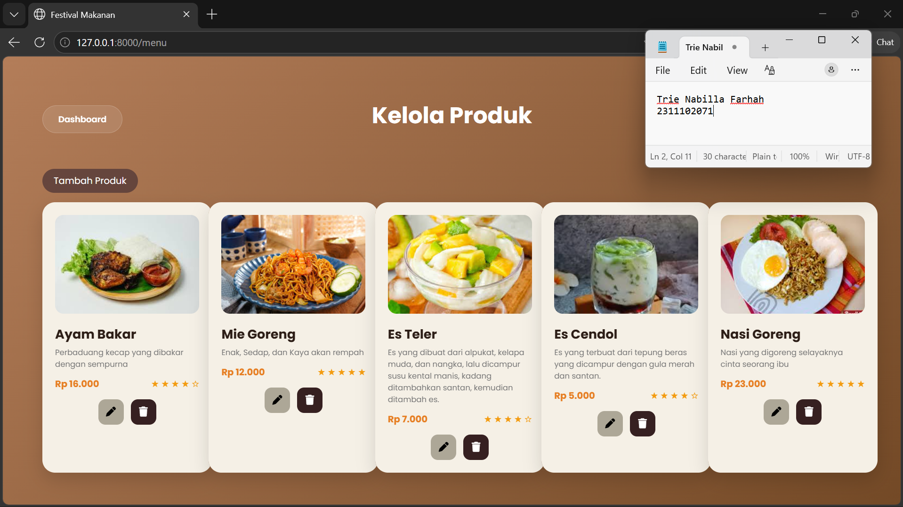
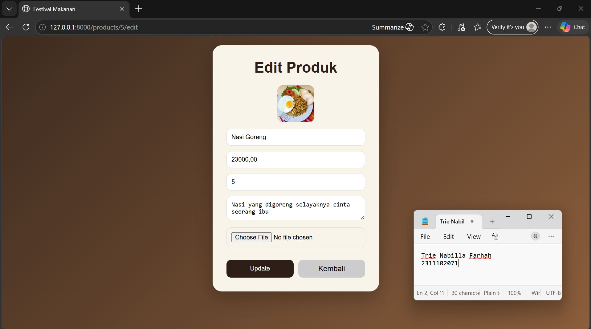
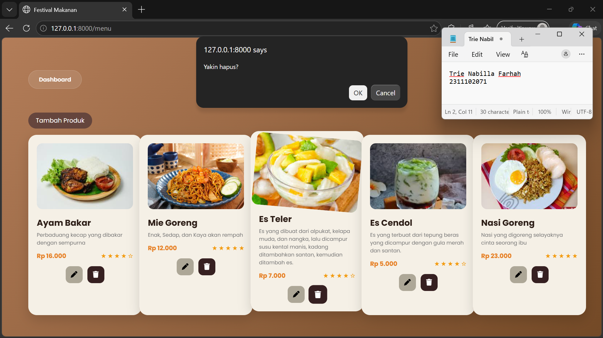
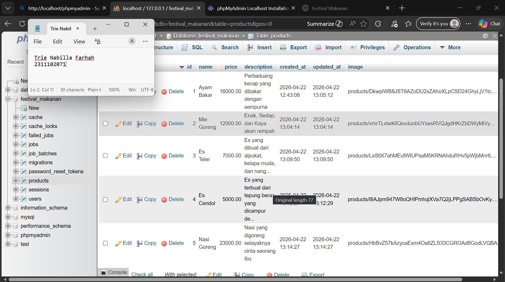

<div align="center">
  <br />
  <h1>LAPORAN PRAKTIKUM <br> APLIKASI BERBASIS PLATFORM </h1>
  <br />
  <h3>MODUL 10-11-12 <br> LARAVEL DAN DATABASE </h3>
  <br />
  
  <br />
  <br />
  <br />
  <h3>Disusun Oleh :</h3>
  <p>
    <strong>Trie Nabilla Farhah</strong>
    <br>
    <strong>2311102071</strong>
    <br>
    <strong>S1 IF-11-REG05</strong>
  </p>
  <br />
  <h3>Dosen Pengampu :</h3>
  <p>
    <strong>Dedi Agung Prabowo, S.Kom., M.Kom</strong>
  </p>
  <br />
  <br />
  <h4>Asisten Praktikum :</h4>
  <strong>Apri Pandu Wicaksono </strong>
  <br>
  <strong>Hamka Zaenul Ardi</strong>
  <br />
  <h3>LABORATORIUM HIGH PERFORMANCE <br>FAKULTAS INFORMATIKA <br>UNIVERSITAS TELKOM PURWOKERTO <br>2026 </h3>
</div>

<hr>

## Dasar Teori

Laravel adalah framework PHP open-source yang digunakan untuk membangun aplikasi web dengan struktur yang rapi, efisien, dan mudah dikembangkan. Laravel mengikuti pola arsitektur MVC (Model-View-Controller), yang memisahkan logika aplikasi, tampilan, dan pengelolaan data sehingga kode lebih terorganisir dan mudah dipelihara. Framework ini dirancang untuk mempermudah proses pengembangan dengan menyediakan berbagai fitur bawaan seperti routing, middleware, dan sistem template.

Salah satu keunggulan Laravel adalah fitur-fiturnya yang lengkap dan modern, seperti Eloquent ORM untuk pengelolaan database secara object-oriented, Blade Template Engine untuk membuat tampilan yang dinamis, serta sistem autentikasi yang sudah tersedia. Laravel juga mendukung migration dan seeding database, sehingga memudahkan pengembang dalam mengelola struktur database dan data awal aplikasi. Selain itu, Laravel memiliki sistem routing yang sederhana namun powerful untuk mengatur alur request dan response dalam aplikasi.

Laravel juga memiliki ekosistem yang kuat dan komunitas yang besar, sehingga banyak tersedia dokumentasi, tutorial, dan package tambahan. Framework ini mendukung praktik pengembangan modern seperti RESTful API, queue, dan caching untuk meningkatkan performa aplikasi. Dengan kemudahan penggunaan dan fitur yang lengkap, Laravel menjadi salah satu framework PHP paling populer untuk membangun aplikasi web skala kecil hingga enterprise.

## Tugas Restoran Mas Jakobi 

## Code web.php

```
<?php

use Illuminate\Support\Facades\Route;
use App\Http\Controllers\ProductController;
use App\Models\Product;

Route::get('/', [ProductController::class, 'index']);
Route::resource('products', ProductController::class);
Route::get('/menu', function () {
    $products = Product::all();
    return view('products.menu', compact('products'));
});
```
## Code ProductController.php

```
<?php

namespace App\Http\Controllers;

use App\Models\Product;
use Illuminate\Http\Request;

class ProductController extends Controller
{
    public function index()
    {
        $products = Product::all();
        return view('products.index', compact('products'));
    }

    public function create()
    {
        return view('products.create');
    }

    public function store(Request $request)
{
    $data = $request->all();

    if ($request->hasFile('image')) {
        $data['image'] = $request->file('image')->store('products', 'public');
    }

    Product::create($data);

    return redirect('/menu');
}

    public function show(Product $product)
    {
        return view('products.show', compact('product'));
    }

    public function edit(Product $product)
    {
        return view('products.edit', compact('product'));
    }

    public function update(Request $request, Product $product)
    {
        $data = $request->all();

        if ($request->hasFile('image')) {
            $data['image'] = $request->file('image')->store('products', 'public');
        } else {
            $data['image'] = $product->image;
        }

        $product->update($data);

        return redirect('/menu');
    }

        public function destroy(Product $product)
    {
        $product->delete();
        return redirect('/menu')->with('success', 'Produk berhasil dihapus');
    }
}
```
## Code index.blade.php

```
@extends('layouts.app')

@section('content')

<style>
    .hero {
        width: 100%;
        height: 100vh;
        display: flex;
        align-items: center;
        justify-content: space-between;
        padding: 80px;

        background: radial-gradient(circle at top left, #f8e8d8, #e4c4a3 60%, #d8b38c);
    }

    .hero-text {
        max-width: 500px;
    }

    .hero-text h1 {
        font-size: 48px;
        margin-bottom: 15px;
    }

    .hero-text p {
        font-size: 16px;
        color: #5c4a3d;
        margin-bottom: 25px;
    }

    .btn-dark {
        padding: 12px 22px;
        border-radius: 25px;
        background: #2d1e17;
        color: white;
        display: inline-block;
    }

    .hero img {
        width: 400px;
        border-radius: 20px;
    }

    .section {
        padding: 60px 80px;
    }

    .grid {
        display: grid;
        grid-template-columns: repeat(auto-fill, minmax(260px, 1fr));
        gap: 20px;
    }

    .card {
        background: white;
        border-radius: 16px;
        padding: 20px;
        box-shadow: 0 6px 20px rgba(0,0,0,0.05);
        transition: 0.2s;
    }

    .card:hover {
        transform: translateY(-6px);
    }

    .price {
        font-weight: bold;
        margin: 10px 0;
    }

    .actions a {
        margin-right: 10px;
        font-size: 14px;
    }

    .delete-btn {
        border: none;
        background: #e84118;
        color: white;
        padding: 6px 10px;
        border-radius: 6px;
        cursor: pointer;
    }
</style>

<!-- HERO FULL -->
<div class="hero">
    <div class="hero-text">
        <h1>Festival Makanan Mas Jakobi</h1>
        <p>Menghadirkan deretan hidangan pilihan yang memadukan bahan baku premium dengan teknik memasak autentik. Temukan pengalaman kuliner terbaik yang dirancang khusus untuk memuaskan selera Anda.</p>

        <div class="buttons">
    <a href="/products/create" class="btn-dark">Tambah Produk</a>
    <a href="/menu" class="btn-outline">Lihat Menu</a>
</div>
    </div>

    
</div>


@endsection
```
## Code Product.php

```
<?php

namespace App\Models;

use Illuminate\Database\Eloquent\Model;

class Product extends Model
{
    protected $fillable = [
    'name',
    'price',
    'description',
    'rating',
    'image'
];
}
```


### Screenshot Output







### Penjelasan Code

Aplikasi festival makanan ini dibangun menggunakan framework Laravel dengan konsep MVC (Model, View, Controller). Pada bagian Model (`Product.php`), digunakan atribut `protected $fillable = ['name','price','description','rating','image'];` untuk menentukan field yang boleh disimpan ke database. Struktur tabel dibuat melalui migration seperti `$table->string('name');`, `$table->integer('price');`, `$table->text('description');`, `$table->integer('rating')->nullable();`, dan `$table->string('image')->nullable();` sehingga data produk dapat tersimpan dengan lengkap. Database berfungsi sebagai penyimpanan utama yang terhubung dengan aplikasi melalui konfigurasi `.env`.

Pada bagian Controller (`ProductController.php`), logika aplikasi diatur untuk mengelola data produk. Data disimpan menggunakan `Product::create($data);` setelah mengambil input dari request, serta menangani upload gambar dengan kode `if ($request->hasFile('image')) { $data['image'] = $request->file('image')->store('products','public'); }`. Proses update juga memastikan gambar lama tidak hilang dengan kondisi `else { $data['image'] = $product->image; }`, sedangkan penghapusan data dilakukan menggunakan `$product->delete();`. Controller juga bertugas mengirim data ke view menggunakan `return view('products.index', compact('products'));`.

Pada bagian View (Blade), tampilan dibuat dinamis untuk menampilkan data produk. Form input menggunakan `<form action="/products" method="POST" enctype="multipart/form-data">` untuk mendukung upload gambar, sedangkan data ditampilkan dengan looping `@foreach($products as $p)`. Gambar ditampilkan menggunakan `image) }}">`, dan rating ditampilkan secara dinamis menggunakan perulangan `@for ($i = 1; $i <= 5; $i++)` untuk menghasilkan bintang sesuai nilai rating. Dengan demikian, aplikasi ini berhasil mengimplementasikan konsep CRUD secara lengkap, mulai dari input, penyimpanan, hingga penampilan data secara interaktif.
