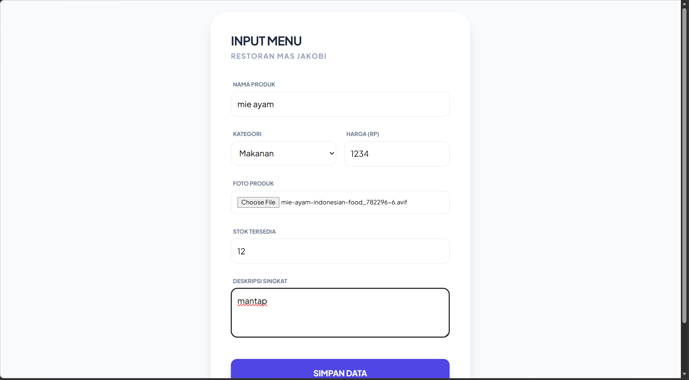
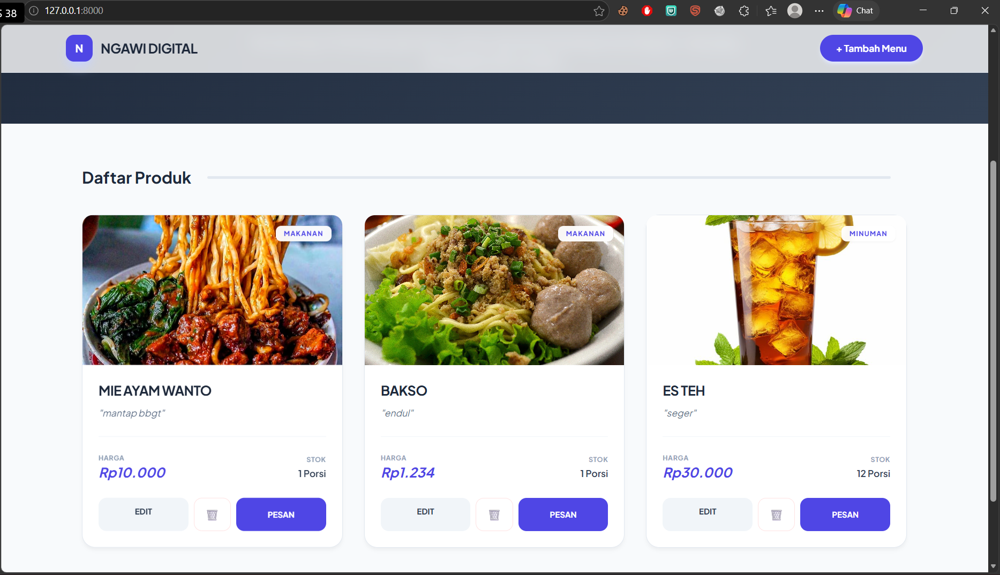
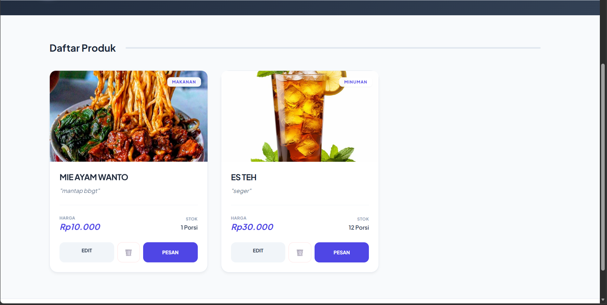

<div align="center">
  <br />
  <h1>LAPORAN PRAKTIKUM <br> APLIKASI BERBASIS PLATFORM </h1>
  <br />
  <h3>MODUL 11 12 13 <br> Laravel dan Database </h3>
  <br />
  
  <br />
  <br />
  <br />
  <h3>Disusun Oleh :</h3>
  <p>
    <strong>Muhammad Zaki Fauzan</strong>
    <br>
    <strong>2311102084</strong>
    <br>
    <strong>S1 IF-11-REG05</strong>
  </p>
  <br />
  <h3>Dosen Pengampu :</h3>
  <p>
    <strong>Dedi Agung Prabowo, S.Kom., M.Kom</strong>
  </p>
  <br />
  <br />
  <h4>Asisten Praktikum :</h4>
  <strong>Apri Pandu Wicaksono </strong>
  <br>
  <strong>Hamka Zaenul Ardi</strong>
  <br />
  <h3>LABORATORIUM HIGH PERFORMANCE <br>FAKULTAS INFORMATIKA <br>UNIVERSITAS TELKOM PURWOKERTO <br>2026 </h3>
</div>

<hr>

# Dasar Teori

1. Dasar Teori Laravel

Laravel adalah kerangka kerja (framework) perangkat lunak open-source berbasis bahasa pemrograman PHP yang mengadopsi pola arsitektur Model-View-Controller (MVC). Arsitektur ini secara tegas memisahkan tiga komponen utama aplikasi: logika pengelolaan data (Model), antarmuka visual yang berinteraksi dengan pengguna (View), dan pusat kendali yang memproses alur kerja sistem (Controller). Tujuan utama Laravel adalah mempercepat dan menyederhanakan proses pengembangan aplikasi web yang kompleks dengan menyediakan alat bantu bawaan—seperti sistem routing, perlindungan keamanan, dan manajemen sesi—sehingga penulisan kode menjadi lebih rapi, terstruktur, dan efisien.

2. Dasar Teori Database

Database adalah kumpulan data atau informasi yang terstruktur, saling berelasi, dan disimpan secara terorganisir di dalam sebuah sistem komputer sehingga dapat diakses, dikelola, dan diperbarui dengan sangat cepat. Dalam ekosistem aplikasi web, sistem manajemen database (seperti MySQL, PostgreSQL, atau SQLite) berfungsi sebagai media penyimpanan permanen (persistent storage). Komponen ini memastikan bahwa semua rekaman vital aplikasi, seperti akun pengguna, katalog produk, hingga riwayat transaksi, tidak hilang ketika aplikasi ditutup atau server dimatikan ulang.


### Source Code

```html
<!DOCTYPE html>
<html>
<head>
    <title>Entry Data</title>
    <script src="https://cdn.tailwindcss.com"></script>
    <style>
        @import url('https://fonts.googleapis.com/css2?family=Plus+Jakarta+Sans:wght@400;600;700&display=swap');
        body { font-family: 'Plus Jakarta Sans', sans-serif; background-color: #f8fafc; }
        input, select, textarea {
            border: 1px solid #e2e8f0 !important;
            border-radius: 12px !important;
            padding: 12px !important;
            width: 100%;
        }
        input:focus { border-color: #4f46e5 !important; outline: none; }
        label { font-size: 11px; font-weight: 700; text-transform: uppercase; color: #64748b; margin-left: 4px; }
    </style>
```

**Kode Lengkap:** [tambah.blade.php](\resources\views\tambah.blade.php)


### Screenshot Output
### 1. Halaman Beranda (Read)
Menampilkan daftar seluruh menu kuliner yang terdaftar di database secara *real-time*.


### 2. Tambah Menu (Create)
Formulir untuk memasukkan data menu makanan/minuman baru beserta unggahan foto produk.


### 3. Edit Menu (Update)
Halaman untuk mengubah informasi produk yang sudah ada, termasuk memperbarui harga, stok, atau mengganti foto.


### 4. Hapus Menu (Delete)
Proses penghapusan data menu dari sistem dan *database*.



### Penjelasan Program
Website ini adalah platform digital "Festival Makanan Mas Jakobi" yang dibangun menggunakan framework Laravel dan database MySQL untuk mengelola serta menampilkan daftar produk UMKM kuliner secara informatif kepada pelanggan. Proyek ini merupakan bagian dari tugas praktikum Aplikasi Berbasis Platform yang bertujuan untuk mendukung program digitalisasi promosi produk lokal dan pengelolaan stok barang.
