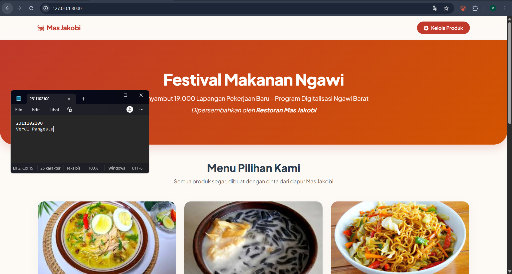
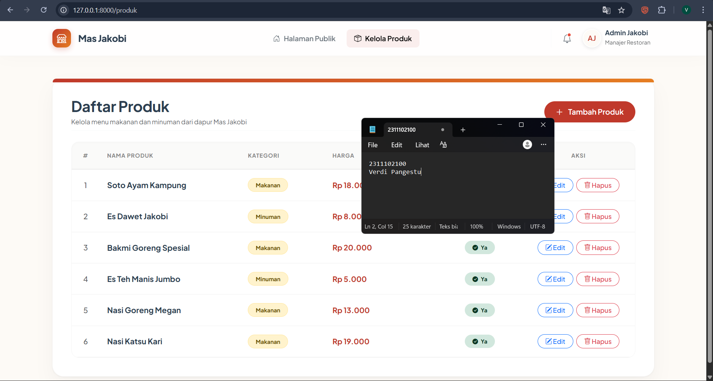
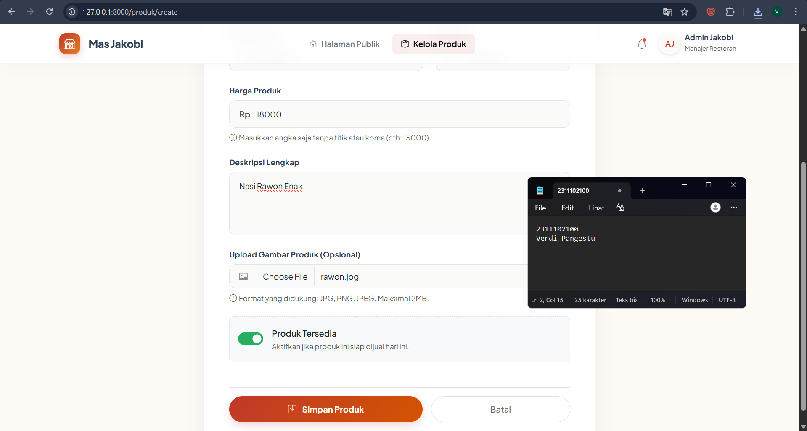
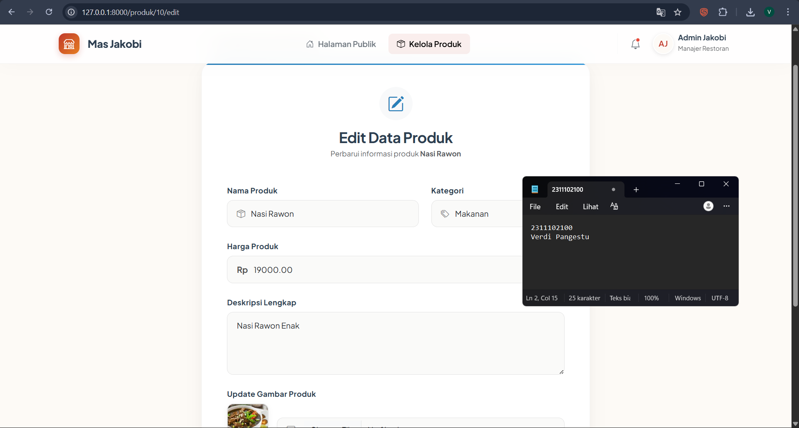
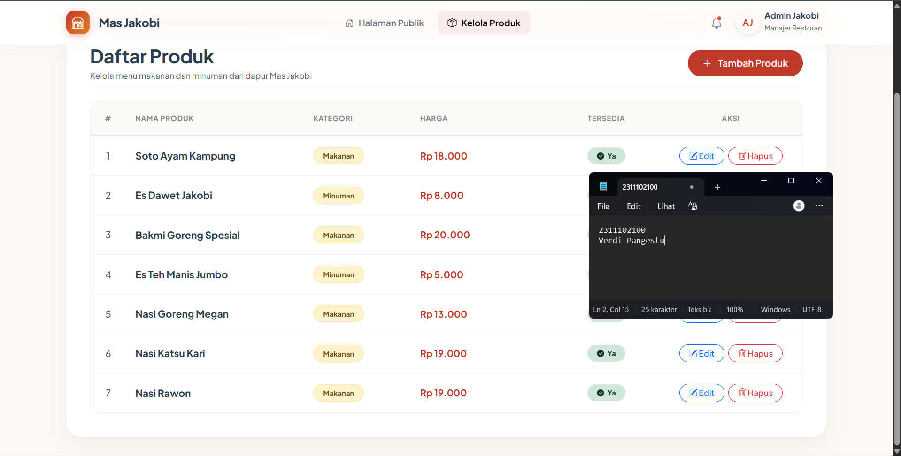
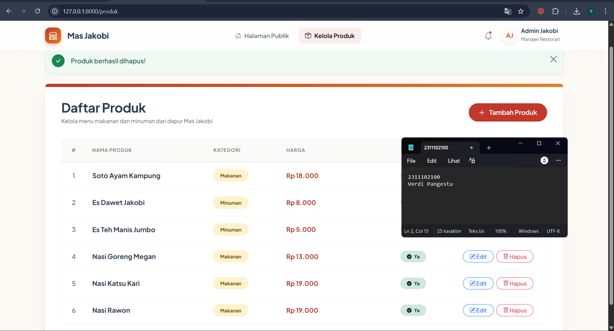

<div align="center">
    <br />
    <h1>LAPORAN PRAKTIKUM <br> APLIKASI BERBASIS PLATFORM</h1>
    <br />
    <h3>MODUL 11, 12, 13 <br> LARAVEL</h3>
    <br />
    
    <br />
    <br />
    <br />
    <h3>Disusun Oleh :</h3>
    <p>
        <strong>Verdi Pangestu</strong>
        <br>
        <strong>2311102100</strong>
        <br>
        <strong>S1 IF-11-REG05</strong>
    </p>
    <br />
    <h3>Dosen Pengampu :</h3>
    <p>
        <strong>Dedi Agung Prabowo, S.Kom., M.Kom</strong>
    </p>
    <br />
    <br />
    <h4>Asisten Praktikum :</h4>
    <strong>Apri Pandu Wicaksono</strong>
    <br>
    <strong>Hamka Zaenul Ardi</strong>
    <br />
    <h3>LABORATORIUM HIGH PERFORMANCE <br> FAKULTAS INFORMATIKA <br> UNIVERSITAS TELKOM PURWOKERTO <br> 2026</h3>
</div>

<hr>

# Dasar Teori

Laravel adalah framework PHP berbasis arsitektur **Model-View-Controller (MVC)** yang dirancang untuk mempermudah pengembangan aplikasi web secara terstruktur, efisien, dan mudah dipelihara. Konsep MVC membagi aplikasi menjadi tiga bagian utama, yaitu **Model** sebagai pengelola data dan interaksi dengan database, **View** sebagai tampilan antarmuka pengguna, serta **Controller** sebagai penghubung antara logika aplikasi dan tampilan. Dengan pola ini, kode program menjadi lebih rapi, terorganisir, dan mudah dikembangkan.

Laravel juga menyediakan sistem **routing** yang berfungsi untuk mengatur jalur akses URL ke controller atau view tertentu. Dalam pengembangan aplikasi web, routing sangat penting karena menentukan halaman mana yang akan ditampilkan saat pengguna mengakses alamat tertentu. Selain itu, Laravel memiliki fitur **Blade Template Engine** yang memudahkan pembuatan tampilan dinamis dengan sintaks yang sederhana namun kuat.

Dalam pengelolaan basis data, Laravel menyediakan fitur **Migration** yang berfungsi sebagai kontrol versi struktur database. Melalui migration, pengembang dapat membuat, mengubah, dan menghapus tabel menggunakan kode PHP tanpa harus menulis perintah SQL secara manual. Untuk manipulasi data, Laravel menggunakan **Eloquent ORM (Object Relational Mapping)** yang memungkinkan tabel database direpresentasikan sebagai objek, sehingga proses tambah, ubah, hapus, dan tampil data menjadi lebih mudah dipahami.

Pada praktikum Modul 11, 12, dan 13 ini, Laravel digunakan untuk membangun aplikasi web **festival makanan** yang menampilkan produk-produk restoran Mas Jakobi. Sistem ini dibuat menggunakan Laravel sebagai framework utama dan MySQL sebagai database penyimpanan data produk. Implementasi ini mencakup pembuatan migration, model, controller, route, view, serta fitur CRUD untuk mengelola data produk.

# Tujuan Praktikum

1. Memahami konsep dasar framework Laravel.
2. Memahami penerapan arsitektur MVC pada Laravel.
3. Mampu membuat koneksi Laravel dengan database MySQL.
4. Mampu membuat tabel database menggunakan migration.
5. Mampu membuat fitur CRUD menggunakan Laravel.
6. Mampu menampilkan data produk pada halaman web.
7. Mampu membangun aplikasi sederhana berbasis Laravel sesuai studi kasus.

# Deskripsi Tugas

Pada tugas Modul 11, 12, dan 13, dibuat sebuah sistem digitalisasi untuk restoran milik **Mas Jakobi** yang berada di **Ngawi Timur**. Restoran tersebut didanai oleh **Jendral Ladesh dari Ngawi Barat**. Dari pendanaan tersebut, Mas Jakobi diminta untuk mendukung program digitalisasi sebagai bagian dari program kerja di Ngawi Barat agar terlaksana **19.000 lapangan pekerjaan**.

Bentuk realisasi digitalisasi tersebut adalah pembuatan **website festival makanan** yang menampilkan berbagai produk dari restoran Mas Jakobi. Produk-produk tersebut ditampilkan di halaman depan website beserta informasi penting, seperti:

- Nama produk
- Harga produk
- Deskripsi produk
- Kategori produk
- Stok produk
- Status ketersediaan produk
- Gambar produk

Aplikasi dibangun menggunakan:

- **Framework Laravel**
- **Database MySQL**

# Analisis Kebutuhan Sistem

## Kebutuhan Fungsional

Sistem yang dibangun harus mampu:

1. Menampilkan daftar produk pada halaman utama.
2. Menampilkan detail produk makanan.
3. Menambahkan data produk baru.
4. Mengubah data produk.
5. Menghapus data produk.
6. Menyimpan seluruh data produk ke database MySQL.
7. Mengunggah gambar produk.

## Kebutuhan Non-Fungsional

Sistem yang dibangun harus:

1. Menggunakan framework Laravel.
2. Menggunakan database MySQL.
3. Memiliki tampilan antarmuka yang sederhana dan mudah digunakan.
4. Memiliki struktur kode yang rapi dan terorganisir.
5. Dapat dijalankan pada localhost menggunakan XAMPP dan VS Code.

# Tools dan Teknologi

- **Framework**: Laravel
- **Bahasa Pemrograman**: PHP
- **Database**: MySQL
- **Text Editor**: Visual Studio Code
- **Server Lokal**: XAMPP
- **Template Engine**: Blade
- **Versioning Database**: Migration
- **ORM**: Eloquent

# Struktur Database

Database yang digunakan bernama:

```sql
festival_makanan
```
# Screenshot Output

#### Halaman Publik
1. **Beranda.png** - Tampilan beranda.


2. **Kelola Produk.png** - Tampilan kelola produk.


3. **Tambah Produk.png** - Tampilan halaman tambah produk.


4. **Edit Porduk.png** - Tampilan halaman edit produk.


5. **Hasil Tambah Edit Porduk.png** - Tampilan halaman edit produk.


6. **Hapus Produk.png** - Tampilan halaman hasil hapus produk es teh.
