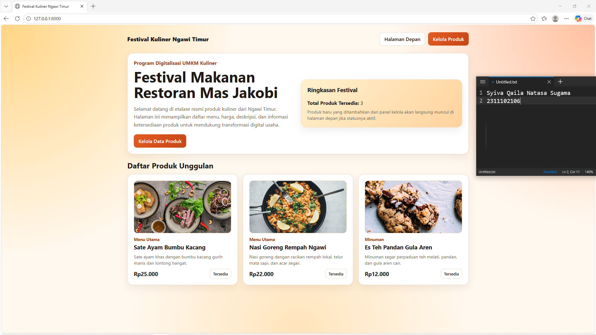
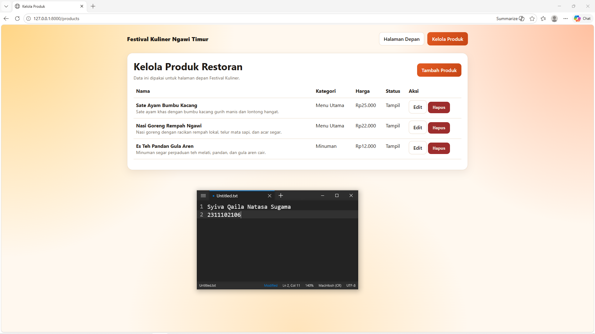
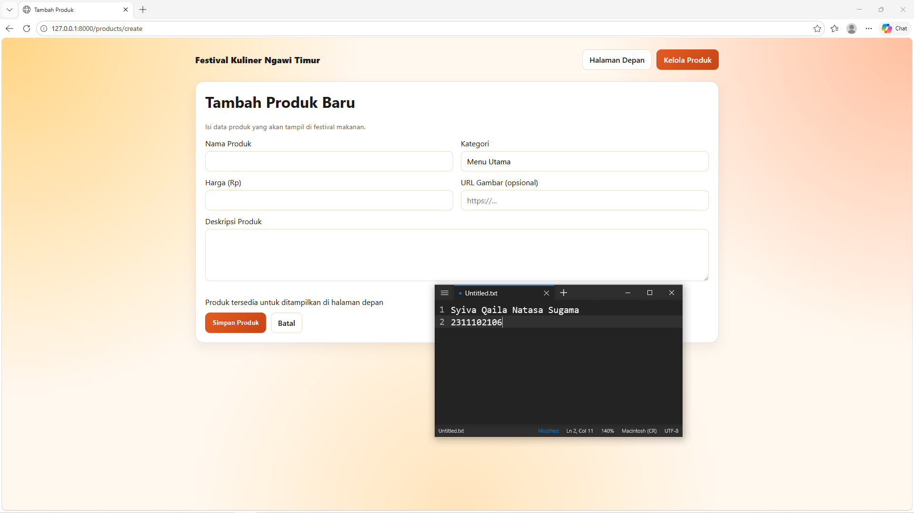
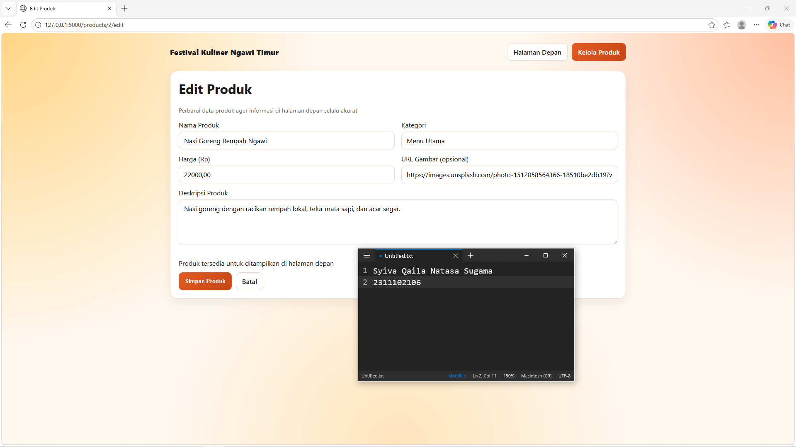

<div align="center">
  <br />
  <h1>LAPORAN PRAKTIKUM <br> APLIKASI BERBASIS PLATFORM </h1>
  <br />
  <h3>MODUL 11 12 13 <br> Laravel dan Database </h3>
  <br />
  
  <br />
  <br />
  <br />
  <h3>Disusun Oleh :</h3>
  <p>
    <strong>Syiva Qaila Natasa Sugama</strong>
    <br>
    <strong>2311102106</strong>
    <br>
    <strong>S1 IF-11-REG05</strong>
  </p>
  <br />
  <h3>Dosen Pengampu :</h3>
  <p>
    <strong>Dedi Agung Prabowo, S.Kom., M.Kom</strong>
  </p>
  <br />
  <br />
  <h4>Asisten Praktikum :</h4>
  <strong>Apri Pandu Wicaksono </strong>
  <br>
  <strong>Hamka Zaenul Ardi</strong>
  <br />
  <h3>LABORATORIUM HIGH PERFORMANCE <br>FAKULTAS INFORMATIKA <br>UNIVERSITAS TELKOM PURWOKERTO <br>2026 </h3>
</div>

<hr>

# Dasar Teori

Dasar Teori Laravel dan Database
Laravel adalah framework pengembangan web berbasis PHP yang menggunakan arsitektur Model-View-Controller (MVC) untuk memisahkan logika bisnis, tampilan, dan manajemen data. Framework ini dirancang untuk meningkatkan produktivitas pengembang melalui sintaks yang ekspresif dan elegan, serta menyediakan berbagai fitur bawaan seperti sistem routing, autentikasi, dan template engine bernama Blade. Dengan Laravel, proses pengembangan aplikasi yang kompleks menjadi lebih terstruktur, aman, dan mudah untuk dipelihara dalam jangka panjang.

Dalam ekosistem Laravel, pengelolaan database menjadi sangat efisien berkat adanya Eloquent ORM (Object-Relational Mapping). Eloquent memungkinkan pengembang untuk berinteraksi dengan tabel database menggunakan sintaks pemrograman berorientasi objek daripada menulis query SQL mentah secara manual. Selain itu, Laravel menyediakan fitur Migrations yang berfungsi sebagai kontrol versi untuk database, memungkinkan tim pengembang untuk membagikan dan mengubah skema basis data secara konsisten tanpa harus melakukan ekspor-impor file SQL secara manual.

Hubungan antara Laravel dan database sering kali dijembatani oleh file konfigurasi .env yang mendukung berbagai sistem manajemen basis data seperti MySQL, PostgreSQL, SQLite, dan SQL Server. Integrasi ini didukung oleh sistem keamanan yang kuat, termasuk perlindungan terhadap serangan SQL Injection melalui penggunaan prepared statements secara otomatis. Kombinasi antara kemudahan skema migrasi dan kecanggihan Eloquent menjadikan Laravel salah satu pilihan utama untuk membangun aplikasi web yang membutuhkan pengolahan data yang intensif dan reliabel.


### Source Code

```php
<!DOCTYPE html>
<html lang="id">
<head>
    <meta charset="UTF-8">
    <meta name="viewport" content="width=device-width, initial-scale=1.0">
    <title>@yield('title', 'Festival Kuliner Ngawi')</title>
    <style>
        :root {
            --bg: #fff8ef;
            --paper: #ffffff;
            --text: #1f1a16;
            --muted: #6d5e52;
            --accent: #e35b22;
            --accent-2: #ffcf4a;
            --line: #eadac8;
            --danger: #9d2d2d;
        }

        * {
            box-sizing: border-box;
        }

        body {
            margin: 0;
            font-family: "Segoe UI", Tahoma, Geneva, Verdana, sans-serif;
            color: var(--text);
            background:
                radial-gradient(circle at 0% 0%, #ffd585 0%, transparent 35%),
                radial-gradient(circle at 100% 0%, #ffc0a0 0%, transparent 30%),
                radial-gradient(circle at 50% 100%, #ffe4bb 0%, transparent 40%),
                var(--bg);
            min-height: 100vh;
        }

        .container {
            width: min(1100px, 92%);
            margin: 0 auto;
            padding: 24px 0 56px;
        }

```

**Kode Lengkap:** [app.blade.php](/resources/views/layouts/app.blade.php)

```php
@csrf

<div class="grid cols-2">
    <div class="field">
        <label for="name">Nama Produk</label>
        <input id="name" type="text" name="name" value="{{ old('name', $product->name ?? '') }}" required>
        @error('name')<p class="error">{{ $message }}</p>@enderror
    </div>

    <div class="field">
        <label for="category">Kategori</label>
        <input id="category" type="text" name="category" value="{{ old('category', $product->category ?? 'Menu Utama') }}" required>
        @error('category')<p class="error">{{ $message }}</p>@enderror
    </div>
</div>

```

**Kode Lengkap:** [_form.blade.php](/resources/views/products/_form.blade.php)


```php
@extends('layouts.app')

@section('title', 'Tambah Produk')

@section('content')
    <section class="card">
        <h1 style="margin-top: 0;">Tambah Produk Baru</h1>
        <p class="help">Isi data produk yang akan tampil di festival makanan.</p>

        <form action="{{ route('products.store') }}" method="POST">
            @include('products._form')
        </form>
    </section>
@endsection


```

**Kode Lengkap:** [create.blade.php](/resources/views/products/create.blade.php)

```php
@extends('layouts.app')

@section('title', 'Edit Produk')

@section('content')
    <section class="card">
        <h1 style="margin-top: 0;">Edit Produk</h1>
        <p class="help">Perbarui data produk agar informasi di halaman depan selalu akurat.</p>

        <form action="{{ route('products.update', $product) }}" method="POST">
            @method('PUT')
            @include('products._form')
        </form>
    </section>
@endsection
```

**Kode Lengkap:** [edit.blade.php](/resources/views/products/edit.blade.php)

```php
@extends('layouts.app')

@section('title', 'Kelola Produk')

@section('content')
    <section class="card">
        <div class="topbar" style="margin-bottom: 10px;">
            <div>
                <h1 style="margin: 0 0 6px;">Kelola Produk Restoran</h1>
                <p class="help" style="margin: 0;">Data ini dipakai untuk halaman depan Festival Kuliner.</p>
            </div>
            <a class="btn primary" href="{{ route('products.create') }}">Tambah Produk</a>
        </div>

        @if (session('success'))
            <div class="alert">{{ session('success') }}</div>
        @endif
```

**Kode Lengkap:** [index.blade.php](/resources/views/products/index.blade.php)


### Screenshot Output

Tampilan beranda/landing page aplikasi Festival Kuliner Ngawi Timur.






### Penjelasan Program
Website ini merupakan aplikasi berbasis framework Laravel bertema Festival Kuliner Ngawi yang berfungsi untuk menampilkan profil restoran serta mengelola daftar produk kulinernya melalui sistem CRUD. Sistem ini terintegrasi langsung dengan database untuk memudahkan pengguna dalam menambah, mengedit, atau menghapus menu makanan yang akan tampil pada halaman utama.
