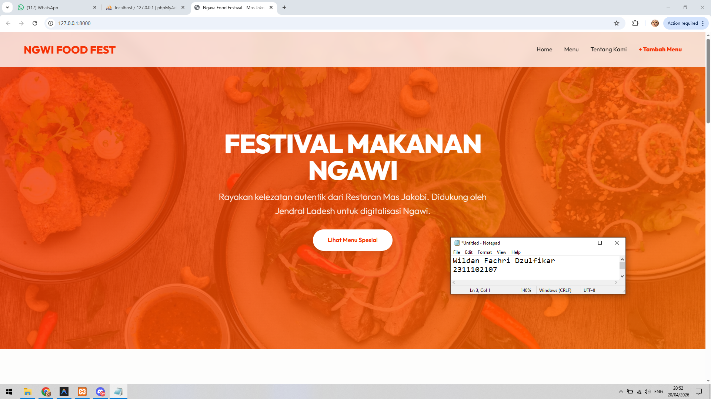
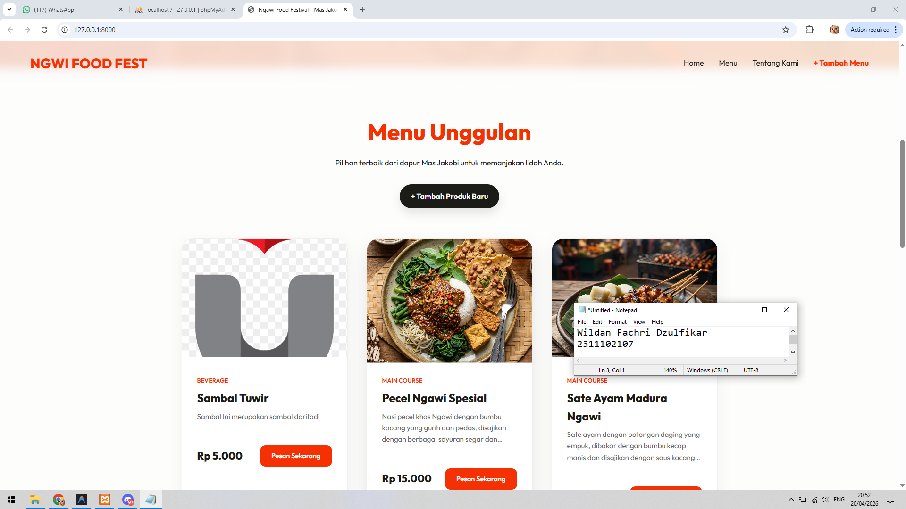
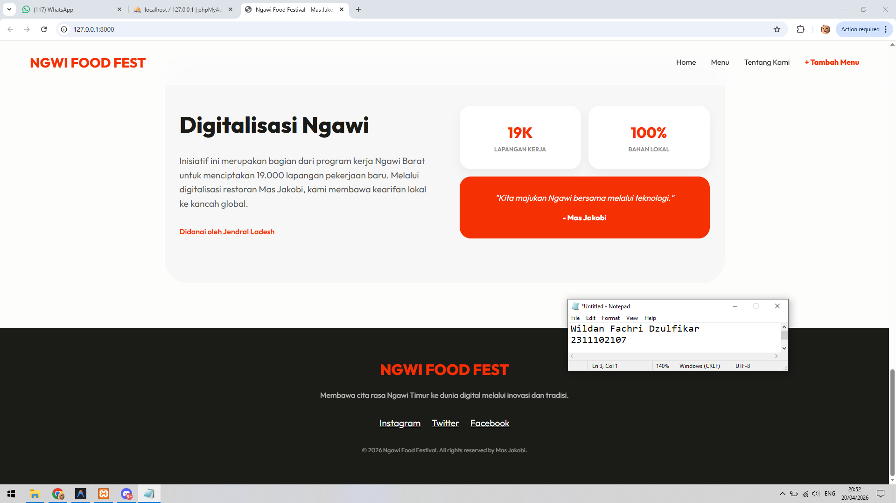
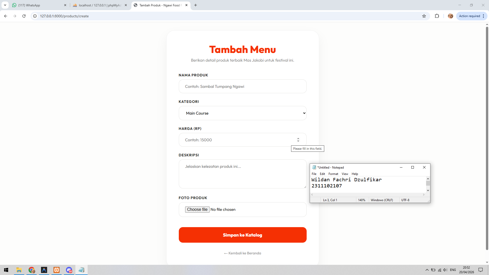

<div align="center">
  <br />
  <h1>LAPORAN PRAKTIKUM <br> APLIKASI BERBASIS PLATFORM </h1>
  <br />
  <h3>MODUL 11 12 13 <br> Laravel dan Database </h3>
  <br />
  
  <br />
  <br />
  <br />
  <h3>Disusun Oleh :</h3>
  <p>
    <strong>Wildan Fachri Dzulfikar</strong>
    <br>
    <strong>2311102107</strong>
    <br>
    <strong>S1 IF-11-REG05</strong>
  </p>
  <br />
  <h3>Dosen Pengampu :</h3>
  <p>
    <strong>Dedi Agung Prabowo, S.Kom., M.Kom</strong>
  </p>
  <br />
  <br />
  <h4>Asisten Praktikum :</h4>
  <strong>Apri Pandu Wicaksono </strong>
  <br>
  <strong>Hamka Zaenul Ardi</strong>
  <br />
  <h3>LABORATORIUM HIGH PERFORMANCE <br>FAKULTAS INFORMATIKA <br>UNIVERSITAS TELKOM PURWOKERTO <br>2026 </h3>
</div>

<hr>

# Dasar Teori

1. Dasar Teori Laravel

Laravel adalah framework berbasis PHP yang digunakan untuk membangun aplikasi web dengan struktur yang rapi, efisien, dan mudah dikembangkan. Laravel menerapkan konsep MVC (Model-View-Controller) yang memisahkan antara logika program, tampilan, dan pengolahan data.

Laravel menyediakan berbagai fitur bawaan seperti routing, middleware, autentikasi, ORM (Eloquent), dan template engine Blade yang mempermudah proses pengembangan aplikasi. Dengan adanya fitur tersebut, developer dapat menghemat waktu dalam penulisan kode dan meningkatkan keamanan serta skalabilitas aplikasi.

Selain itu, Laravel juga mendukung integrasi dengan berbagai layanan database dan memiliki sistem migration yang memungkinkan pengelolaan struktur database secara terorganisir dan terkontrol. Oleh karena itu, Laravel banyak digunakan dalam pengembangan aplikasi web modern karena kemudahan, fleksibilitas, dan performanya.

2. Dasar Teori Database

Database adalah kumpulan data yang disimpan secara terstruktur dan dapat diakses, dikelola, serta diperbarui dengan mudah. Database digunakan untuk menyimpan informasi penting dalam sebuah sistem, seperti data pengguna, transaksi, dan produk.

Salah satu jenis database yang umum digunakan adalah Relational Database Management System (RDBMS), yaitu sistem yang menyimpan data dalam bentuk tabel yang saling berhubungan. Contoh database yang sering digunakan dalam pengembangan web adalah MySQL, yang memiliki kemampuan dalam mengelola data secara efisien dan mendukung penggunaan bahasa query SQL (Structured Query Language).

Database memiliki beberapa komponen penting seperti tabel, field (kolom), record (baris), primary key, dan foreign key yang berfungsi untuk menjaga keterkaitan antar data. Selain itu, database juga mendukung operasi dasar yang dikenal dengan istilah CRUD (Create, Read, Update, Delete) untuk memanipulasi data.

Penggunaan database dalam aplikasi sangat penting untuk memastikan data tersimpan dengan aman, terstruktur, dan mudah diakses kapan saja. Integrasi antara Laravel dan database memungkinkan pengelolaan data yang lebih efektif melalui fitur ORM (Eloquent) yang mempermudah interaksi antara kode program dan database.


### Source Code

```php
<body>
    <div class="form-container">
        <h1>Tambah Menu</h1>
        <p>Berikan detail produk terbaik Mas Jakobi untuk festival ini.</p>

        <form action="{{ route('products.store') }}" method="POST" enctype="multipart/form-data">
            @csrf

            <div class="form-group">
                <label for="name">Nama Produk</label>
                <input type="text" name="name" id="name" placeholder="Contoh: Sambal Tumpang Ngawi" required>
                @error('name') <div class="error-msg">{{ $message }}</div> @enderror
            </div>

            <div class="form-group">
                <label for="category">Kategori</label>
                <select name="category" id="category" required>
                    <option value="Main Course">Main Course</option>
                    <option value="Snack">Snack</option>
                    <option value="Beverage">Beverage</option>
                    <option value="Dessert">Dessert</option>
                </select>
                @error('category') <div class="error-msg">{{ $message }}</div> @enderror
            </div>

            <div class="form-group">
                <label for="price">Harga (Rp)</label>
                <input type="number" name="price" id="price" placeholder="Contoh: 15000" required>
                @error('price') <div class="error-msg">{{ $message }}</div> @enderror
            </div>

            <div class="form-group">
                <label for="description">Deskripsi</label>
                <textarea name="description" id="description" rows="4" placeholder="Jelaskan kelezatan produk ini..." required></textarea>
                @error('description') <div class="error-msg">{{ $message }}</div> @enderror
            </div>

            <div class="form-group">
                <label for="image">Foto Produk</label>
                <input type="file" name="image" id="image" required>
                @error('image') <div class="error-msg">{{ $message }}</div> @enderror
            </div>

            <button type="submit" class="submit-btn">Simpan ke Katalog</button>
        </form>

        <a href="{{ route('home') }}" class="back-link">&larr; Kembali ke Beranda</a>
    </div>
</body>
```

**Kode Lengkap:** [create.blade.php](/resources/views/products/create.blade.php)


```php
<?php

use App\Http\Controllers\LandingPageController;
use App\Models\Product;
use Illuminate\Http\Request;
use Illuminate\Support\Facades\Route;

Route::get('/', [LandingPageController::class, 'index'])->name('home');
Route::get('/products/create', [LandingPageController::class, 'create'])->name('products.create');
Route::post('/products', [LandingPageController::class, 'store'])->name('products.store');
```

**Kode Lengkap:** [web.php](/routes/web.php)


### Screenshot Output

Tampilan beranda/landing page aplikasi Festival Kuliner Ngawi Timur.
\
\
\
\


### Penjelasan Program

Website ini adalah platform digital berbasis framework Laravel yang dirancang untuk mengelola dan menampilkan katalog kuliner autentik dari Restoran Mas Jakobi dalam rangka mendukung program digitalisasi di Ngawi. Melalui antarmuka yang modern, pengguna dapat menjelajahi berbagai menu unggulan serta mengelola data produk makanan secara dinamis guna memperluas jangkauan pasar kuliner lokal.