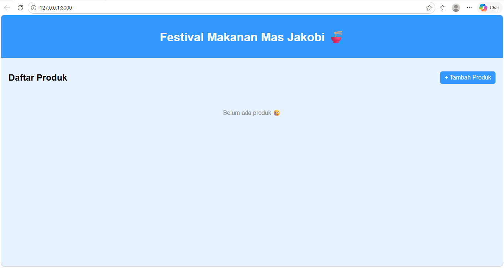
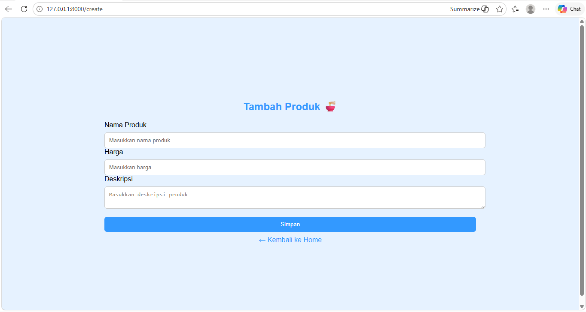
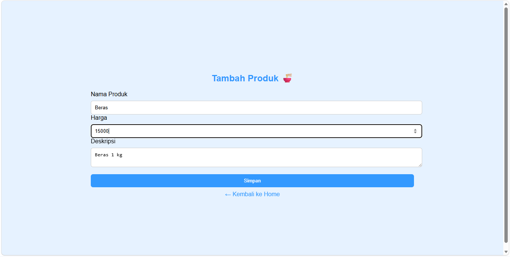
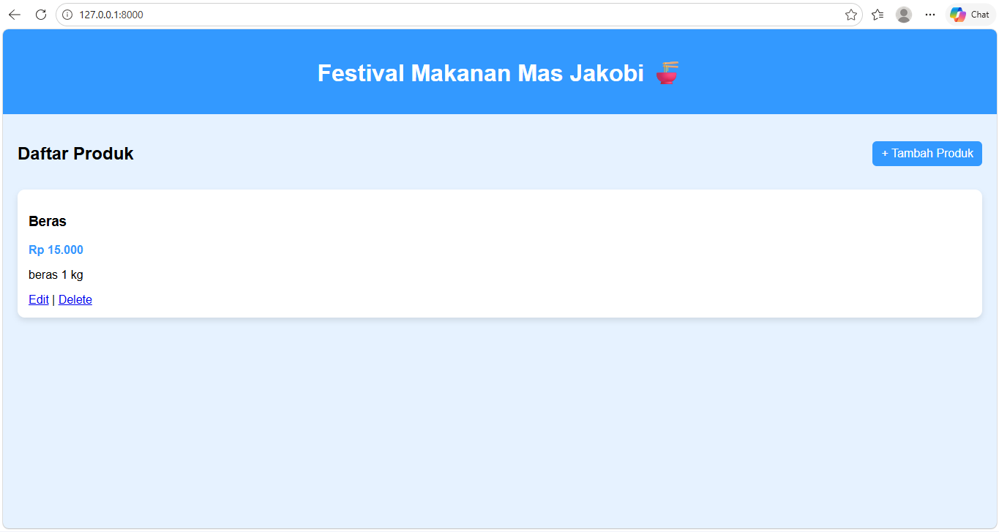
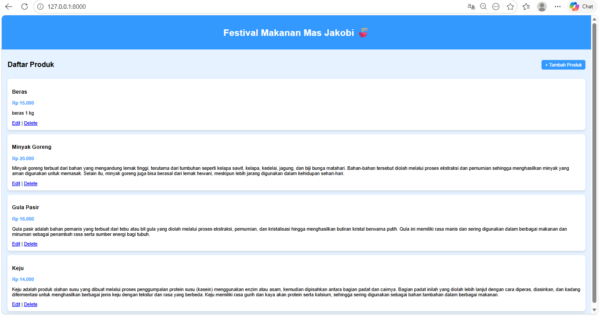
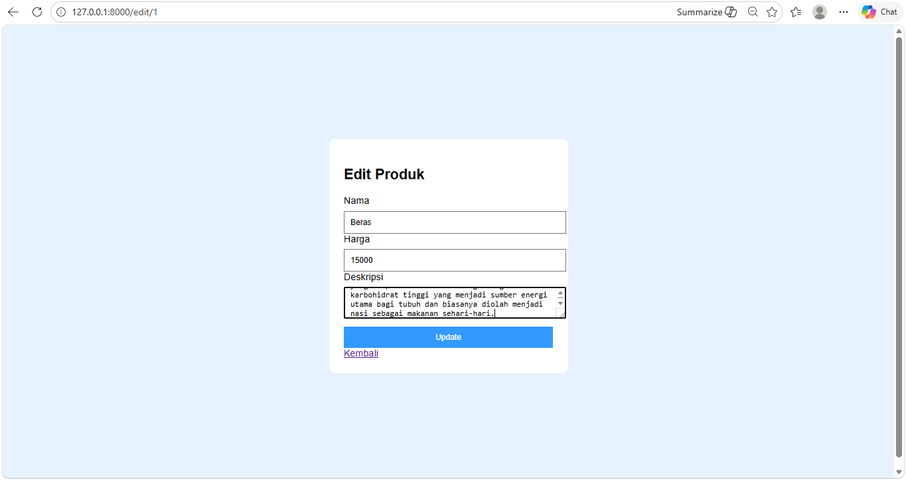
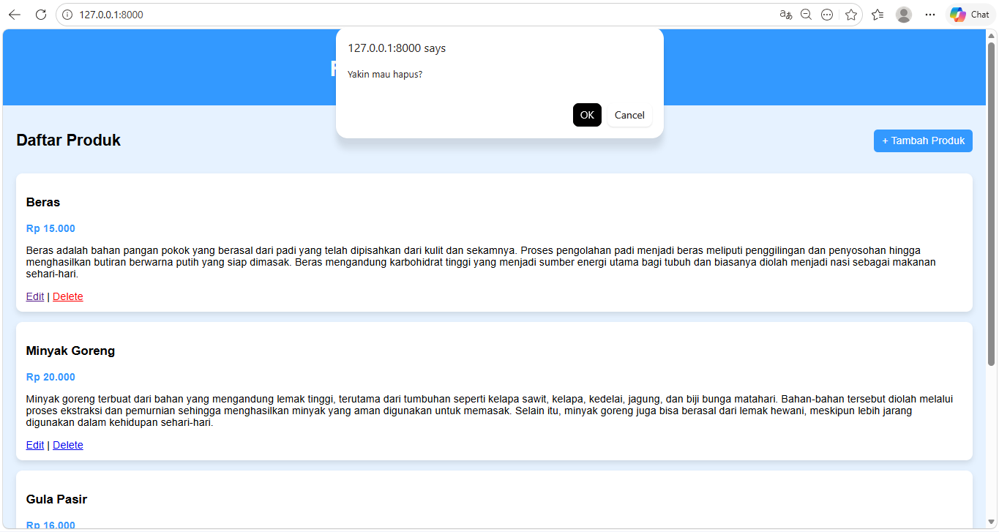
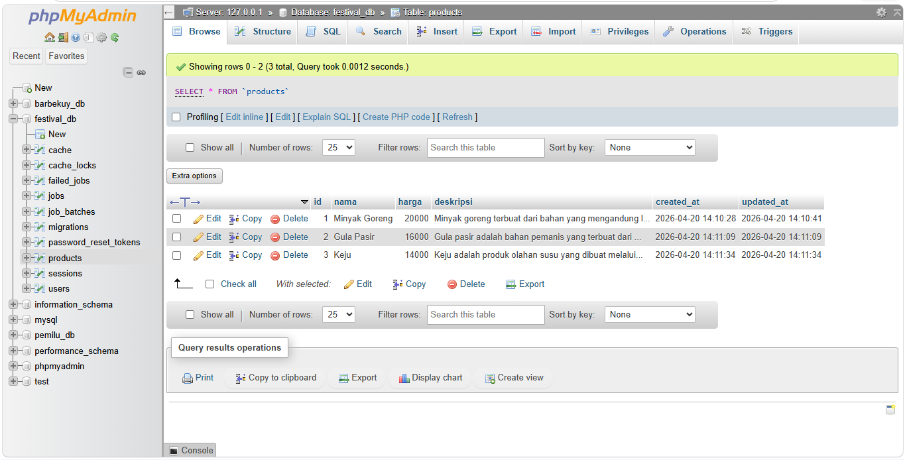

<div align="center">
  <br />
  <h1>LAPORAN PRAKTIKUM <br> APLIKASI BERBASIS PLATFORM </h1>
  <br />
  <h3>MODUL 11, 12, 13 <br> LARAVEL & DATABASE </h3>
  <br />
  
  <br />
  <br />
  <br />
  <h3>Disusun Oleh :</h3>
  <p>
    <strong>Naya Putwi Setiasih</strong>
    <br>
    <strong>2311102155</strong>
    <br>
    <strong>S1 IF-11-REG05</strong>
  </p>
  <br />
  <h3>Dosen Pengampu :</h3>
  <p>
    <strong>Dedi Agung Prabowo, S.Kom., M.Kom</strong>
  </p>
  <br />
  <br />
  <h4>Asisten Praktikum :</h4>
  <strong>Apri Pandu Wicaksono</strong>
  <br>
  <strong>Hamka Zaenul Ardi</strong>
  <br />
  <h3>LABORATORIUM HIGH PERFORMANCE <br>FAKULTAS INFORMATIKA <br>UNIVERSITAS TELKOM PURWOKERTO <br>2026 </h3>
</div>

<hr>

---


# 📚 Dasar Teori

## 1. Laravel

Laravel adalah sebuah framework berbasis PHP yang digunakan untuk membangun aplikasi web secara lebih cepat, terstruktur, dan efisien. Laravel menyediakan berbagai fitur dan alat bantu yang memudahkan developer sehingga tidak perlu membuat semuanya dari awal. Framework ini menggunakan konsep MVC (Model-View-Controller), yaitu model untuk mengelola data, view untuk tampilan, dan controller sebagai penghubung antara keduanya. Dengan sintaks yang rapi dan mudah dipahami, Laravel sangat cocok digunakan baik oleh pemula maupun profesional dalam mengembangkan berbagai jenis aplikasi web, seperti website, sistem informasi, hingga layanan berbasis API.

---

## 2. MVC (Model View Controller)

Model-View-Controller (MVC) adalah sebuah pola arsitektur dalam pengembangan aplikasi yang digunakan untuk memisahkan struktur program menjadi tiga bagian utama, yaitu Model, View, dan Controller. Model bertugas mengelola data dan logika yang berkaitan dengan database, View berfungsi untuk menampilkan antarmuka atau tampilan kepada pengguna, sedangkan Controller berperan sebagai penghubung yang mengatur alur komunikasi antara Model dan View. Dengan adanya pemisahan ini, pengembangan aplikasi menjadi lebih terstruktur, mudah dikelola, serta memudahkan proses perawatan dan pengembangan di masa depan.

---

## 3. MySQL

MySQL adalah sebuah sistem manajemen basis data (database) yang digunakan untuk menyimpan, mengelola, dan mengolah data secara terstruktur. MySQL termasuk dalam jenis database relasional, yang berarti data disimpan dalam bentuk tabel-tabel yang saling berhubungan. Sistem ini menggunakan bahasa SQL (Structured Query Language) untuk melakukan berbagai operasi seperti menambah, mengubah, menghapus, dan mengambil data. MySQL banyak digunakan dalam pengembangan aplikasi web karena bersifat open-source, mudah digunakan, serta mampu menangani data dalam jumlah besar dengan performa yang cukup baik.

---

## 4. Eloquent ORM

Eloquent ORM adalah fitur Object-Relational Mapping (ORM) yang disediakan oleh framework Laravel untuk memudahkan interaksi antara aplikasi dengan database. Dengan Eloquent ORM, data dalam database direpresentasikan sebagai objek atau model dalam kode program, sehingga developer dapat mengelola data tanpa harus menulis query SQL secara langsung. Setiap tabel dalam database biasanya diwakili oleh sebuah model, yang memungkinkan proses seperti mengambil, menambah, mengubah, dan menghapus data dilakukan dengan sintaks yang lebih sederhana dan mudah dipahami. Penggunaan Eloquent ORM membuat kode menjadi lebih rapi, terstruktur, serta mempercepat proses pengembangan aplikasi.

---

# 💻 Tugas 11, 12, 13 — Laravel dan Database

## Source Code yang utama 

### a. File View (`home.blade.php`)
```php
<!DOCTYPE html>
<html>
<head>
    <title>Festival Makanan</title>
    <style>
        body {
            font-family: Arial, sans-serif;
            background-color: #e6f2ff;
            margin: 0;
            padding: 0;
        }

    header {
        background-color: #3399ff;
        color: white;
        padding: 15px;
        text-align: center;
    }

    .container {
        padding: 20px;
    }

    .top-bar {
        display: flex;
        justify-content: space-between;
        align-items: center;
    }

    .btn {
        background-color: #3399ff;
        color: white;
        padding: 8px 12px;
        border: none;
        border-radius: 6px;
        text-decoration: none;
    }

    .btn:hover {
        background-color: #267acc;
    }

    .card {
        background: white;
        border-radius: 10px;
        padding: 15px;
        margin-top: 15px;
        box-shadow: 0 4px 8px rgba(0,0,0,0.1);
    }

    .card h3 {
        margin: 0;
        color: #333;
    }

    .harga {
        color: #3399ff;
        font-weight: bold;
    }

    .empty {
        text-align: center;
        margin-top: 50px;
        color: gray;
    }
</style>

</head>
<body>

<header>
    <h1>Festival Makanan Mas Jakobi 🍜</h1>
</header>

<div class="container">

<div class="top-bar">
    <h2>Daftar Produk</h2>
    <a href="/create" class="btn">+ Tambah Produk</a>
</div>

@if($products->count() > 0)
    @foreach($products as $p)
        <div class="card">
            <h3>{{ $p->nama }}</h3>
            <p class="harga">Rp {{ number_format($p->harga, 0, ',', '.') }}</p>
            <p>{{ $p->deskripsi }}</p>
        </div>
    @endforeach
@else
    <div class="empty">
        <p>Belum ada produk 😢</p>
    </div>
@endif

</div>


</body>
</html>
...
```
### b. File View (`create.blade.php`)
```html

<!DOCTYPE html>
<html>
<head>
    <title>Tambah Produk</title>
</head>
<body>
    <!DOCTYPE html>

<html>
<head>
    <title>Tambah Produk</title>
    <style>
        body {
            font-family: Arial, sans-serif;
            background-color: #e6f2ff;
            display: flex;
            justify-content: center;
            align-items: center;
            height: 100vh;
        }

```
    .container {
        background: white;
        padding: 25px;
        border-radius: 10px;
        width: 350px;
        box-shadow: 0 4px 10px rgba(0,0,0,0.1);
    }

    h2 {
        text-align: center;
        color: #3399ff;
    }

    input, textarea {
        width: 100%;
        padding: 10px;
        margin-top: 8px;
        border: 1px solid #ccc;
        border-radius: 6px;
    }

    button {
        width: 100%;
        padding: 10px;
        background-color: #3399ff;
        color: white;
        border: none;
        border-radius: 6px;
        margin-top: 15px;
        cursor: pointer;
    }

    button:hover {
        background-color: #267acc;
    }

    .error {
        color: red;
        font-size: 12px;
    }

    a {
        display: block;
        text-align: center;
        margin-top: 10px;
        text-decoration: none;
        color: #3399ff;
    }
</style>

</head>
<body>

<div class="container">
    <h2>Tambah Produk 🍜</h2>

@if ($errors->any())
    <div class="error">
        <ul>
            @foreach ($errors->all() as $error)
                <li>{{ $error }}</li>
            @endforeach
        </ul>
    </div>
@endif

<form action="/store" method="POST">
    @csrf

    <label>Nama Produk</label>
    <input type="text" name="nama" placeholder="Masukkan nama produk" required>

    <label>Harga</label>
    <input type="number" name="harga" placeholder="Masukkan harga" required>

    <label>Deskripsi</label>
    <textarea name="deskripsi" placeholder="Masukkan deskripsi produk" required></textarea>

    <button type="submit">Simpan</button>
</form>

<a href="/">← Kembali ke Home</a>

</div>

</body>
</html>
```

### c. File View (`edit.blade.php`)
```html
<!DOCTYPE html>

<html>
<head>
    <title>Edit Produk</title>
    <style>
        body {
            font-family: Arial;
            background-color: #e6f2ff;
            display: flex;
            justify-content: center;
            align-items: center;
            height: 100vh;
        }

    .container {
        background: white;
        padding: 25px;
        border-radius: 10px;
        width: 350px;
    }

    input, textarea {
        width: 100%;
        padding: 10px;
        margin-top: 8px;
    }

    button {
        width: 100%;
        padding: 10px;
        background: #3399ff;
        color: white;
        border: none;
        margin-top: 10px;
    }
</style>

</head>
<body>

<div class="container">
    <h2>Edit Produk</h2>

<form action="/update/{{ $product->id }}" method="POST">
    @csrf

    <label>Nama</label>
    <input type="text" name="nama" value="{{ $product->nama }}">

    <label>Harga</label>
    <input type="number" name="harga" value="{{ $product->harga }}">

    <label>Deskripsi</label>
    <textarea name="deskripsi">{{ $product->deskripsi }}</textarea>

    <button type="submit">Update</button>
</form>

<a href="/">Kembali</a>

</div>

</body>
</html>
```


# 🧠 Penjelasan Program

Program ini dibuat menggunakan framework Laravel dengan konsep MVC, di mana data produk disimpan di dalam database MySQL dan diakses melalui model yang sudah dibuat, yaitu Product.

Pada bagian controller, data produk diambil menggunakan fungsi Product::all() untuk menampilkan seluruh data yang ada di database. Setelah itu, data tersebut dikirim ke bagian view untuk ditampilkan ke halaman website. Tampilan produk dibuat dalam bentuk card supaya lebih rapi, menarik, dan mudah dibaca oleh pengguna.

Selain menampilkan data, sistem ini juga dilengkapi fitur untuk menambahkan dan menghapus produk. Data yang diinput melalui form akan langsung tersimpan ke dalam database, lalu otomatis ditampilkan kembali di halaman utama tanpa perlu melakukan perubahan manual.

Secara keseluruhan, aplikasi ini sudah mampu menampilkan data secara dinamis karena terhubung langsung dengan database. Dengan adanya sistem ini, proses digitalisasi pada restoran Mas Jakobi bisa berjalan dengan lebih efektif, terutama dalam hal promosi dan penyampaian informasi produk ke pengguna.

---

# 🚀 Cara Menjalankan Program


1. Jalankan XAMPP (Apache dan MySQL)
2. Masuk ke folder project Laravel
3. Jalankan perintah:
   php artisan serve
4. Buka browser:
   http://127.0.0.1:8000

---


# 📸 Output

Website menampilkan daftar makanan dengan tampilan modern menggunakan Bootstrap. Setiap produk ditampilkan dalam bentuk card yang berisi nama makanan, harga, dan deskripsi.
<br/>
<br/>
<br/>
<br/>
<br/>
<br/>
<br/>
<br/>


