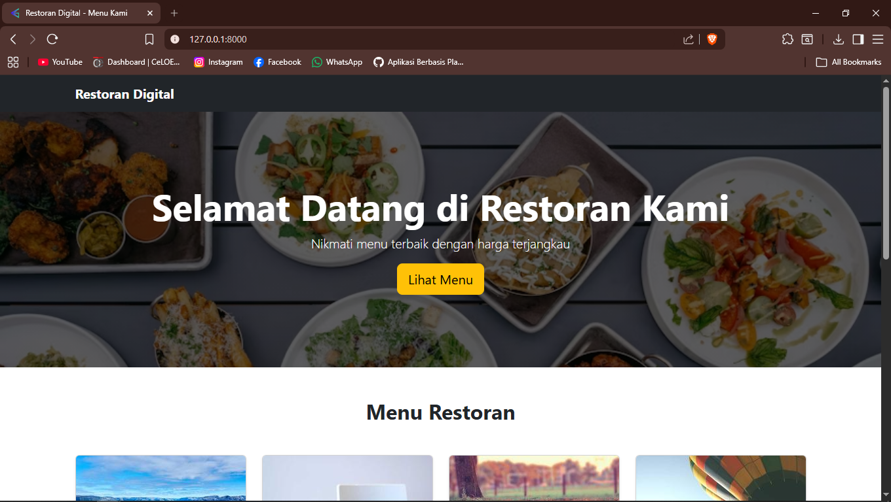
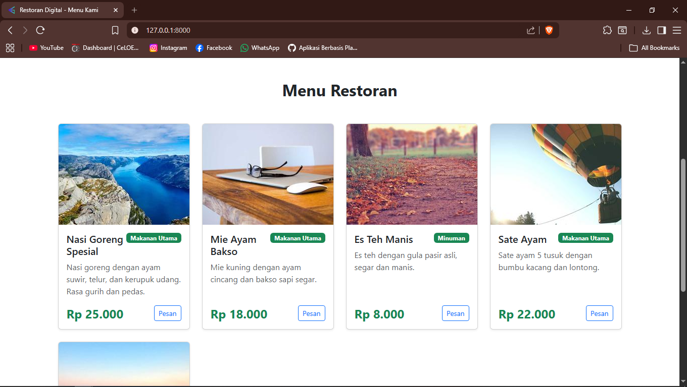
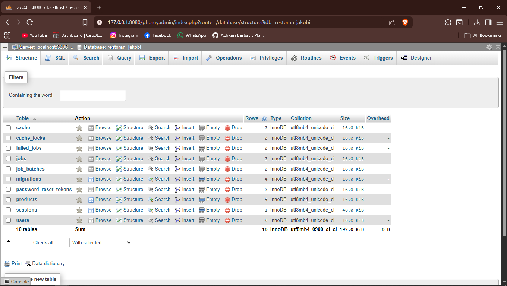

<div align="center">
  <br />
  <h1>LAPORAN PRAKTIKUM <br> APLIKASI BERBASIS PLATFORM </h1>
  <br />
  <h3>MODUL 11,12,13 <br> Laravel & Database </h3>
  <br />
  
  <br />
  <br />
  <br />
  <h3>Disusun Oleh :</h3>
  <p>
    <strong>Arya Bima</strong>
    <br>
    <strong>2311102257</strong>
    <br>
    <strong>S1 IF-11-REG05</strong>
  </p>
  <br />
  <h3>Dosen Pengampu :</h3>
  <p>
    <strong>Dedi Agung Prabowo, S.Kom., M.Kom</strong>
  </p>
  <br />
  <br />
  <h4>Asisten Praktikum :</h4>
  <strong>Apri Pandu Wicaksono </strong>
  <br>
  <strong>Hamka Zaenul Ardi</strong>
  <br />
  <h3>LABORATORIUM HIGH PERFORMANCE <br>FAKULTAS INFORMATIKA <br>UNIVERSITAS TELKOM PURWOKERTO <br>2026 </h3>
</div>

<hr>

# Dasar Teori
## Laravel

Laravel adalah framework PHP yang digunakan untuk membangun aplikasi web secara lebih cepat, terstruktur, dan efisien. Laravel pertama kali dikembangkan oleh Taylor Otwell dan menjadi salah satu framework paling populer karena memiliki sintaks yang sederhana serta fitur yang lengkap.

Laravel menerapkan konsep MVC (Model View Controller). Model digunakan untuk mengelola data dan berhubungan dengan database, View digunakan untuk menampilkan antarmuka kepada pengguna, sedangkan Controller berfungsi mengatur alur logika aplikasi. Dengan konsep ini, kode program menjadi lebih rapi dan mudah dipelihara.

Framework ini juga menyediakan banyak fitur bawaan seperti routing, middleware, autentikasi, validasi form, session, hingga ORM bernama Eloquent. Eloquent ORM memudahkan pengembang dalam mengakses tabel database tanpa harus selalu menulis query SQL secara manual. Sebagai contoh, tabel `users` dapat diakses melalui model `User` sehingga proses mengambil, menambah, mengubah, dan menghapus data menjadi lebih mudah.

Laravel mendukung penggunaan migration, yaitu fitur untuk membuat dan mengelola struktur tabel database melalui kode program. Dengan migration, pengembang dapat menyimpan riwayat perubahan database sehingga memudahkan proses pengembangan tim dan deployment aplikasi.

## Database

Database adalah kumpulan data yang disusun secara sistematis sehingga dapat disimpan, dikelola, dan diakses dengan mudah. Database digunakan dalam berbagai aplikasi untuk menyimpan informasi seperti data pengguna, transaksi, produk, dan laporan.

Dalam sistem database terdapat beberapa komponen penting, yaitu tabel, field, record, dan primary key. Tabel digunakan untuk menyimpan data berdasarkan kategori tertentu. Field adalah atribut atau kolom dalam tabel, sedangkan record adalah isi data pada setiap baris tabel. Primary key merupakan atribut unik yang digunakan untuk membedakan setiap record.

Laravel umumnya menggunakan database relasional seperti MySQL, PostgreSQL, SQLite. Database relasional menyimpan data dalam bentuk tabel yang saling berhubungan melalui relasi tertentu, seperti one to one, one to many, dan many to many.

Hubungan antara Laravel dan database sangat erat karena hampir semua aplikasi web membutuhkan penyimpanan data. Laravel mempermudah proses koneksi ke database melalui file konfigurasi `.env` dan menyediakan query builder maupun Eloquent ORM untuk mengelola data dengan lebih cepat dan aman. Dengan adanya Laravel dan database, pengembangan aplikasi dapat dilakukan secara lebih terstruktur, efisien, dan mudah dikembangkan di masa mendatang.

---

# Tugas 11, 12, 13: Restoran Jakobi
#### Project dapat dilihat <a href="restoran-jakobi" target="_blank">disini</a>
#### Skema Database (MySQL):
```php
Schema::create('products', function (Blueprint $table) {
    $table->id();
    $table->string('nama_produk');
    $table->text('deskripsi');
    $table->decimal('harga', 10, 2);
    $table->string('kategori')->nullable();
    $table->string('gambar')->nullable();
    $table->timestamps();
});
```

### output:




**Penjelasan:**
Program ini membuat website restoran sederhana menggunakan Laravel dan MySQL. Data menu disimpan dalam tabel `products` yang berisi nama produk, deskripsi, harga, kategori, dan gambar. Laravel menggunakan model, controller, dan route untuk mengambil data dari database lalu menampilkannya ke halaman utama. Tampilan website dibuat menggunakan Bootstrap 5 CDN agar lebih menarik dan responsif. Dengan praktikum ini, pengguna dapat memahami alur dasar pembuatan aplikasi Laravel berbasis database.