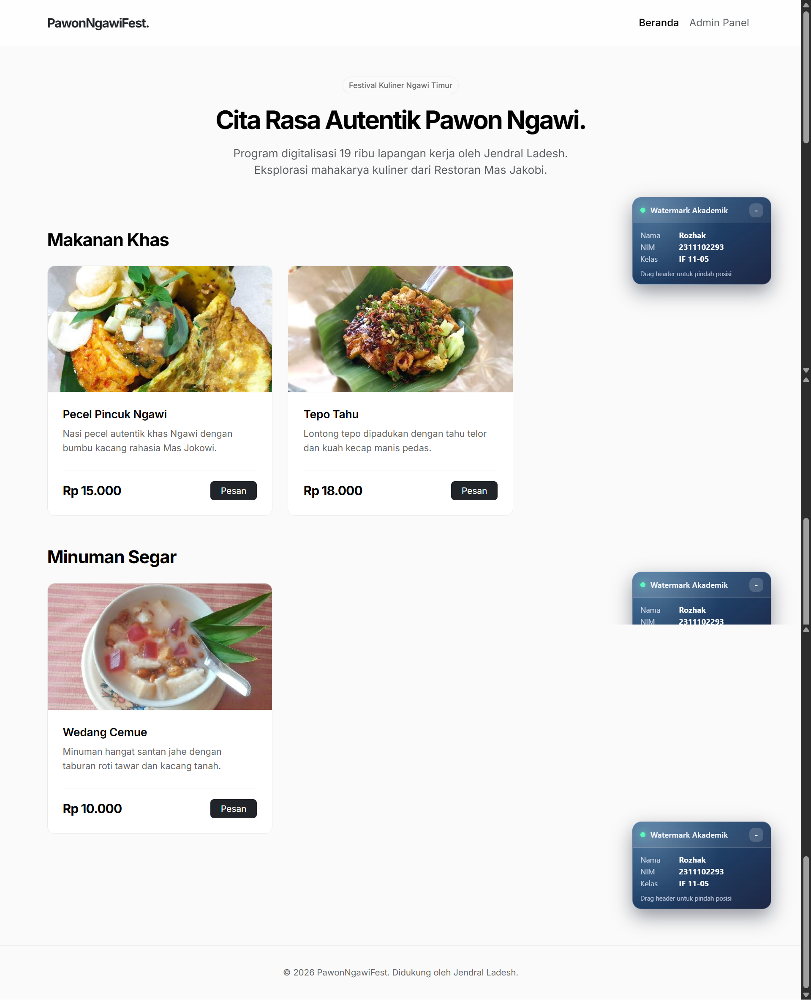
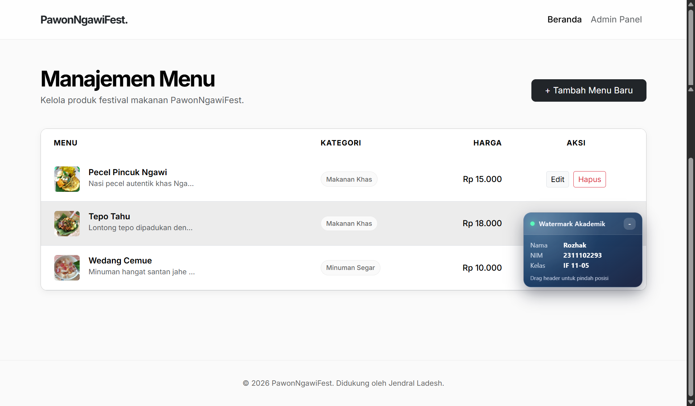
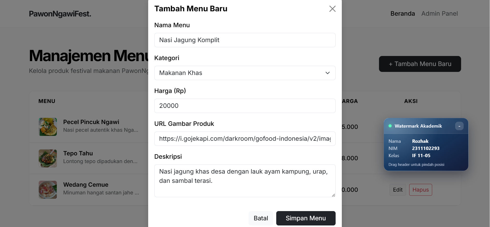
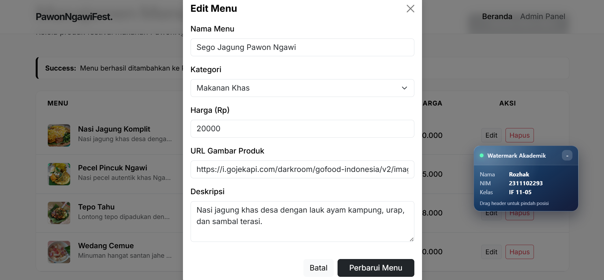
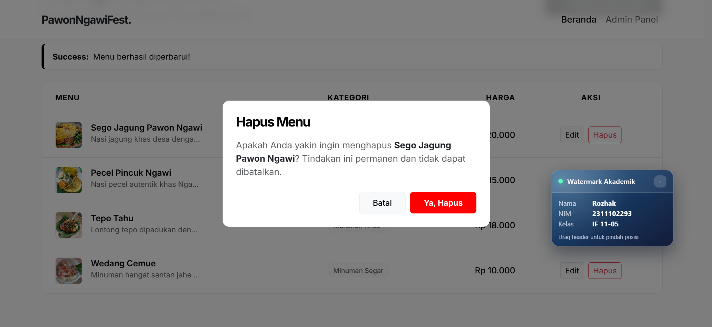

<div align="center">
    <br />
    <h1>LAPORAN PRAKTIKUM <br> APLIKASI BERBASIS PLATFORM </h1>
    <br />
    <h3>MODUL 11, 12, 13 <br> LARAVEL </h3>
    <br />
    
    <br />
    <br />
    <br />
    <h3>Disusun Oleh :</h3>
    <p>
        <strong>Rozhak</strong>
        <br>
        <strong>2311102293</strong>
        <br>
        <strong>S1 IF-11-REG05</strong>
    </p>
    <br />
    <h3>Dosen Pengampu :</h3>
    <p>
        <strong>Dedi Agung Prabowo, S.Kom., M.Kom</strong>
    </p>
    <br />
    <br />
    <h4>Asisten Praktikum :</h4>
    <strong>Apri Pandu Wicaksono </strong>
    <br>
    <strong>Hamka Zaenul Ardi</strong>
    <br />
    <h3>LABORATORIUM HIGH PERFORMANCE <br>FAKULTAS INFORMATIKA <br>UNIVERSITAS TELKOM PURWOKERTO <br>2026 </h3>
</div>
<hr>

## Dasar Teori

Laravel adalah kerangka kerja (_framework_) PHP berbasis arsitektur _Model-View-Controller_ (MVC) yang dirancang untuk meningkatkan produktivitas pengembang melalui sintaks yang ekspresif. Konsep MVC memisahkan aplikasi menjadi tiga komponen utama: _Model_ untuk mengelola logika data, _View_ untuk antarmuka pengguna menggunakan mesih templat _Blade_, dan _Controller_ sebagai jembatan yang mengatur alur logika bisnis. Sistem _routing_ pada Laravel bertindak sebagai pengatur lalu lintas yang memetakan permintaan URL ke fungsi kontroler yang sesuai secara efisien.

Dalam pengelolaan basis data, Laravel menyediakan fitur _Migration_ yang berfungsi sebagai sistem kontrol versi untuk skema _database_, memungkinkan pengembang mendefinisikan struktur tabel secara programatik menggunakan kode PHP tanpa perlu menulis SQL manual. Interaksi dengan data dilakukan melalui _Eloquent ORM (Object-Relational-Mapping)_ yang memungkinkan manipulasi rekaman basis data sebagai objek JavaScript/PHP yang intuitif. Eloquent juga memfasilitasi manajemen relasi antar tabel, seperti _One-to-Many_, melalui fungsi relasional yang kuat, sehingga pengambilan data terkait dapat dilakukan dengan kode yang bersih dan efisien melalui teknik _Eager Loading_.

## Tugas Modul 11, 12, 13 - PawonNgawiFest

### 1. Source Code

```php
<?php

namespace App\Models;

use Illuminate\Database\Eloquent\Model;
use Illuminate\Database\Eloquent\Factories\HasFactory;
use Illuminate\Database\Eloquent\Relations\HasMany;

class Category extends Model {
    use HasFactory;

    protected $fillable = ['name', 'slug'];

    public function products(): HasMany {
        return $this->hasMany(Product::class);
    }
}
```

**Kode Lengkap:** [app/Models/Category.php](app/Models/Category.php)

```php
<?php

namespace App\Models;

use Illuminate\Database\Eloquent\Model;
use Illuminate\Database\Eloquent\Factories\HasFactory;
use Illuminate\Database\Eloquent\Relations\BelongsTo;

class Product extends Model {
    use HasFactory;

    protected $fillable = [
        'category_id', 
        'name', 
        'description', 
        'price', 
        'image'
    ];

    public function category(): BelongsTo {
        return $this->belongsTo(Category::class);
    }
}
```

**Kode Lengkap:** [app/Models/Product.php](app/Models/Product.php)

```php
<?php
...
class DatabaseSeeder extends Seeder {
    use WithoutModelEvents;


    public function run(): void {
        $makanan = Category::create([
            'name' => 'Makanan Khas',
            'slug' => Str::slug('Makanan Khas')
        ]);

        $minuman = Category::create([
            'name' => 'Minuman Segar',
            'slug' => Str::slug('Minuman Segar')
        ]);

        Product::create([
            ...
        ]);

        Product::create([
            ...
        ]);

        Product::create([
            ...
        ]);
    }
}
```

**Kode Lengkap:** [database/seeders/DatabaseSeeder.php](database/seeders/DatabaseSeeder.php)

```php
<?php
...
class HomeController extends Controller {
    public function index() {
        $categories = Category::with('products')->get();

        return view('welcome', compact('categories'));
    }
}
```

**Kode Lengkap:** [app/Http/Controllers/ProductController.php](app/Http/Controllers/ProductController.php)

```php
<?php
...
class ProductController extends Controller {

    public function index() {
        $products = Product::with('category')->latest()->get();
        return view('products.index', compact('products'));
    }

    public function create() {
        $categories = Category::all();
        return view('products.create', compact('categories'));
    }

    public function store(Request $request) {
        $validatedData = $request->validate([
            'category_id' => 'required|exists:categories,id',
            'name' => 'required|string|max:150',
            'price' => 'required|numeric|min:0',
            'description' => 'nullable|string',
            'image' => 'nullable|url'
        ]);

        Product::create($validatedData);

        return redirect()->route('products.index')->with('success', 'Menu berhasil ditambahkan ke Pawon!');
    }

    public function edit(string $id) {
        $product = Product::findOrFail($id);
        $categories = Category::all();
        return view('products.edit', compact('product', 'categories'));
    }

    public function update(Request $request, string $id) {
        $product = Product::findOrFail($id);
        $validatedData = $request->validate([
            'category_id' => 'required|exists:categories,id',
            'name' => 'required|string|max:150',
            'price' => 'required|numeric|min:0',
            'description' => 'nullable|string',
            'image' => 'nullable|url'
        ]);

        $product->update($validatedData);

        return redirect()->route('products.index')->with('success', 'Menu berhasil diperbarui!');
    }

    public function destroy(string $id) {
        $product = Product::findOrFail($id);
        $product->delete();
        return redirect()->route('products.index')->with('success', 'Menu berhasil dihapus!');
    }
}
```

**Kode Lengkap:** [app/Http/Controllers/ProductController.php](app/Http/Controllers/ProductController.php)

### 2. Penjelasan

Proyek **PawonNgawiFest** adalah platform digitalisasi katalog menu untuk Restoran Mas Jakobi yang dibangun menggunakan Laravel. Pada bagian basis data, file migrasi digunakan untuk membuat tabel `categories` dan `products`. Kedua tabal ini dihubungkan melalui relasi _One-to-Many_, di mana satu kategori dapat menampung banyak produk. Pengaturan koneksi diarahkan ke server MySQL pada _shared hosting_ melalui konfigurasi file `.env`.

Pada sisi logika, `HomeController` bertugas mengambil data kategori berserta relasi produknya dari database menggunakan metode `with()` untuk kemudian dikirimkan ke halaman _Landing Page_. Sementara itu `ProductController` digungsikan sebagai _Resource Controller_ untuk menangani proses pembuatan, pembacaan, pembaruan, dan penghausan data (CRUD) pada panel admin. Pada antarmuka pengguna, aplikasi menggunakan _Blade Templating_ dengan satu _Master Layout_ sebagai kartu produk yang berisi harga, deskripsi, dan kategori yang datanya ditarik secara dinamis dari basis data.

### 3. Output

| No | File Name                    | Keterangan                          |
|----|------------------------------|-------------------------------------|
| 1  |  | Halaman ringkasan dashboard admin   |
| 2  |          | Halaman utama panel administrasi    |
| 3  |          | Form untuk menambahkan data menu    |
| 4  |            | Form untuk mengubah data menu       |
| 5  |  | Dialog konfirmasi penghapusan menu  |

## Kesimpulan

Penggunaan framework Laravel dengan arsitektur MVC, fitur _Migration_, dan _Eloquent ORM_ sangat mempermudah proses pembuatan aplikasi web dinamis yang membutuhkan pengelolaan basis data dan relasi antar tabel yang kompleks.