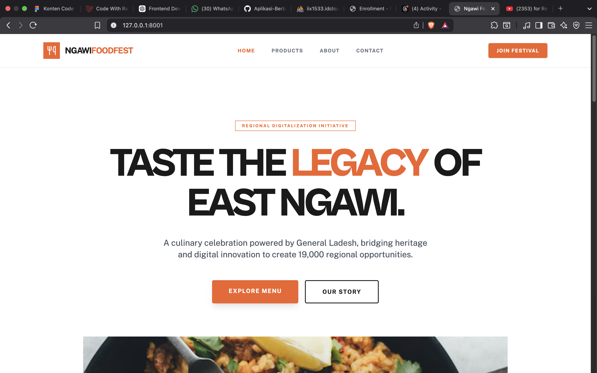
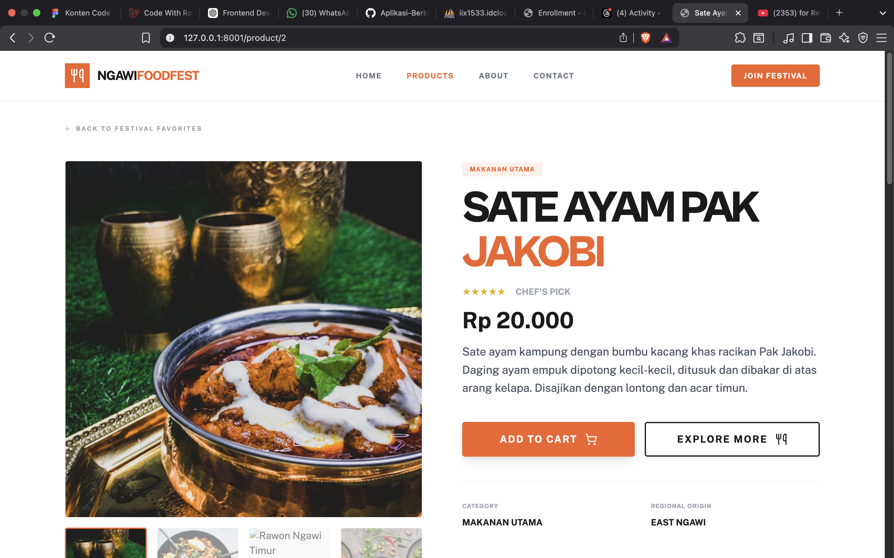
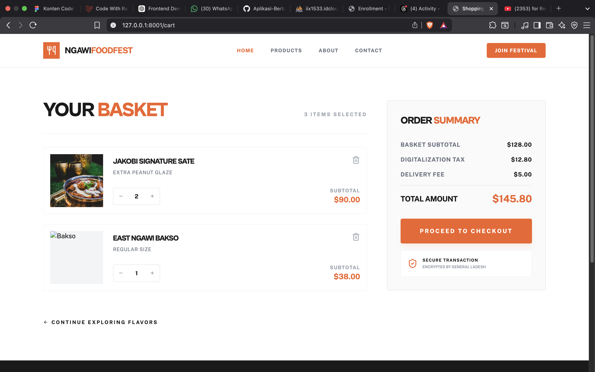
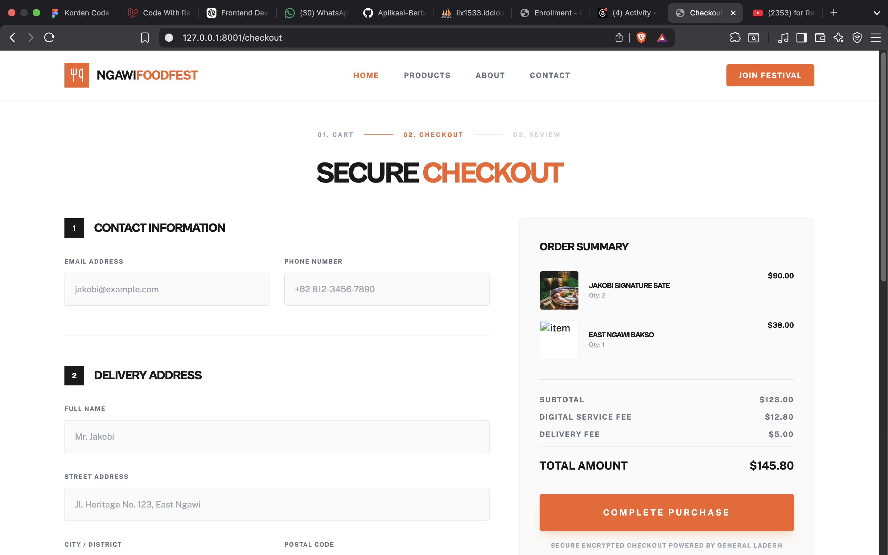

<div align="center">
  <br />
  <h1>LAPORAN PRAKTIKUM <br> APLIKASI BERBASIS PLATFORM </h1>
  <br />
  <h3>MODUL 11 12 13 <br> Laravel dan Database </h3>
  <br />
  
  <br />
  <br />
  <br />
  <h3>Disusun Oleh :</h3>
  <p>
    <strong>Muhamad Rafli Al Farizqi</strong>
    <br>
    <strong>2311102315</strong>
    <br>
    <strong>S1 IF-11-REG05</strong>
  </p>
  <br />
  <h3>Dosen Pengampu :</h3>
  <p>
    <strong>Dedi Agung Prabowo, S.Kom., M.Kom</strong>
  </p>
  <br />
  <br />
  <h4>Asisten Praktikum :</h4>
  <strong>Apri Pandu Wicaksono </strong>
  <br>
  <strong>Hamka Zaenul Ardi</strong>
  <br />
  <h3>LABORATORIUM HIGH PERFORMANCE <br>FAKULTAS INFORMATIKA <br>UNIVERSITAS TELKOM PURWOKERTO <br>2026 </h3>
</div>

<hr>

# Dasar Teori

## 1. Dasar Teori Laravel

Laravel adalah framework PHP open-source yang menggunakan arsitektur Model-View-Controller (MVC) untuk membangun aplikasi web secara terstruktur dan efisien. Framework ini menyediakan berbagai fitur bawaan yang mempercepat proses pengembangan, seperti sistem routing, Eloquent ORM, Blade Template Engine, migration, seeding, middleware, dan autentikasi.

Komponen utama Laravel:
- **Model**: Merepresentasikan data dan logika akses ke database menggunakan Eloquent ORM.
- **View**: Menampilkan antarmuka kepada pengguna menggunakan Blade Template Engine.
- **Controller**: Mengatur alur proses antara model dan view, menerima request dan mengembalikan response.

Fitur-fitur penting Laravel yang digunakan dalam project ini:
- **Routing**: Menentukan URL dan aksi yang dijalankan oleh controller.
- **Eloquent ORM**: Mempermudah operasi CRUD tanpa menulis query SQL secara langsung.
- **Migration**: Kontrol versi untuk skema database, memungkinkan pembuatan dan modifikasi tabel secara programatis.
- **Seeder**: Mengisi data awal ke dalam database untuk keperluan pengembangan dan testing.
- **Blade Template Engine**: Memudahkan pembuatan tampilan dinamis dengan fitur template inheritance dan directive.

## 2. Dasar Teori Database

Database adalah kumpulan data terstruktur yang disimpan secara sistematis agar mudah diakses, dikelola, dan diperbarui. Sistem yang digunakan untuk mengelola database disebut DBMS (Database Management System). Dalam project ini digunakan MySQL sebagai DBMS.

Konsep dasar dalam database relasional:
- **Tabel**: Tempat penyimpanan data dalam bentuk baris dan kolom.
- **Record (baris)**: Satu kesatuan data yang merepresentasikan satu entitas.
- **Field (kolom)**: Atribut dari data, seperti nama, harga, dan deskripsi.
- **Primary Key**: Kunci unik untuk mengidentifikasi setiap record.
- **Data Types**: Tipe data yang menentukan jenis nilai yang dapat disimpan (string, integer, decimal, boolean, text, dll).

Integrasi Laravel dengan MySQL dilakukan melalui konfigurasi file `.env` dan penggunaan Eloquent ORM yang secara otomatis melindungi dari serangan SQL Injection melalui prepared statements. Migration digunakan untuk membuat dan mengelola struktur tabel, sedangkan Seeder digunakan untuk mengisi data awal.

<hr>

### Source Code

#### 1. Migration - Create Products Table
`database/migrations/2026_04_21_101001_create_products_table.php`

```php
<?php

use Illuminate\Database\Migrations\Migration;
use Illuminate\Database\Schema\Blueprint;
use Illuminate\Support\Facades\Schema;

return new class extends Migration
{
    /**
     * Run the migrations.
     */
    public function up(): void
    {
        Schema::create('products', function (Blueprint $table) {
            $table->id();
            $table->string('name');
            $table->text('description');
            $table->decimal('price', 10, 2);
            $table->string('category');
            $table->string('image')->nullable();
            $table->boolean('is_featured')->default(false);
            $table->timestamps();
        });
    }

    /**
     * Reverse the migrations.
     */
    public function down(): void
    {
        Schema::dropIfExists('products');
    }
};
```

#### 2. Model - Product
`app/Models/Product.php`

```php
<?php

namespace App\Models;

use Illuminate\Database\Eloquent\Model;

// Muhamad Rafli Al Farizqi - 2311102315
class Product extends Model
{
    protected $fillable = [
        'name',
        'description',
        'price',
        'category',
        'image',
        'is_featured',
    ];

    protected $casts = [
        'price' => 'decimal:2',
        'is_featured' => 'boolean',
    ];
}
```

#### 3. Controller - ProductController
`app/Http/Controllers/ProductController.php`

```php
<?php

namespace App\Http\Controllers;

use App\Models\Product;
use Illuminate\Http\Request;

// Muhamad Rafli Al Farizqi - 2311102315
class ProductController extends Controller
{
    public function index(Request $request)
    {
        $query = Product::query();

        if ($request->filled('category')) {
            $query->where('category', $request->category);
        }

        if ($request->filled('search')) {
            $query->where('name', 'like', '%' . $request->search . '%');
        }

        $featuredProducts = Product::where('is_featured', true)->take(3)->get();
        $products = $query->latest()->paginate(8);
        $categories = Product::select('category')->distinct()->pluck('category');

        return view('products.index', compact('products', 'featuredProducts', 'categories'));
    }

    public function show(Product $product)
    {
        $relatedProducts = Product::where('category', $product->category)
            ->where('id', '!=', $product->id)
            ->take(4)
            ->get();

        return view('products.show', compact('product', 'relatedProducts'));
    }
}
```

#### 4. Seeder - ProductSeeder
`database/seeders/ProductSeeder.php`

```php
<?php

namespace Database\Seeders;

use App\Models\Product;
use Illuminate\Database\Seeder;

// Muhamad Rafli Al Farizqi - 2311102315
class ProductSeeder extends Seeder
{
    public function run(): void
    {
        $products = [
            [
                'name' => 'Nasi Pecel Ngawi',
                'description' => 'Nasi pecel khas Ngawi dengan bumbu kacang pilihan, dilengkapi sayur bayam, kacang panjang, tauge, dan daun kemangi segar. Disajikan dengan rempeyek kacang renyah dan sambal terasi pedas.',
                'price' => 15000,
                'category' => 'Makanan Utama',
                'image' => 'nasi-pecel.jpg',
                'is_featured' => true,
            ],
            [
                'name' => 'Sate Ayam Pak Jakobi',
                'description' => 'Sate ayam kampung dengan bumbu kacang khas racikan Pak Jakobi. Daging ayam empuk dipotong kecil-kecil, ditusuk dan dibakar di atas arang kelapa. Disajikan dengan lontong dan acar timun.',
                'price' => 20000,
                'category' => 'Makanan Utama',
                'image' => 'sate-ayam.jpg',
                'is_featured' => true,
            ],
            [
                'name' => 'Rawon Ngawi Timur',
                'description' => 'Rawon daging sapi dengan kuah hitam pekat dari kluwek asli. Disajikan dengan nasi putih hangat, tauge pendek, telur asin, dan sambal terasi. Cita rasa autentik Ngawi Timur.',
                'price' => 25000,
                'category' => 'Makanan Utama',
                'image' => 'rawon.jpg',
                'is_featured' => true,
            ],
            [
                'name' => 'Lontong Sayur Ngawi',
                'description' => 'Lontong dengan kuah santan gurih berisi labu siam, tempe, dan tahu. Ditaburi bawang goreng dan kerupuk udang. Menu sarapan favorit warga Ngawi.',
                'price' => 12000,
                'category' => 'Makanan Utama',
                'image' => 'lontong-sayur.jpg',
                'is_featured' => false,
            ],
            [
                'name' => 'Es Dawet Ngawi',
                'description' => 'Es dawet segar dengan cendol pandan, santan kelapa, dan gula merah cair. Ditambahkan es serut untuk kesegaran maksimal. Minuman legendaris khas Ngawi.',
                'price' => 8000,
                'category' => 'Minuman',
                'image' => 'es-dawet.jpg',
                'is_featured' => false,
            ],
            [
                'name' => 'Wedang Jahe Rempah',
                'description' => 'Wedang jahe hangat dengan campuran rempah-rempah pilihan: sereh, kayu manis, dan cengkeh. Cocok dinikmati saat cuaca dingin di malam festival.',
                'price' => 7000,
                'category' => 'Minuman',
                'image' => 'wedang-jahe.jpg',
                'is_featured' => false,
            ],
            [
                'name' => 'Terang Bulan Mini',
                'description' => 'Terang bulan mini dengan berbagai topping: coklat, keju, kacang, dan wijen. Adonan tebal dan lembut, dipanggang sempurna. Jajanan favorit festival.',
                'price' => 10000,
                'category' => 'Jajanan',
                'image' => 'terang-bulan.jpg',
                'is_featured' => false,
            ],
            [
                'name' => 'Getuk Goreng Ngawi',
                'description' => 'Getuk goreng dari singkong pilihan, digoreng hingga kecoklatan dan renyah di luar namun lembut di dalam. Ditaburi gula halus. Oleh-oleh khas Ngawi.',
                'price' => 5000,
                'category' => 'Jajanan',
                'image' => 'getuk-goreng.jpg',
                'is_featured' => false,
            ],
            [
                'name' => 'Bakso Bakar Festival',
                'description' => 'Bakso sapi jumbo dibakar dengan saus kacang pedas manis. Tekstur kenyal dengan aroma pembakaran yang menggugah selera. Menu spesial festival.',
                'price' => 15000,
                'category' => 'Jajanan',
                'image' => 'bakso-bakar.jpg',
                'is_featured' => false,
            ],
            [
                'name' => 'Es Jeruk Peras Segar',
                'description' => 'Jeruk peras asli tanpa campuran air, ditambahkan es batu dan sedikit gula. Kesegaran alami dari buah jeruk lokal Ngawi.',
                'price' => 6000,
                'category' => 'Minuman',
                'image' => 'es-jeruk.jpg',
                'is_featured' => false,
            ],
            [
                'name' => 'Ayam Goreng Kremes Ngawi',
                'description' => 'Ayam kampung goreng dengan kremesan renyah gurih. Dimarinasi dengan bumbu kuning tradisional selama 12 jam. Disajikan dengan lalapan dan sambal.',
                'price' => 22000,
                'category' => 'Makanan Utama',
                'image' => 'ayam-kremes.jpg',
                'is_featured' => false,
            ],
            [
                'name' => 'Tahu Tek Ngawi',
                'description' => 'Tahu goreng dipotong-potong dengan lontong, tauge, dan kentang, disiram bumbu petis khas Jawa Timur. Ditaburi bawang goreng dan kerupuk.',
                'price' => 10000,
                'category' => 'Jajanan',
                'image' => 'tahu-tek.jpg',
                'is_featured' => false,
            ],
        ];

        foreach ($products as $product) {
            Product::create($product);
        }
    }
}
```

#### 5. DatabaseSeeder
`database/seeders/DatabaseSeeder.php`

```php
<?php

namespace Database\Seeders;

use App\Models\User;
use Illuminate\Database\Console\Seeds\WithoutModelEvents;
use Illuminate\Database\Seeder;

class DatabaseSeeder extends Seeder
{
    use WithoutModelEvents;

    public function run(): void
    {
        $this->call([
            ProductSeeder::class,
        ]);
    }
}
```

#### 6. Routes
`routes/web.php`

```php
<?php

use App\Http\Controllers\ProductController;
use Illuminate\Support\Facades\Route;

// Muhamad Rafli Al Farizqi - 2311102315
Route::get('/', [ProductController::class, 'index'])->name('products.index');
Route::get('/product/{product}', [ProductController::class, 'show'])->name('products.show');
```

#### 7. Layout - app.blade.php
`resources/views/layouts/app.blade.php`

```html
<!-- Muhamad Rafli Al Farizqi - 2311102315 -->
<!DOCTYPE html>
<html lang="id">
<head>
    <meta charset="UTF-8">
    <meta name="viewport" content="width=device-width, initial-scale=1.0">
    <title>@yield('title', 'Festival Makanan Ngawi Timur')</title>
    <link href="https://cdn.jsdelivr.net/npm/bootstrap@5.3.0/dist/css/bootstrap.min.css" rel="stylesheet">
    <link href="https://cdnjs.cloudflare.com/ajax/libs/font-awesome/6.4.0/css/all.min.css" rel="stylesheet">
    <style>
        :root {
            --primary: #D4380D;
            --secondary: #FA8C16;
            --accent: #FFF7E6;
            --dark: #1A1A2E;
        }

        body {
            font-family: 'Segoe UI', Tahoma, Geneva, Verdana, sans-serif;
            background-color: #FFF9F0;
        }

        .navbar-festival {
            background: linear-gradient(135deg, var(--primary), var(--secondary));
            box-shadow: 0 2px 10px rgba(0,0,0,0.15);
        }

        .navbar-festival .navbar-brand {
            font-weight: 800;
            font-size: 1.4rem;
            color: white !important;
            letter-spacing: 1px;
        }

        .navbar-festival .nav-link {
            color: rgba(255,255,255,0.9) !important;
            font-weight: 500;
        }

        .navbar-festival .nav-link:hover {
            color: white !important;
        }

        .hero-section {
            background: linear-gradient(135deg, var(--primary) 0%, var(--secondary) 50%, #FAAD14 100%);
            color: white;
            padding: 80px 0;
            position: relative;
            overflow: hidden;
        }

        .hero-section::before {
            content: '';
            position: absolute;
            top: 0; left: 0; right: 0; bottom: 0;
            background: url("data:image/svg+xml,...");
        }

        .hero-section h1 {
            font-size: 3rem;
            font-weight: 900;
            text-shadow: 2px 2px 4px rgba(0,0,0,0.2);
        }

        .product-card {
            border: none;
            border-radius: 16px;
            overflow: hidden;
            transition: all 0.3s ease;
            box-shadow: 0 2px 15px rgba(0,0,0,0.08);
            background: white;
        }

        .product-card:hover {
            transform: translateY(-8px);
            box-shadow: 0 12px 30px rgba(212, 56, 13, 0.15);
        }

        .price-tag {
            background: linear-gradient(135deg, var(--primary), var(--secondary));
            color: white;
            padding: 6px 16px;
            border-radius: 20px;
            font-weight: 700;
        }

        .category-badge {
            background: var(--accent);
            color: var(--primary);
            padding: 4px 12px;
            border-radius: 12px;
            font-size: 0.8rem;
            font-weight: 600;
        }

        .footer-festival {
            background: var(--dark);
            color: rgba(255,255,255,0.8);
            padding: 40px 0 20px;
        }

        /* ... style lainnya ... */
    </style>
</head>
<body>
    <nav class="navbar navbar-expand-lg navbar-festival">
        <div class="container">
            <a class="navbar-brand" href="{{ route('products.index') }}">
                <i class="fas fa-utensils me-2"></i>Festival Makanan Ngawi Timur
            </a>
            <button class="navbar-toggler" type="button" data-bs-toggle="collapse" data-bs-target="#navbarNav">
                <span class="navbar-toggler-icon"></span>
            </button>
            <div class="collapse navbar-collapse" id="navbarNav">
                <ul class="navbar-nav ms-auto">
                    <li class="nav-item">
                        <a class="nav-link" href="{{ route('products.index') }}"><i class="fas fa-home me-1"></i> Beranda</a>
                    </li>
                    <li class="nav-item">
                        <a class="nav-link" href="{{ route('products.index') }}#products"><i class="fas fa-bowl-food me-1"></i> Menu</a>
                    </li>
                    <li class="nav-item">
                        <a class="nav-link" href="#contact"><i class="fas fa-phone me-1"></i> Kontak</a>
                    </li>
                </ul>
            </div>
        </div>
    </nav>

    @yield('content')

    <footer class="footer-festival" id="contact">
        <div class="container">
            <div class="row">
                <div class="col-md-4 mb-3">
                    <h5><i class="fas fa-utensils me-2"></i>Festival Makanan Ngawi Timur</h5>
                    <p>Festival makanan tahunan oleh Restoran Mas Jakobi dengan dukungan Jendral Ladesh.</p>
                </div>
                <div class="col-md-4 mb-3">
                    <h5>Kontak</h5>
                    <p><i class="fas fa-map-marker-alt me-2"></i>Jl. Raya Ngawi Timur No. 45</p>
                    <p><i class="fas fa-phone me-2"></i>(0351) 123-4567</p>
                </div>
                <div class="col-md-4 mb-3">
                    <h5>Jam Operasional Festival</h5>
                    <p><i class="fas fa-clock me-2"></i>Senin - Jumat: 10:00 - 22:00</p>
                    <p><i class="fas fa-clock me-2"></i>Sabtu - Minggu: 09:00 - 23:00</p>
                </div>
            </div>
            <hr style="border-color: rgba(255,255,255,0.1);">
            <div class="text-center">
                <p class="mb-0">&copy; 2026 Festival Makanan Ngawi Timur - Restoran Mas Jakobi.</p>
                <p class="mb-0 mt-1" style="font-size: 0.85rem;">Muhamad Rafli Al Farizqi - 2311102315</p>
            </div>
        </div>
    </footer>

    <script src="https://cdn.jsdelivr.net/npm/bootstrap@5.3.0/dist/js/bootstrap.bundle.min.js"></script>
    @yield('scripts')
</body>
</html>
```

#### 8. View - Homepage (index.blade.php)
`resources/views/products/index.blade.php`

```html
<!-- Muhamad Rafli Al Farizqi - 2311102315 -->
@extends('layouts.app')

@section('title', 'Festival Makanan Ngawi Timur - Beranda')

@section('content')
    {{-- Hero Section --}}
    <section class="hero-section">
        <div class="container position-relative">
            <div class="row align-items-center">
                <div class="col-lg-7">
                    <div class="hero-badge">
                        <i class="fas fa-fire me-1"></i> Festival Makanan 2026
                    </div>
                    <h1>Festival Makanan<br>Ngawi Timur</h1>
                    <p class="mb-4">Nikmati ragam kuliner khas Ngawi dari Restoran Mas Jakobi.
                    <br>Program digitalisasi Jendral Ladesh untuk 19 ribu lapangan pekerjaan.</p>
                    <a href="#products" class="btn btn-light btn-lg px-4 fw-bold">
                        <i class="fas fa-bowl-food me-2"></i>Lihat Menu
                    </a>
                </div>
                <div class="col-lg-5 mt-4 mt-lg-0">
                    <div class="row g-3">
                        <div class="col-6">
                            <div class="stats-box">
                                <div class="number">{{ $products->total() }}</div>
                                <div>Menu Tersedia</div>
                            </div>
                        </div>
                        <div class="col-6">
                            <div class="stats-box">
                                <div class="number">{{ $categories->count() }}</div>
                                <div>Kategori</div>
                            </div>
                        </div>
                        <div class="col-6">
                            <div class="stats-box">
                                <div class="number">19RB</div>
                                <div>Target Lapker</div>
                            </div>
                        </div>
                        <div class="col-6">
                            <div class="stats-box">
                                <div class="number">2026</div>
                                <div>Tahun Festival</div>
                            </div>
                        </div>
                    </div>
                </div>
            </div>
        </div>
    </section>

    {{-- Featured Products --}}
    @if($featuredProducts->count() > 0)
    <section class="py-5">
        <div class="container">
            <h2 class="section-title">Menu Andalan</h2>
            <p class="text-muted mb-4">Pilihan terbaik dari Restoran Mas Jakobi</p>
            <div class="row g-4">
                @foreach($featuredProducts as $product)
                <div class="col-md-4">
                    <div class="card product-card h-100 position-relative">
                        <span class="featured-badge"><i class="fas fa-star me-1"></i> Andalan</span>
                        <div class="img-placeholder bg-light">
                            <i class="fas fa-bowl-food"></i>
                        </div>
                        <div class="card-body d-flex flex-column">
                            <h5 class="card-title mb-0">{{ $product->name }}</h5>
                            <span class="category-badge mb-2">{{ $product->category }}</span>
                            <p class="card-text flex-grow-1">{{ Str::limit($product->description, 100) }}</p>
                            <div class="d-flex justify-content-between align-items-center mt-auto">
                                <span class="price-tag">Rp {{ number_format($product->price, 0, ',', '.') }}</span>
                                <a href="{{ route('products.show', $product) }}" class="btn btn-outline-danger btn-sm">
                                    Detail <i class="fas fa-arrow-right ms-1"></i>
                                </a>
                            </div>
                        </div>
                    </div>
                </div>
                @endforeach
            </div>
        </div>
    </section>
    @endif

    {{-- All Products dengan Filter & Search --}}
    <section class="py-5" style="background: white;" id="products">
        <div class="container">
            <h2 class="section-title">Semua Menu Festival</h2>
            <div class="row mb-4 align-items-center">
                <div class="col-md-8 mb-3 mb-md-0">
                    <a href="{{ route('products.index') }}" class="filter-btn btn btn-sm me-1 {{ !request('category') ? 'active' : '' }}">Semua</a>
                    @foreach($categories as $category)
                        <a href="{{ route('products.index', ['category' => $category]) }}" class="filter-btn btn btn-sm me-1 {{ request('category') == $category ? 'active' : '' }}">{{ $category }}</a>
                    @endforeach
                </div>
                <div class="col-md-4">
                    <form action="{{ route('products.index') }}" method="GET">
                        <input type="text" name="search" class="form-control search-box" placeholder="Cari menu..." value="{{ request('search') }}">
                    </form>
                </div>
            </div>
            <div class="row g-4">
                @forelse($products as $product)
                <div class="col-md-3 col-sm-6">
                    <div class="card product-card h-100">
                        <div class="img-placeholder bg-light">
                            @if($product->category == 'Makanan Utama')
                                <i class="fas fa-plate-wheat"></i>
                            @elseif($product->category == 'Minuman')
                                <i class="fas fa-mug-hot"></i>
                            @else
                                <i class="fas fa-cookie-bite"></i>
                            @endif
                        </div>
                        <div class="card-body d-flex flex-column">
                            <span class="category-badge mb-2">{{ $product->category }}</span>
                            <h6 class="card-title">{{ $product->name }}</h6>
                            <p class="card-text flex-grow-1">{{ Str::limit($product->description, 80) }}</p>
                            <div class="d-flex justify-content-between align-items-center mt-auto">
                                <span class="price-tag">Rp {{ number_format($product->price, 0, ',', '.') }}</span>
                                <a href="{{ route('products.show', $product) }}" class="btn btn-sm" style="color: var(--primary);">
                                    Detail <i class="fas fa-chevron-right"></i>
                                </a>
                            </div>
                        </div>
                    </div>
                </div>
                @empty
                <div class="col-12 text-center py-5">
                    <h5 class="text-muted">Menu tidak ditemukan</h5>
                </div>
                @endforelse
            </div>
            <div class="d-flex justify-content-center mt-4">
                {{ $products->withQueryString()->links() }}
            </div>
        </div>
    </section>

    {{-- About Section --}}
    <section class="py-5">
        <div class="container">
            <div class="row align-items-center">
                <div class="col-md-6">
                    <h2 class="section-title">Tentang Festival</h2>
                    <p class="mt-4 text-muted">
                        Festival Makanan Ngawi Timur adalah wujud nyata kolaborasi antara
                        <strong>Mas Jakobi</strong> sebagai pemilik restoran di Ngawi Timur
                        dengan <strong>Jendral Ladesh</strong> dari Ngawi Barat.
                        Festival ini merupakan bagian dari program digitalisasi yang bertujuan
                        untuk menciptakan <strong>19 ribu lapangan pekerjaan</strong> bagi masyarakat Ngawi.
                    </p>
                </div>
                <div class="col-md-6">
                    <div class="p-4 rounded-4" style="background: linear-gradient(135deg, var(--accent), #FFF2E8);">
                        <div class="row g-3">
                            <div class="col-6 text-center p-3">
                                <i class="fas fa-store fa-2x mb-2" style="color: var(--primary);"></i>
                                <h6 class="fw-bold">Restoran Mas Jakobi</h6>
                            </div>
                            <div class="col-6 text-center p-3">
                                <i class="fas fa-handshake fa-2x mb-2" style="color: var(--primary);"></i>
                                <h6 class="fw-bold">Jendral Ladesh</h6>
                            </div>
                            <div class="col-6 text-center p-3">
                                <i class="fas fa-laptop-code fa-2x mb-2" style="color: var(--primary);"></i>
                                <h6 class="fw-bold">Digitalisasi</h6>
                            </div>
                            <div class="col-6 text-center p-3">
                                <i class="fas fa-users fa-2x mb-2" style="color: var(--primary);"></i>
                                <h6 class="fw-bold">19 Ribu Lapker</h6>
                            </div>
                        </div>
                    </div>
                </div>
            </div>
        </div>
    </section>
@endsection
```

#### 9. View - Detail Produk (show.blade.php)
`resources/views/products/show.blade.php`

```html
<!-- Muhamad Rafli Al Farizqi - 2311102315 -->
@extends('layouts.app')

@section('title', $product->name . ' - Festival Makanan Ngawi Timur')

@section('content')
    <section class="py-5">
        <div class="container">
            <nav aria-label="breadcrumb" class="mb-4">
                <ol class="breadcrumb">
                    <li class="breadcrumb-item"><a href="{{ route('products.index') }}">Beranda</a></li>
                    <li class="breadcrumb-item"><a href="{{ route('products.index', ['category' => $product->category]) }}">{{ $product->category }}</a></li>
                    <li class="breadcrumb-item active">{{ $product->name }}</li>
                </ol>
            </nav>

            <div class="row g-5">
                <div class="col-md-5">
                    <div class="rounded-4 overflow-hidden" style="background: linear-gradient(135deg, var(--accent), #FFF2E8);">
                        <div class="img-placeholder" style="height: 350px; font-size: 5rem;">
                            @if($product->category == 'Makanan Utama')
                                <i class="fas fa-plate-wheat"></i>
                            @elseif($product->category == 'Minuman')
                                <i class="fas fa-mug-hot"></i>
                            @else
                                <i class="fas fa-cookie-bite"></i>
                            @endif
                        </div>
                    </div>
                </div>

                <div class="col-md-7">
                    <div class="d-flex align-items-center gap-2 mb-3">
                        <span class="category-badge">{{ $product->category }}</span>
                        @if($product->is_featured)
                            <span class="badge" style="background: var(--secondary);">
                                <i class="fas fa-star me-1"></i> Menu Andalan
                            </span>
                        @endif
                    </div>

                    <h1 class="fw-bold mb-3">{{ $product->name }}</h1>

                    <div class="price-tag mb-4" style="font-size: 1.3rem; padding: 10px 24px;">
                        Rp {{ number_format($product->price, 0, ',', '.') }}
                    </div>

                    <h5 class="fw-bold mb-2">Deskripsi</h5>
                    <p class="text-muted" style="line-height: 1.8;">{{ $product->description }}</p>

                    <hr class="my-4">

                    <div class="row g-3">
                        <div class="col-auto">
                            <div class="d-flex align-items-center gap-2 p-3 rounded-3" style="background: var(--accent);">
                                <i class="fas fa-tag" style="color: var(--primary);"></i>
                                <div>
                                    <small class="text-muted d-block">Kategori</small>
                                    <strong>{{ $product->category }}</strong>
                                </div>
                            </div>
                        </div>
                        <div class="col-auto">
                            <div class="d-flex align-items-center gap-2 p-3 rounded-3" style="background: var(--accent);">
                                <i class="fas fa-store" style="color: var(--primary);"></i>
                                <div>
                                    <small class="text-muted d-block">Restoran</small>
                                    <strong>Mas Jakobi</strong>
                                </div>
                            </div>
                        </div>
                        <div class="col-auto">
                            <div class="d-flex align-items-center gap-2 p-3 rounded-3" style="background: var(--accent);">
                                <i class="fas fa-map-marker-alt" style="color: var(--primary);"></i>
                                <div>
                                    <small class="text-muted d-block">Lokasi</small>
                                    <strong>Ngawi Timur</strong>
                                </div>
                            </div>
                        </div>
                    </div>

                    <a href="{{ route('products.index') }}" class="btn mt-4 px-4" style="background: var(--primary); color: white; border-radius: 25px;">
                        <i class="fas fa-arrow-left me-2"></i>Kembali ke Menu
                    </a>
                </div>
            </div>
        </div>
    </section>

    {{-- Related Products --}}
    @if($relatedProducts->count() > 0)
    <section class="py-5" style="background: white;">
        <div class="container">
            <h3 class="section-title">Menu Lainnya dari {{ $product->category }}</h3>
            <div class="row g-4">
                @foreach($relatedProducts as $related)
                <div class="col-md-3 col-sm-6">
                    <div class="card product-card h-100">
                        <div class="img-placeholder bg-light" style="height: 150px; font-size: 2rem;">
                            @if($related->category == 'Makanan Utama')
                                <i class="fas fa-plate-wheat"></i>
                            @elseif($related->category == 'Minuman')
                                <i class="fas fa-mug-hot"></i>
                            @else
                                <i class="fas fa-cookie-bite"></i>
                            @endif
                        </div>
                        <div class="card-body d-flex flex-column">
                            <h6 class="card-title">{{ $related->name }}</h6>
                            <p class="card-text flex-grow-1">{{ Str::limit($related->description, 60) }}</p>
                            <div class="d-flex justify-content-between align-items-center mt-auto">
                                <span class="price-tag" style="font-size: 0.8rem;">Rp {{ number_format($related->price, 0, ',', '.') }}</span>
                                <a href="{{ route('products.show', $related) }}" class="btn btn-sm" style="color: var(--primary);">
                                    Detail <i class="fas fa-chevron-right"></i>
                                </a>
                            </div>
                        </div>
                    </div>
                </div>
                @endforeach
            </div>
        </div>
    </section>
    @endif
@endsection
```

<hr>

### Cara Menjalankan

1. Clone repository dan masuk ke folder project
2. Install dependencies:
   ```bash
   composer install
   ```
3. Copy file `.env.example` menjadi `.env` dan sesuaikan konfigurasi database:
   ```
   DB_CONNECTION=mysql
   DB_HOST=127.0.0.1
   DB_PORT=3306
   DB_DATABASE=ngawi
   DB_USERNAME=root
   DB_PASSWORD=
   ```
4. Generate application key:
   ```bash
   php artisan key:generate
   ```
5. Buat database MySQL dengan nama `ngawi`
6. Jalankan migration dan seeder:
   ```bash
   php artisan migrate:fresh --seed
   ```
7. Jalankan server:
   ```bash
   php artisan serve
   ```
8. Buka browser dan akses `http://localhost:8000`

<hr>

### Struktur Project

```
app/
├── Http/Controllers/
│   └── ProductController.php      # Controller untuk mengelola produk
├── Models/
│   └── Product.php                # Model Eloquent untuk tabel products
database/
├── migrations/
│   └── create_products_table.php  # Migration untuk membuat tabel products
├── seeders/
│   ├── DatabaseSeeder.php         # Seeder utama
│   └── ProductSeeder.php          # Seeder data produk makanan
resources/views/
├── layouts/
│   └── app.blade.php              # Layout utama website
├── products/
│   ├── index.blade.php            # Halaman beranda + daftar produk
│   └── show.blade.php             # Halaman detail produk
routes/
└── web.php                        # Definisi routing website
```

<hr>

### Fitur Website

- **Desain Modern (Tailwind CSS)**: Antarmuka yang estetis dan responsif.
- **Hero Banner Interaktif**: Mempromosikan festival Ngawi Timur dan lapangan kerja.
- **Dynamic Catalogue**: Menampilkan produk makanan dan jajanan beserta label "Featured".
- **Halaman Keranjang (Cart)**: Tampilan pesanan dan penghitungan subtotal bergaya premium.
- **Halaman Checkout**: Form validasi dan metode pembayaran (Secure Checkout).
- **Halaman Detail Produk**: Informasi lengkap beserta tombol "Add to Cart".
- **Custom Pagination**: Sistem paginasi yang elegan mengikuti tema festival Ngawi.
- **Database MySQL**: Terhubung dengan Seeder untuk memuat data makanan/minuman awal.

<hr>

### Hasil Screenshot

*(Berikut adalah hasil _screenshot_ tampilan website dari pembaruan modul)*

**1. Halaman Beranda (Home Page & Paginasi)**
<br>

<br><br>

**2. Halaman Detail Produk & Tombol Add to Cart**
<br>

<br><br>

**3. Halaman Keranjang (Cart Page)**
<br>

<br><br>

**4. Proses Checkout (Secure Checkout)**
<br>

<br>
