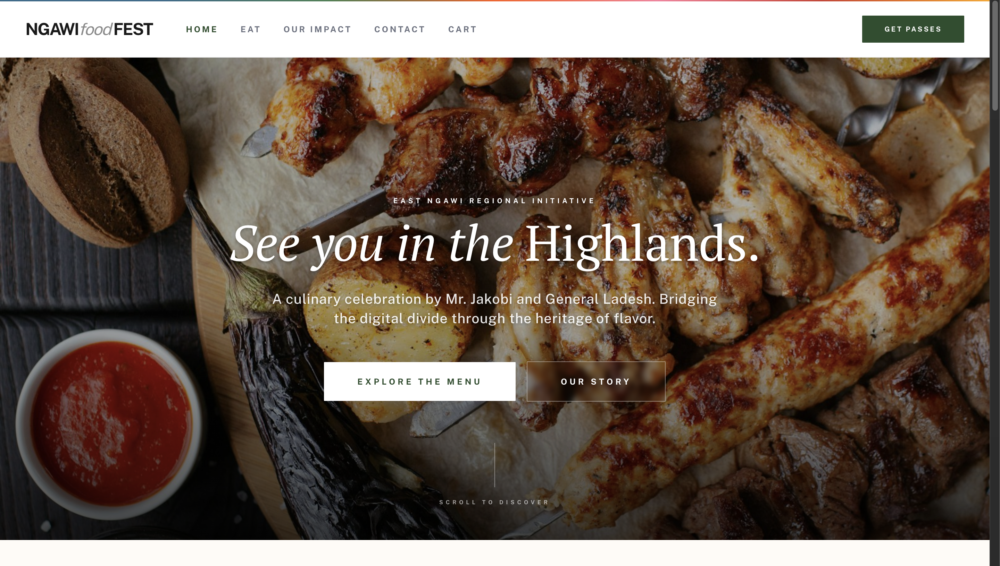
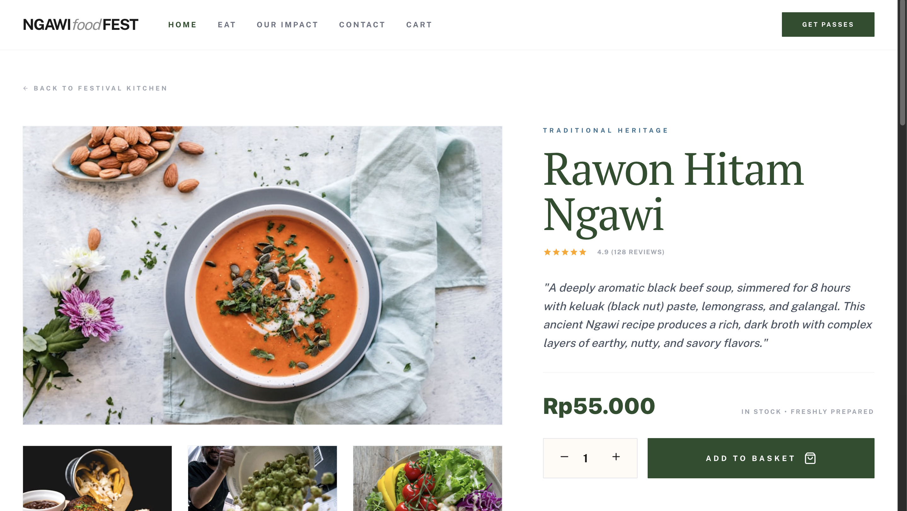
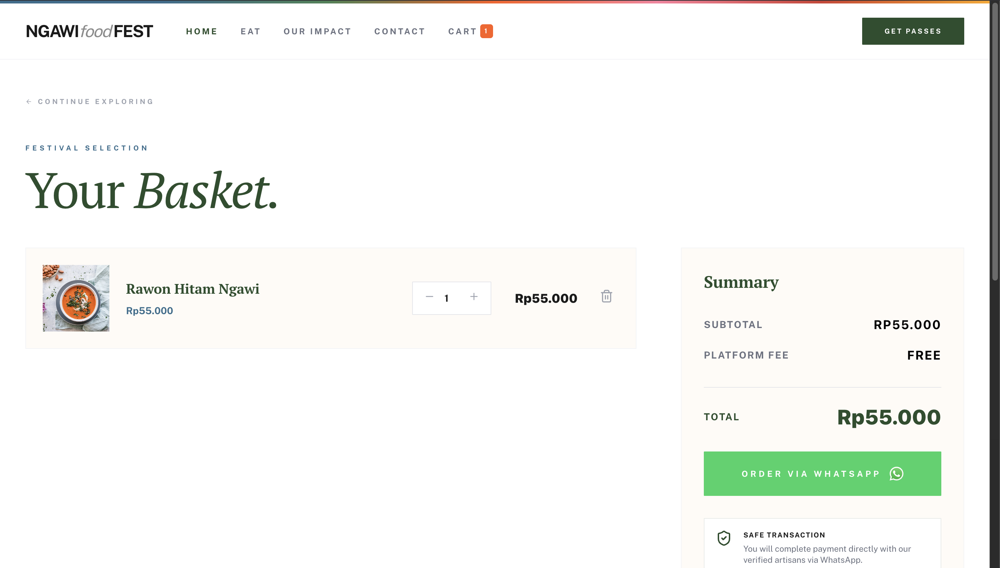

<div align="center">
  <br />
  <h1>LAPORAN PRAKTIKUM <br> APLIKASI BERBASIS PLATFORM </h1>
  <br />
  <h3>MODUL 11 12 13 <br> Laravel dan Database </h3>
  <br />
  
  <br />
  <br />
  <br />
  <h3>Disusun Oleh :</h3>
  <p>
    <strong>Grashela Ayudia Prameswari</strong>
    <br>
    <strong>2311102318</strong>
    <br>
    <strong>S1 IF-11-REG05</strong>
  </p>
  <br />
  <h3>Dosen Pengampu :</h3>
  <p>
    <strong>Dedi Agung Prabowo, S.Kom., M.Kom</strong>
  </p>
  <br />
  <br />
  <h4>Asisten Praktikum :</h4>
  <strong>Apri Pandu Wicaksono </strong>
  <br>
  <strong>Hamka Zaenul Ardi</strong>
  <br />
  <h3>LABORATORIUM HIGH PERFORMANCE <br>FAKULTAS INFORMATIKA <br>UNIVERSITAS TELKOM PURWOKERTO <br>2026 </h3>
</div>

<hr>

# Dasar Teori

## 1. Dasar Teori Laravel

Laravel adalah framework PHP open-source yang menggunakan arsitektur Model-View-Controller (MVC) untuk membangun aplikasi web secara terstruktur dan efisien. Framework ini menyediakan berbagai fitur bawaan yang mempercepat proses pengembangan, seperti sistem routing, Eloquent ORM, Blade Template Engine, migration, seeding, middleware, dan autentikasi.

Komponen utama Laravel:
- **Model**: Merepresentasikan data dan logika akses ke database menggunakan Eloquent ORM.
- **View**: Menampilkan antarmuka kepada pengguna menggunakan Blade Template Engine.
- **Controller**: Mengatur alur proses antara model dan view, menerima request dan mengembalikan response.

Fitur-fitur penting Laravel yang digunakan dalam project ini:
- **Routing**: Menentukan URL dan aksi yang dijalankan oleh controller.
- **Eloquent ORM**: Mempermudah operasi CRUD tanpa menulis query SQL secara langsung.
- **Migration**: Kontrol versi untuk skema database, memungkinkan pembuatan dan modifikasi tabel secara programatis.
- **Seeder**: Mengisi data awal ke dalam database untuk keperluan pengembangan dan testing.
- **Blade Template Engine**: Memudahkan pembuatan tampilan dinamis dengan fitur template inheritance dan directive.
- **Session (Cart)**: Menggunakan sesi bawaan Laravel untuk menyimpan keranjang belanja sementara sebelum proses _checkout_.

## 2. Dasar Teori Database

Database adalah kumpulan data terstruktur yang disimpan secara sistematis agar mudah diakses, dikelola, dan diperbarui. Sistem yang digunakan untuk mengelola database disebut DBMS (Database Management System). Dalam project ini digunakan MySQL sebagai DBMS.

Konsep dasar dalam database relasional:
- **Tabel**: Tempat penyimpanan data dalam bentuk baris dan kolom.
- **Record (baris)**: Satu kesatuan data yang merepresentasikan satu entitas.
- **Field (kolom)**: Atribut dari data, seperti nama, harga, dan deskripsi.
- **Primary Key**: Kunci unik untuk mengidentifikasi setiap record.
- **Data Types**: Tipe data yang menentukan jenis nilai yang dapat disimpan (string, integer, decimal, boolean, text, dll).

Integrasi Laravel dengan MySQL dilakukan melalui konfigurasi file `.env` dan penggunaan Eloquent ORM yang secara otomatis melindungi dari serangan SQL Injection melalui prepared statements. Migration digunakan untuk membuat dan mengelola struktur tabel, sedangkan Seeder digunakan untuk mengisi data awal.

<hr>

### Source Code

#### 1. Migration - Create Products Table
`database/migrations/..._create_products_table.php`

```php
<?php

use Illuminate\Database\Migrations\Migration;
use Illuminate\Database\Schema\Blueprint;
use Illuminate\Support\Facades\Schema;

return new class extends Migration
{
    public function up(): void
    {
        Schema::create('products', function (Blueprint $table) {
            $table->id();
            $table->string('name');
            $table->string('slug')->unique();
            $table->string('category');
            $table->text('description');
            $table->decimal('price', 10, 2);
            $table->string('image');
            $table->string('preparation_time')->nullable();
            $table->string('regional_origin')->nullable();
            $table->integer('calories')->nullable();
            $table->string('total_fat')->nullable();
            $table->string('protein')->nullable();
            $table->string('carbs')->nullable();
            $table->string('sodium')->nullable();
            $table->json('ingredients')->nullable();
            $table->json('allergens')->nullable();
            $table->text('method')->nullable();
            $table->text('serving_suggestion')->nullable();
            $table->decimal('rating', 2, 1)->default(5.0);
            $table->integer('review_count')->default(0);
            $table->timestamps();
        });
    }

    public function down(): void
    {
        Schema::dropIfExists('products');
    }
};
```

#### 2. Model - Product
`app/Models/Product.php`

```php
<?php

namespace App\Models;

use Illuminate\Database\Eloquent\Model;

// Grashela Ayudia Prameswari - 2311102318
class Product extends Model
{
    protected $fillable = [
        'name', 'slug', 'category', 'description', 'price', 'image',
        'preparation_time', 'regional_origin', 'calories', 'total_fat',
        'protein', 'carbs', 'sodium', 'ingredients', 'allergens',
        'method', 'serving_suggestion', 'rating', 'review_count',
    ];

    protected function casts(): array
    {
        return [
            'ingredients' => 'array',
            'allergens' => 'array',
             'price' => 'decimal:2',
            'rating' => 'decimal:1',
        ];
    }
}
```

#### 3. Controller - ProductController & CartController
`app/Http/Controllers/ProductController.php`

```php
<?php

namespace App\Http\Controllers;

use App\Models\Product;

// Grashela Ayudia Prameswari - 2311102318
class ProductController extends Controller
{
    public function index()
    {
        $products = Product::all();
        return view('home', compact('products'));
    }

    public function show(string $slug)
    {
        $product = Product::where('slug', $slug)->firstOrFail();
        $relatedProducts = Product::where('id', '!=', $product->id)->take(3)->get();

        return view('product-detail', compact('product', 'relatedProducts'));
    }
}
```

`app/Http/Controllers/CartController.php`

```php
<?php

namespace App\Http\Controllers;

use App\Models\Product;
use Illuminate\Http\Request;

// Grashela Ayudia Prameswari - 2311102318
class CartController extends Controller
{
    public function index()
    {
        $cart = session()->get('cart', []);
        $total = 0;
        foreach ($cart as $item) {
            $total += $item['price'] * $item['quantity'];
        }
        return view('cart', compact('cart', 'total'));
    }

    public function add(Request $request, $id)
    {
        // Logika menambah barang ke session
    }

    public function update(Request $request, $id)
    {
        // Logika merubah jumlah (quantity) pada barang
    }

    public function remove($id)
    {
         // Logika hapus entri keranjang
    }

    public function checkout()
    {
        // Memformat daftar pesanan dan menghasilkan link API WhatsApp
        // Redirect ke link integrasi WA.
    }
}
```

#### 4. Seeder - ProductSeeder
`database/seeders/ProductSeeder.php`

```php
<?php

namespace Database\Seeders;

use App\Models\Product;
use Illuminate\Database\Seeder;

// Grashela Ayudia Prameswari - 2311102318
class ProductSeeder extends Seeder
{
    public function run(): void
    {
        $products = [
            [
                'name' => 'Jakobi Signature Sate (Ngawi)',
                'slug' => 'jakobi-signature-sate',
                'category' => 'Traditional Grill',
                'description' => 'The crown jewel of Mr. Jakobi\'s kitchen. Tender chunks of prime chicken marinated for 24 hours in a complex blend of 17 regional spices.',
                'price' => 45000,
                'image' => 'https://images.unsplash.com/photo-1606471191009-63994c53433b?w=800&q=80',
                'preparation_time' => '20 - 25 Minutes',
                'regional_origin' => 'East Ngawi Highlands',
                // Dan lain-lain ...
            ],
            // Data produk Ngawi lainnya
        ];

        foreach ($products as $product) {
            Product::create($product);
        }
    }
}
```

#### 5. Routes
`routes/web.php`

```php
<?php

use Illuminate\Support\Facades\Route;
use App\Http\Controllers\ProductController;
use App\Http\Controllers\CartController;

// Grashela Ayudia Prameswari - 2311102318
Route::get('/', [ProductController::class, 'index'])->name('home');
Route::get('/product/{slug}', [ProductController::class, 'show'])->name('product.show');

// Cart Routes
Route::get('/cart', [CartController::class, 'index'])->name('cart.index');
Route::post('/cart/add/{id}', [CartController::class, 'add'])->name('cart.add');
Route::post('/cart/update/{id}', [CartController::class, 'update'])->name('cart.update');
Route::get('/cart/remove/{id}', [CartController::class, 'remove'])->name('cart.remove');
Route::get('/cart/checkout', [CartController::class, 'checkout'])->name('cart.checkout');
```

#### 6. Layout - app.blade.php
`resources/views/layouts/app.blade.php`

Menggunakan arsitektur desain *High-Fidelity* dengan integrasi utuh library Tailwind CSS melalui CDN dan Font dari FontShare API serta Google Fonts (PT Serif). Menampilkan menu navigasi yang tersematkan icon *Cart* dan *Badge Session Cart*.

#### 7. View - Homepage (home.blade.php)
`resources/views/home.blade.php`

Menampilkan *Hero Section* modern yang menceritakan tentang inisiatif festival pekerjaan di Ngawi, list *Featured Tastes* dinamis langsung dari database, serta section "Our Story". Animasi *Hover/Glassmorphism* dari Tailwind diaplikasikan secara apik.

#### 8. View - Product Detail (product-detail.blade.php)
`resources/views/product-detail.blade.php`

Menampilkan tampilan detail pesanan suatu menu masakan seperti "The Composition", "The Method", lengkap beserta rating reviu. Pengguna dapat mengubah kuantitas (Quantity) menggunakan button (+) dan (-) lalu memasukkannya ke dalam tas (cart). Terdapat juga rekomendasi menu terkait di bagian bawah ("You Might Also Like").

#### 9. View - Cart Page (cart.blade.php)
`resources/views/cart.blade.php`

Menampilkan summary total dan subtotal keranjang belanja yang disimpan pada Session. Memfasilitasi pengguna untuk menambah / mengurangi pesanan maupun menghapus dari keranjang. Terintegrasi sebuah tombol checkout berwarna hijau bergaya khas WA menuju portal pemesanan WhatsApp ("Order via WhatsApp").

<hr>

### Cara Menjalankan

1. Clone repository dan masuk ke folder project
2. Install dependencies:
   ```bash
   composer install
   ```
3. Copy file `.env.example` menjadi `.env` dan sesuaikan konfigurasi database:
   ```
   DB_CONNECTION=mysql
   DB_HOST=127.0.0.1
   DB_PORT=3306
   DB_DATABASE=ngawi
   DB_USERNAME=root
   DB_PASSWORD=
   ```
4. Generate application key:
   ```bash
   php artisan key:generate
   ```
5. Buat database MySQL dengan nama yang sesuai konfigurasi (contoh: `ngawi` atau `2311102318_grashelaayudiaprameswari`)
6. Jalankan migration dan seeder:
   ```bash
   php artisan migrate:fresh --seed
   ```
7. Jalankan server:
   ```bash
   php artisan serve
   ```
8. Buka browser dan akses `http://localhost:8000`

<hr>

### Struktur Project

```
app/
├── Http/Controllers/
│   ├── ProductController.php      # Controller untuk mengelola menu dan beranda
│   └── CartController.php         # Controller untuk shopping bag dan checkout WA
├── Models/
│   └── Product.php                # Model Eloquent untuk produk/masakan
database/
├── migrations/
│   └── ...create_products...php   # Migration tabel products
├── seeders/
│   ├── DatabaseSeeder.php         # Seeder trigger utama
│   └── ProductSeeder.php          # 12 sampel masakan khas Ngawi
resources/views/
├── layouts/
│   └── app.blade.php              # UI Navbar + Footer (Tailwind Style)
├── home.blade.php                 # Halaman Beranda (Menu Festival)
├── product-detail.blade.php       # Halaman Detail Menu / Add to Cart
└── cart.blade.php                 # Halaman Daftar Keranjang (Basket)
routes/
└── web.php                        # Daftar Endpoints
```

<hr>

### Fitur Website

- **Desain Kelas Atas (Coachella-style)**: Didukung Tailwind CSS, efek glassmorphism, dan tipografi estetis PT Serif & Cabinet Grotesk.
- **Hero Banner Interaktif**: Mencantumkan nilai narasi inisiatif festival bagi "East Ngawi".
- **Dynamic Catalogue**: Daftar produk yang dipanggil langsung dari skema MySQL dengan fitur badge yang elegan.
- **State Keranjang Belanja Berbasis Cache Sesi**: Tidak perlu register/login untuk menambahkan produk.
- **Halaman Checkout Whatsapp**: Ringkasan barang yang dibawa dihitung (Total/Subtotal) yang secara cerdas format pesan lalu diarahkan langsung ke WhatsApp artisan/penjual.
- **Halaman Detail Detail Resep**: Komposisi produk, alergen, dan metode pengolahan disajikan dalam card terpisah di bawah preview menu utama.
- **Widget Produk Terkait (You Might Also Like)**: Algoritma sederhana limit query agar memunculkan menu dalam satu kategori.

<hr>

### Hasil Screenshot

*(Berikut adalah hasil _screenshot_ tampilan website)*

**1. Halaman Beranda (Home Page)**
<br>

<br><br>

**2. Halaman Detail Produk (Product Detail)**
<br>

<br><br>

**3. Halaman Keranjang (Cart Page)**
<br>

<br>
